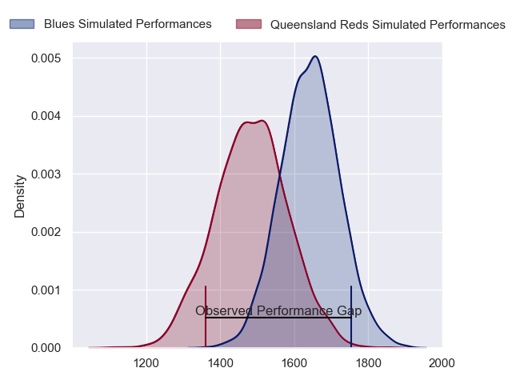
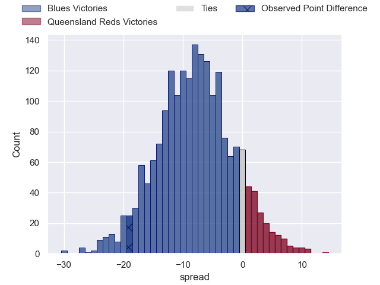

---  
layout: page  
title: Blues at Queensland Reds; 45.0-26.0  
date: 2023-05-19 05:35:00 18:00:00 -0500  
categories: match review  
---
# Blues at Queensland Reds; 45.0-26.0

# Club Level Predictions

The first set of predictions treats a club as the smallest object, as the club develops its members, organizes a gameplan, and deploys its players as needed for each match. This club model has a prediction of 0.288, which translates to predicting Blues to win by 8.1.

Each club has a rating and a rating deviation (simiar to a Glicko system), and expected performances can be generated. This allows for simulated matches and spreads like the ones below.
## Projected Performances

## Projected Spreads

## Projected Results

# Player Level Predictions

Treating teams instead as an entity made up of the currently active players, I have ratings for each player in an altogether different system. These can be combined to form team ratings once teamsheets are announced, weighting starters a bit higher than the reserves. After the match is played, players can be weighted by their minutes on the field, allowing for an accurate measure of the team's composition. With these compiled team ratings, we can make predictions, measure inaccuracy, and update the individual player ratings.
## Prediction with Player Minutes: Blues by 6.8

Blues by 10.8 on a neutral field

There were 9 large changes in win probability in this match
## Prediction without Player Minutes: Blues by 4.8

Blues by 8.8 on a neutral pitch

|   Away Minutes | Away Player                   |   Away elo |   Away Percentile |   Number |   Home Percentile |   Home elo | Home Player      |   Home Minutes |
|---------------:|:------------------------------|-----------:|------------------:|---------:|------------------:|-----------:|:-----------------|---------------:|
|             60 | Jordan Lay                    |      64.48 |                23 |        1 |                74 |      87.98 | George Blake     |             35 |
|             53 | Ricky Riccitelli              |      85.22 |                69 |        2 |                93 |     105.81 | Richie Asiata    |             35 |
|             52 | Marcel Renata                 |      82.74 |                63 |        3 |                55 |      81.82 | Sef Fa'agase     |             49 |
|             80 | Patrick Tuipulotu             |     128.02 |                98 |        4 |                93 |     110.27 | Angus Blyth      |             80 |
|             65 | Cameron Suafoa                |      99.56 |                88 |        5 |                56 |      79.43 | Connor Vest      |             72 |
|             80 | Akira Ioane                   |     110.22 |                94 |        6 |                93 |     107.95 | Liam Wright      |             80 |
|             80 | Adrian Choat                  |      84.03 |                65 |        7 |                49 |      76.56 | Fraser McReight  |             80 |
|             74 | Hoskins Sotutu                |     114.22 |                96 |        8 |                49 |      77.7  | Seru Uru         |             49 |
|             74 | Sam Nock                      |      95.79 |                80 |        9 |                85 |     100.5  | Tate McDermott   |             71 |
|             46 | Beauden Barrett               |     145.02 |               100 |       10 |                76 |      92.54 | Lawson Creighton |             80 |
|             42 | AJ Lam                        |      70.89 |                40 |       11 |                89 |     105.62 | Filipo Daugunu   |             53 |
|             80 | Harry Plummer                 |      96.38 |                79 |       12 |                54 |      76.36 | Taj Annan        |             56 |
|             80 | Bryce Heem                    |      98.43 |                83 |       13 |                52 |      79.14 | Josh Flook       |             80 |
|             80 | Mark Telea                    |     107.33 |                93 |       14 |                82 |      94.62 | Suliasi Vunivalu |             80 |
|             80 | Zarn Sullivan                 |      81.45 |                55 |       15 |                70 |      90.34 | Jock Campbell    |             80 |
|             27 | Kurt Eklund                   |     117.1  |                97 |       16 |                51 |      79.37 | Matt Faessler    |             45 |
|             20 | Josh Fusitua                  |      87.71 |                73 |       17 |                79 |      86.72 | Dane Zander      |             42 |
|             28 | Nepo Laulala                  |     104.62 |                92 |       18 |                71 |      91.36 | Zane Nonggorr    |             34 |
|             15 | James Tucker                  |      91.41 |                76 |       19 |                69 |      86.44 | Ryan Smith       |              8 |
|              6 | Anton Segner                  |      74.04 |                45 |       20 |                88 |     100.9  | Harry Wilson     |             31 |
|              6 | Taufa Funaki                  |      68.91 |                32 |       21 |                71 |      86.52 | Kalani Thomas    |              9 |
|             34 | Roger Tuivasa-Sheck           |      72.4  |                39 |       22 |                72 |      96.35 | Tom Lynagh       |             24 |
|             38 | Jacob Ratumaitavuki-Kneepkens |     116    |                94 |       23 |                77 |      91.54 | Mac Grealy       |             27 |

