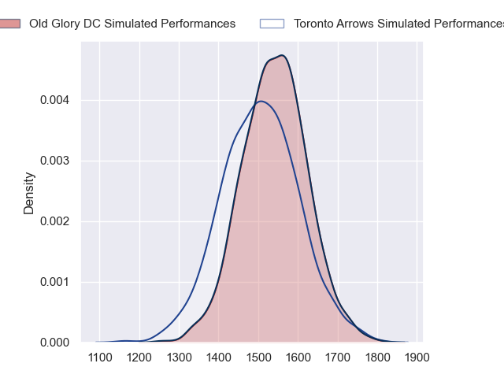
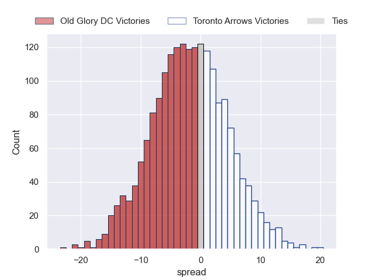

---  
layout: page  
title: Old Glory DC at Toronto Arrows; 29-29  
date: 2023-05-19 01:00:00 18:00:00 -0500  
categories: match review  
---
# Old Glory DC at Toronto Arrows; 29-29

# Club Level Predictions

The first set of predictions treats a club as the smallest object, as the club develops its members, organizes a gameplan, and deploys its players as needed for each match. This club model has a prediction of 0.452, which translates to predicting Old Glory DC to win by 1.7.

Each club has a rating and a rating deviation (simiar to a Glicko system), and expected performances can be generated. This allows for simulated matches and spreads like the ones below.
## Projected Performances

## Projected Spreads

## Projected Results

# Player Level Predictions

Treating teams instead as an entity made up of the currently active players, I have ratings for each player in an altogether different system. These can be combined to form team ratings once teamsheets are announced, weighting starters a bit higher than the reserves. After the match is played, players can be weighted by their minutes on the field, allowing for an accurate measure of the team's composition. With these compiled team ratings, we can make predictions, measure inaccuracy, and update the individual player ratings.
## Prediction with Player Minutes: Old Glory DC by 9.5

Old Glory DC by 13.5 on a neutral field
## Prediction without Player Minutes: Old Glory DC by 9.5

Old Glory DC by 13.5 on a neutral pitch

|   Away Minutes | Away Player              |   Away elo |   Away Percentile |   Number |   Home Percentile |   Home elo | Home Player      |   Home Minutes |
|---------------:|:-------------------------|-----------:|------------------:|---------:|------------------:|-----------:|:-----------------|---------------:|
|             80 | Jack Iscaro              |      33.83 |                 0 |        1 |                 0 |      28.84 | Lolani Faleiva   |             80 |
|             80 | Nic Souchon              |      63.71 |                25 |        2 |               nan |      46.21 | Tyler Wong       |             80 |
|             80 | Kyle Stewart             |      62.75 |                20 |        3 |                 5 |      51.88 | Tyler Rowland    |             80 |
|             80 | Colin Grosse             |      77.06 |                50 |        4 |                 0 |      25.54 | Mason Flesch     |             80 |
|             80 | Kyle Baillie             |      61.3  |                19 |        5 |                 1 |      29.7  | Adrian Wadden    |             80 |
|             80 | Lautaro Ezequiel Bavaro  |      78.33 |                53 |        6 |                14 |      58.72 | Owain Ruttan     |             80 |
|             80 | Niko Jones               |      64.48 |                24 |        7 |                79 |      90.27 | James O'Neill    |             80 |
|             80 | Jamason Fa'anana Schultz |      91.67 |                78 |        8 |                53 |      80.32 | Travis Larsen    |             80 |
|             80 | Danny Joseph Tusitala    |      55.24 |                10 |        9 |                36 |      70.89 | Ross Braude      |             80 |
|             80 | Gradyn Bowd              |      61.93 |                18 |       10 |                 8 |      48.12 | Peter Nelson     |             80 |
|             80 | Tafeaga Junior Sau       |      54.95 |                12 |       11 |                28 |      66.32 | D'Shawn Bowen    |             80 |
|             80 | Thretton Palamo          |      57.6  |                14 |       12 |                 0 |      12.41 | Mitch Richardson |             80 |
|             80 | William Talataina-Mu     |      41.63 |                 1 |       13 |                15 |      57.9  | Tautalatasi Tasi |             80 |
|             80 | Peni Lasaqa              |      61.45 |                21 |       14 |                14 |      56.97 | Ciaran Breen     |             80 |
|             80 | Owen Sheehy              |      54.09 |                11 |       15 |                17 |      61.25 | Shane O'Leary    |             80 |

