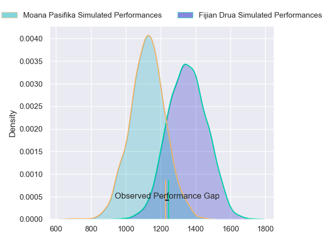
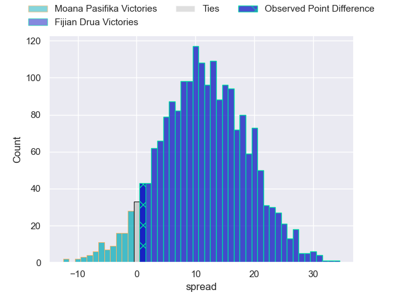
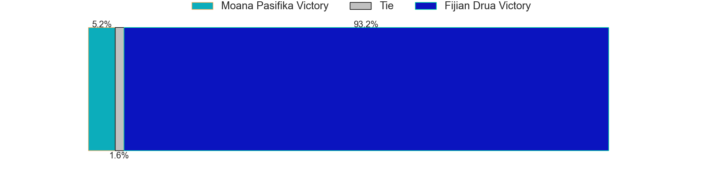

---  
layout: page  
title: Moana Pasifika at Fijian Drua; 46.0-47.0  
date: 2023-05-26 22:05:00 18:00:00 -0500  
categories: match review  
---
# Moana Pasifika at Fijian Drua; 46.0-47.0

# Club Level Predictions

The first set of predictions treats a club as the smallest object, as the club develops its members, organizes a gameplan, and deploys its players as needed for each match. This club model has a prediction of 0.784, which translates to predicting Fijian Drua to win by 11.7.

Each club has a rating and a rating deviation (simiar to a Glicko system), and expected performances can be generated. This allows for simulated matches and spreads like the ones below.
## Projected Performances

## Projected Spreads

## Projected Results

# Player Level Predictions

Treating teams instead as an entity made up of the currently active players, I have ratings for each player in an altogether different system. These can be combined to form team ratings once teamsheets are announced, weighting starters a bit higher than the reserves. After the match is played, players can be weighted by their minutes on the field, allowing for an accurate measure of the team's composition. With these compiled team ratings, we can make predictions, measure inaccuracy, and update the individual player ratings.
## Prediction with Player Minutes: Fijian Drua by 14.1

Fijian Drua by 10.1 on a neutral field

There were 18 large changes in win probability in this match
## Prediction without Player Minutes: Fijian Drua by 14.1

Fijian Drua by 10.1 on a neutral pitch

|   Away Minutes | Away Player           |   Away elo |   Away Percentile |   Number |   Home Percentile |   Home elo | Home Player             |   Home Minutes |
|---------------:|:----------------------|-----------:|------------------:|---------:|------------------:|-----------:|:------------------------|---------------:|
|             53 | Ezekiel Lindenmuth    |      73.85 |                41 |        1 |                85 |      95.23 | Haereiti Hetet          |             61 |
|             57 | Luteru Tolai          |      94.29 |                83 |        2 |                96 |     112.69 | Tevita Ikanivere        |             61 |
|             48 | Joe Apikotoa          |      95.42 |                86 |        3 |               nan |      62.61 | Mesake Doge             |             61 |
|             80 | Michael Curry         |      96.03 |                82 |        4 |                96 |     117.05 | Isoa Nasilasila         |             80 |
|             61 | Mike McKee            |      71.02 |                33 |        5 |                83 |      97.68 | Te Ahiwaru Cirikidaveta |             80 |
|             68 | Penitoa Finau         |      61.21 |                18 |        6 |                31 |      69.08 | Joseva Tamani           |             80 |
|             61 | Alamanda Motuga       |      68.88 |                30 |        7 |                35 |      70.8  | Vilive Miramira         |             74 |
|             80 | Solomone Funaki       |      80.31 |                53 |        8 |                74 |      90.62 | Ratu Meli Derenalagi    |             80 |
|             36 | Jonathan Taumateine   |      63.46 |                21 |        9 |                43 |      75.41 | Frank Lomani            |             80 |
|             80 | Christian Leali'ifano |     102.3  |                86 |       10 |                83 |      98.77 | Teti Tela               |             80 |
|             80 | Timoci Tavatavanawai  |      71.26 |                39 |       11 |                46 |      76.19 | Eroni Sau               |             66 |
|             56 | Henry Taefu           |      49.48 |                 5 |       12 |                99 |     139.14 | Kalaveti Ravouvou       |             74 |
|             80 | Levi Aumua            |     111.08 |                93 |       13 |                47 |      76.93 | Iosefo Masi             |             80 |
|             80 | Tima Fainga'anuku     |     101.68 |                87 |       14 |                42 |      74.64 | Selestino Ravutaumada   |             80 |
|             80 | William Havili        |     106.01 |                89 |       15 |                61 |      86.57 | Ilaisa Droasese         |             80 |
|             23 | Samiuela Moli         |      55.65 |                11 |       16 |                47 |      76.04 | Zuriel Togiatama        |             19 |
|             27 | Abraham Pole          |      82.44 |                61 |       17 |                73 |      86.06 | Emosi Tuqiri            |             19 |
|             32 | Chris Apoua           |      71.07 |                33 |       18 |                36 |      72.52 | Samuela Tawake          |             19 |
|             19 | Mahroni Ngakuru       |      52.36 |                 8 |       19 |               nan |      80.55 | Etonia Waqa             |             23 |
|             12 | Miracle Faiilagi      |      67.19 |                27 |       20 |                52 |      78.29 | Elia Canakaivata        |              6 |
|             44 | Ere Enari             |      99.92 |                84 |       21 |                67 |      87.47 | Peni Matawalu           |              6 |
|             24 | Fine Inisi            |      68.73 |                29 |       22 |               nan |      86.41 | Kemu Valetini           |              0 |
|             19 | Jonah Mau'u           |      82.7  |                60 |       23 |                52 |      79.72 | Michael Naitokani       |             14 |

