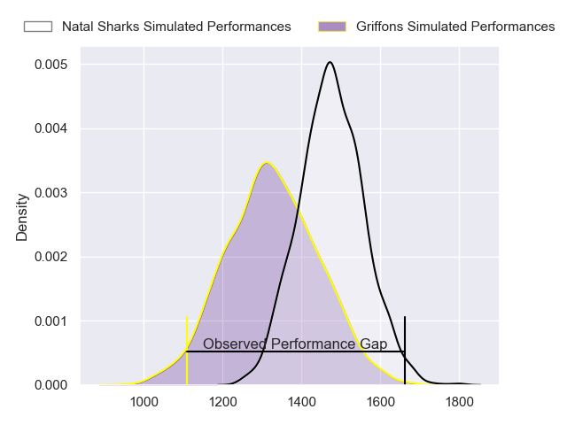
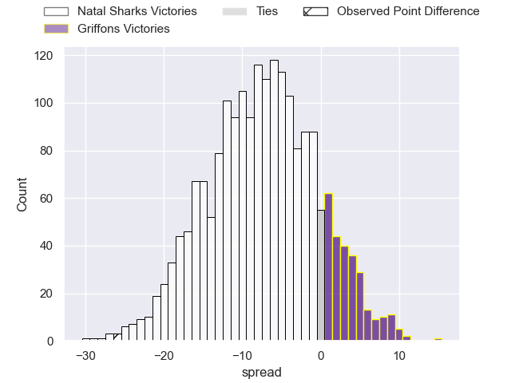
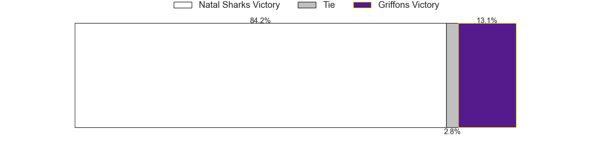

---  
layout: page  
title: Natal Sharks at Griffons; 35-9  
date: 2023-05-26 15:00:00 18:00:00 -0500  
categories: match review  
---
# Natal Sharks at Griffons; 35-9

# Club Level Predictions

The first set of predictions treats a club as the smallest object, as the club develops its members, organizes a gameplan, and deploys its players as needed for each match. This club model has a prediction of 0.303, which translates to predicting Natal Sharks to win by 7.5.

Each club has a rating and a rating deviation (simiar to a Glicko system), and expected performances can be generated. This allows for simulated matches and spreads like the ones below.
## Projected Performances

## Projected Spreads

## Projected Results

# Player Level Predictions

Treating teams instead as an entity made up of the currently active players, I have ratings for each player in an altogether different system. These can be combined to form team ratings once teamsheets are announced, weighting starters a bit higher than the reserves. After the match is played, players can be weighted by their minutes on the field, allowing for an accurate measure of the team's composition. With these compiled team ratings, we can make predictions, measure inaccuracy, and update the individual player ratings.
## Prediction with Player Minutes: Natal Sharks by 25.2

Natal Sharks by 29.2 on a neutral field

There were 3 large changes in win probability in this match
## Prediction without Player Minutes: Natal Sharks by 25.2

Natal Sharks by 29.2 on a neutral pitch

|   Away Minutes | Away Player                 |   Away elo |   Away Percentile |   Number |   Home Percentile |   Home elo | Home Player                 |   Home Minutes |
|---------------:|:----------------------------|-----------:|------------------:|---------:|------------------:|-----------:|:----------------------------|---------------:|
|             80 | Dian Bleuler                |      82.71 |                64 |        1 |               nan |      57.71 | Xolani Jacobs               |             80 |
|             80 | Dameon Venter               |      70.34 |                32 |        2 |                33 |      68.62 | Hendrik Petrus van Schoor   |             80 |
|             80 | Khuthuzani Kingdom Mchunu   |      92.19 |                81 |        3 |                45 |      75.75 | Doctor Booysen              |             80 |
|             80 | Ockie Barnard               |      94.69 |                81 |        4 |                 8 |      51.77 | Rian Olivier                |             80 |
|             80 | Daniel Pieter (Reniel) Hugo |      79.87 |                53 |        5 |                11 |      55.99 | Michael Benadie             |             80 |
|             80 | Dylan Richardson            |      82.83 |                60 |        6 |                52 |      77.32 | Mitch Carstens              |             80 |
|             80 | James Venter                |      83.03 |                61 |        7 |                41 |      73.54 | Thomas Ongera               |             80 |
|             80 | Celimpilo Gumede            |      69.55 |                41 |        8 |                 7 |      51.28 | Sokuphumla (Soso) Xakalashe |             80 |
|             80 | Bradley Davids              |      87.45 |                68 |        9 |                39 |      73.12 | Jaywinn Juries              |             80 |
|             80 | Lionel Cronje               |      81.29 |                53 |       10 |                 4 |      44.15 | Robbie Petzer               |             80 |
|             80 | Marnus Potgieter            |      95.45 |                84 |       11 |                27 |      66.35 | Randy Fillies               |             80 |
|             80 | Rohan Janse van Rensburg    |      85.5  |                68 |       12 |                19 |      61.91 | Jeandre De Beer             |             80 |
|             80 | Murray Koster               |      78.85 |                51 |       13 |                10 |      55.2  | Carel-Jan Coetzee           |             80 |
|             80 | Yaw Osei Penxe              |      79.01 |                53 |       14 |                12 |      56.24 | Domenic Smit                |             80 |
|             80 | Nevaldo Fleurs              |      85.78 |                60 |       15 |                65 |      87.35 | Duan Pretorius              |             80 |

