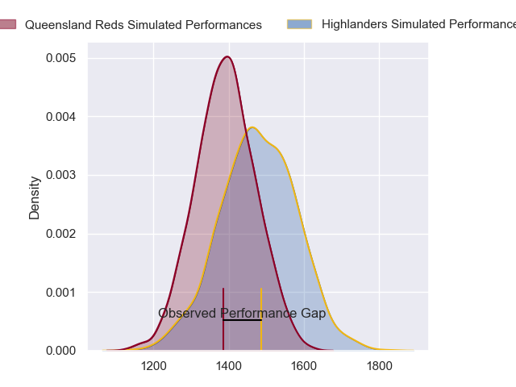
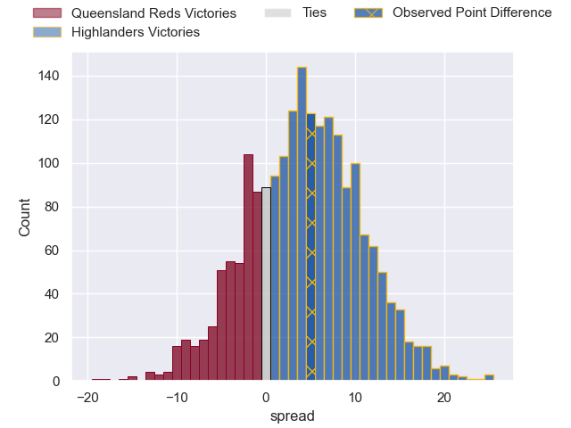
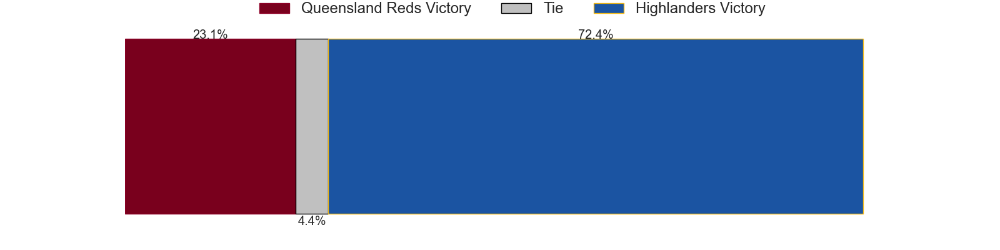

---  
layout: page  
title: Queensland Reds at Highlanders; 30.0-35.0  
date: 2023-05-26 03:05:00 18:00:00 -0500  
categories: match review  
---
# Queensland Reds at Highlanders; 30.0-35.0

# Club Level Predictions

The first set of predictions treats a club as the smallest object, as the club develops its members, organizes a gameplan, and deploys its players as needed for each match. This club model has a prediction of 0.622, which translates to predicting Highlanders to win by 4.4.

Each club has a rating and a rating deviation (simiar to a Glicko system), and expected performances can be generated. This allows for simulated matches and spreads like the ones below.
## Projected Performances

## Projected Spreads

## Projected Results

# Player Level Predictions

Treating teams instead as an entity made up of the currently active players, I have ratings for each player in an altogether different system. These can be combined to form team ratings once teamsheets are announced, weighting starters a bit higher than the reserves. After the match is played, players can be weighted by their minutes on the field, allowing for an accurate measure of the team's composition. With these compiled team ratings, we can make predictions, measure inaccuracy, and update the individual player ratings.
## Prediction with Player Minutes: Highlanders by 5.8

Highlanders by 1.8 on a neutral field

There were 10 large changes in win probability in this match
## Prediction without Player Minutes: Highlanders by 4.7

Highlanders by 0.7 on a neutral pitch

|   Away Minutes | Away Player      |   Away elo |   Away Percentile |   Number |   Home Percentile |   Home elo | Home Player          |   Home Minutes |
|---------------:|:-----------------|-----------:|------------------:|---------:|------------------:|-----------:|:---------------------|---------------:|
|             49 | Peni Ravai       |      87.88 |                73 |        1 |                69 |      86.36 | Ethan de Groot       |             54 |
|             75 | Matt Faessler    |      78.31 |                50 |        2 |                75 |      89.29 | Andrew Makalio       |             52 |
|             61 | Zane Nonggorr    |      88.66 |                70 |        3 |                70 |      86.69 | Jermaine Ainsley     |             65 |
|             81 | Angus Blyth      |     107.4  |                92 |        4 |                99 |     132.3  | Pari Pari Parkinson  |             54 |
|             30 | Connor Vest      |      86.59 |                68 |        5 |                61 |      83.09 | Max Hicks            |             64 |
|             10 | Liam Wright      |     107.75 |                93 |        6 |                86 |      99.7  | Shannon Frizell      |             81 |
|             81 | Fraser McReight  |      67.71 |                29 |        7 |                93 |     108.52 | Billy Harmon         |             81 |
|             81 | Harry Wilson     |     101.51 |                87 |        8 |                10 |      55.38 | Hugh Renton          |             81 |
|             35 | Tate McDermott   |      97.08 |                81 |        9 |                78 |      94.67 | Aaron Smith          |             67 |
|             81 | Tom Lynagh       |      94.61 |                71 |       10 |                92 |     108.35 | Freddie Burns        |             81 |
|             81 | Mac Grealy       |      89.97 |                76 |       11 |                67 |      86.16 | Jona Nareki          |             81 |
|             59 | James O'Connor   |      83.02 |                59 |       12 |                57 |      81.79 | Sam Gilbert          |             73 |
|             81 | Josh Flook       |      72.65 |                38 |       13 |                43 |      74.93 | Matt Whaanga         |             81 |
|             81 | Suliasi Vunivalu |      95.03 |                80 |       14 |                63 |      84.21 | Jonah Lowe           |             68 |
|             81 | Jock Campbell    |      86.98 |                63 |       15 |                84 |      99.58 | Mitch Hunt           |             81 |
|              6 | Richie Asiata    |     105.03 |                92 |       16 |                78 |      90.67 | Rhys Marshall        |             29 |
|             20 | Dane Zander      |      86.32 |                81 |       17 |                77 |      89.76 | Dan Lienert-Brown    |             27 |
|             32 | Sef Fa'agase     |      85.18 |                67 |       18 |                69 |      85.35 | Saula Mau            |             16 |
|             71 | Jake Upfield     |      92.06 |                77 |       19 |                50 |      79.46 | Marino Mikaele-Tu'u  |             17 |
|             51 | Lopeti Faifua    |      84.98 |                64 |       20 |                39 |      72.81 | Sean Withy           |             27 |
|             46 | Kalani Thomas    |      87.06 |                72 |       21 |                54 |      79.44 | Folau Fakatava       |             14 |
|              0 | Lawson Creighton |      88.58 |                67 |       22 |                81 |      98.85 | Connor Garden-Bachop |             13 |
|             22 | Hunter Paisami   |     113.61 |                95 |       23 |                58 |      81.53 | Scott Gregory        |              8 |

