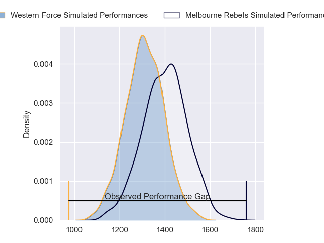
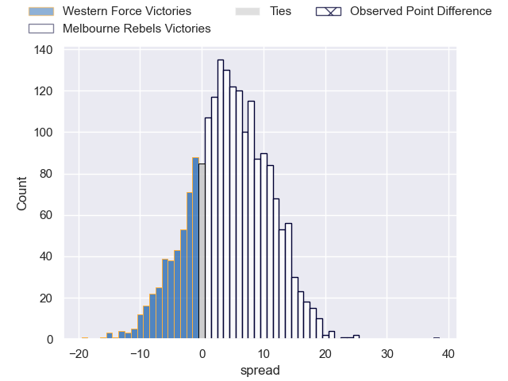
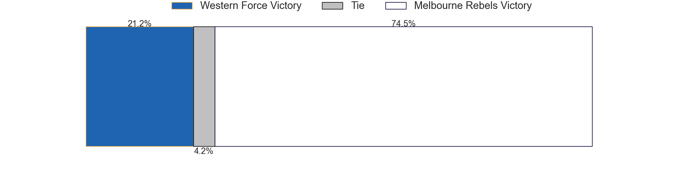

---  
layout: page  
title: Western Force at Melbourne Rebels; 14.0-52.0  
date: 2023-05-26 05:35:00 18:00:00 -0500  
categories: match review  
---
# Western Force at Melbourne Rebels; 14.0-52.0

# Club Level Predictions

The first set of predictions treats a club as the smallest object, as the club develops its members, organizes a gameplan, and deploys its players as needed for each match. This club model has a prediction of 0.617, which translates to predicting Melbourne Rebels to win by 4.3.

Each club has a rating and a rating deviation (simiar to a Glicko system), and expected performances can be generated. This allows for simulated matches and spreads like the ones below.
## Projected Performances

## Projected Spreads

## Projected Results

# Player Level Predictions

Treating teams instead as an entity made up of the currently active players, I have ratings for each player in an altogether different system. These can be combined to form team ratings once teamsheets are announced, weighting starters a bit higher than the reserves. After the match is played, players can be weighted by their minutes on the field, allowing for an accurate measure of the team's composition. With these compiled team ratings, we can make predictions, measure inaccuracy, and update the individual player ratings.
## Prediction with Player Minutes: Western Force by 1.5

Western Force by 5.5 on a neutral field

There were 6 large changes in win probability in this match
## Prediction without Player Minutes: Melbourne Rebels by 0.5

Western Force by 3.5 on a neutral pitch

|   Away Minutes | Away Player           |   Away elo |   Away Percentile |   Number |   Home Percentile |   Home elo | Home Player       |   Home Minutes |
|---------------:|:----------------------|-----------:|------------------:|---------:|------------------:|-----------:|:------------------|---------------:|
|             47 | Angus Wagner          |      79.17 |                53 |        1 |                84 |      94.57 | Matt Gibbon       |             71 |
|             70 | Folau Fainga'a        |     111.23 |                95 |        2 |                50 |      77.76 | Jordan Uelese     |             78 |
|             47 | Siosifa Amone         |      89.62 |               nan |        3 |                81 |      92.6  | Sam Talakai       |             64 |
|             41 | Felix Kalapu          |      39.72 |                 2 |        4 |                60 |      83.1  | Josh Canham       |             80 |
|             47 | Jeremy Williams       |      82.64 |                59 |        5 |                63 |      84.69 | Matt Philip       |             70 |
|             80 | Michael Wells         |      98.57 |                86 |        6 |                36 |      71.9  | Josh Kemeny       |             80 |
|             80 | Carlo Tizzano         |      92.63 |                78 |        7 |                69 |      86.81 | Brad Wilkin       |             80 |
|             70 | Rahboni Vosayaco      |     107.07 |                91 |        8 |                58 |      82.5  | Richard Hardwick  |             70 |
|             70 | Issak Fines-Leleiwasa |      96.28 |                81 |        9 |                87 |     101.55 | Ryan Louwrens     |             70 |
|             71 | Max Burey             |      88.32 |                66 |       10 |                61 |      85.67 | Carter Gordon     |             80 |
|             80 | Manasa Mataele        |     104.81 |                90 |       11 |                97 |     118.53 | Monty Ioane       |             76 |
|             80 | Hamish Stewart        |     129.55 |                98 |       12 |                85 |     101.04 | Reece Hodge       |             80 |
|             80 | Sam Spink             |     101.31 |                86 |       13 |                59 |      83.07 | Lukas Ripley      |             49 |
|             78 | Zach Kibirige         |      72.98 |                38 |       14 |                45 |      75.47 | Lachie Anderson   |             80 |
|             80 | Chase Tiatia          |      88.02 |                64 |       15 |                87 |     104.03 | Andrew Kellaway   |             80 |
|             10 | Tom Horton            |      97.97 |                85 |       16 |               nan |      83.26 | Theo Fourie       |              2 |
|             33 | Marley Pearce         |      84.38 |               nan |       17 |               nan |      89.67 | Isaac Aedo Kailea |              9 |
|             33 | Bo Abra               |      72.78 |               nan |       18 |                68 |      85.17 | Pone Fa'amausili  |             16 |
|             33 | Izack Rodda           |      91.63 |               nan |       19 |                46 |      77.73 | Trevor Hosea      |             10 |
|             39 | Tim Anstee            |      71.6  |                26 |       20 |                51 |      78.41 | Vaiolini Ekuasi   |             10 |
|             10 | Isi Naisarani         |      73.35 |                36 |       21 |                77 |      93.98 | James Tuttle      |             10 |
|             10 | Ian Prior             |      94.24 |                78 |       22 |                48 |      79.78 | Nick Jooste       |             31 |
|             11 | George Poolman        |      87.11 |               nan |       23 |                50 |      80.2  | Joe Pincus        |              4 |

