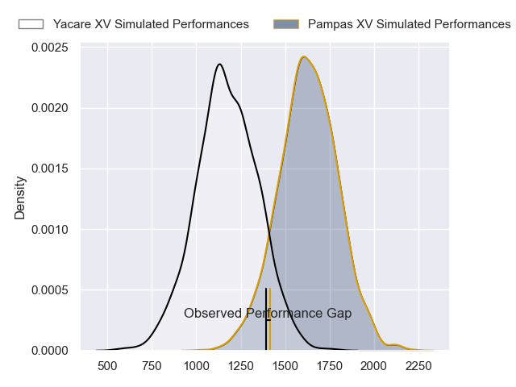
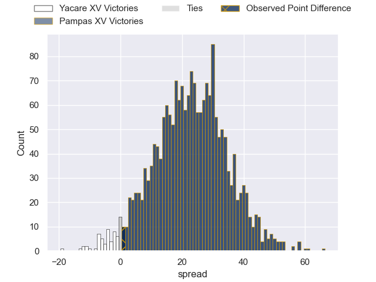

---  
layout: page  
title: Yacare XV at Pampas XV; 24-25  
date: 2023-05-26 22:00:00 18:00:00 -0500  
categories: match review  
---
# Yacare XV at Pampas XV; 24-25

# Club Level Predictions

The first set of predictions treats a club as the smallest object, as the club develops its members, organizes a gameplan, and deploys its players as needed for each match. This club model has a prediction of 0.911, which translates to predicting Pampas XV to win by 23.0.

Each club has a rating and a rating deviation (simiar to a Glicko system), and expected performances can be generated. This allows for simulated matches and spreads like the ones below.
## Projected Performances

## Projected Spreads

## Projected Results

# Player Level Predictions

Treating teams instead as an entity made up of the currently active players, I have ratings for each player in an altogether different system. These can be combined to form team ratings once teamsheets are announced, weighting starters a bit higher than the reserves. After the match is played, players can be weighted by their minutes on the field, allowing for an accurate measure of the team's composition. With these compiled team ratings, we can make predictions, measure inaccuracy, and update the individual player ratings.
## Prediction with Player Minutes: Pampas XV by 2.0

Yacare XV by 2.0 on a neutral field
## Prediction without Player Minutes: Pampas XV by 2.0

Yacare XV by 2.0 on a neutral pitch

|   Away Minutes | Away Player             |   Away elo |   Away Percentile |   Number |   Home Percentile |   Home elo | Home Player                    |   Home Minutes |
|---------------:|:------------------------|-----------:|------------------:|---------:|------------------:|-----------:|:-------------------------------|---------------:|
|             80 | Lucas Noguera Paz       |      68.95 |                29 |        1 |                55 |      75.5  | Miguel Angel Prince            |             80 |
|             80 | Mariano Muntaner        |      46.38 |                 5 |        2 |                34 |      69.82 | Ramiro Gurovich                |             80 |
|             80 | Facundo Pomponio        |      76.49 |                47 |        3 |                24 |      65.87 | Javier Angel Coronel           |             80 |
|             80 | Lucas Sommer            |     100.51 |                87 |        4 |                32 |      69.9  | Lorenzo Colidio                |             80 |
|             80 | Mariano Garcete Elli    |      62.88 |                19 |        5 |                 1 |      33.15 | Eliseo Fourcade                |             80 |
|             80 | Felipe Villagran        |      62.84 |                20 |        6 |                43 |      74.37 | Nicolas Damorim                |             80 |
|             80 | Felipe Puertas          |      94.12 |                81 |        7 |                20 |      63.13 | Manuel Bernstein               |             80 |
|             80 | Juan Cruz Perez Rachel  |      51.68 |                 7 |        8 |                21 |      64.01 | Santiago Ruiz                  |             80 |
|             80 | Ignacio Inchauspe       |      87.71 |                69 |        9 |                52 |      80.13 | Rafael Iriarte                 |             80 |
|             80 | Federico Cacciabúe      |      61.89 |                19 |       10 |                12 |      57.2  | Joaquin Lamas                  |             80 |
|             80 | Juan Daniel Gonzalez    |      41.29 |                 2 |       11 |                94 |     110.93 | Tomas Passaro                  |             80 |
|             80 | Juan David Agudelo Rojo |      67.27 |                27 |       12 |                22 |      64.49 | Felipe de la Vega              |             80 |
|             80 | Ramiro Amarilla         |      66.3  |                25 |       13 |                47 |      76.91 | Juan Pablo Castro Collado      |             80 |
|             80 | Tomas Acosta Pimentel   |      89.02 |                69 |       14 |                23 |      64.76 | Benjamin Elizalde              |             80 |
|             80 | Nicolas Picasso Cerdera |      64.4  |                21 |       15 |                 6 |      51.67 | Eliseo Nicolas Morales Abraham |             80 |

