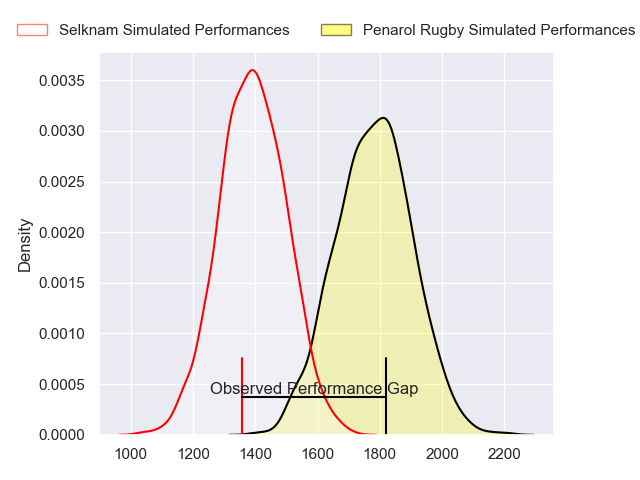
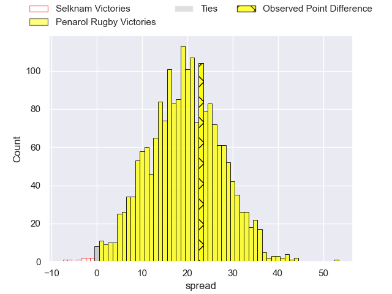
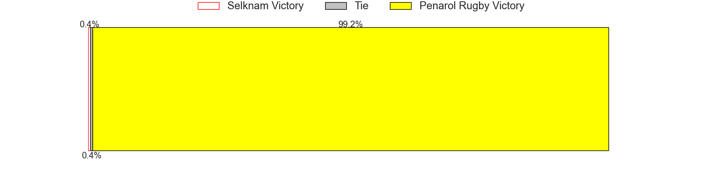

---  
layout: page  
title: Selknam at Penarol Rugby; 8-31  
date: 2023-05-26 22:00:00 18:00:00 -0500  
categories: match review  
---
# Selknam at Penarol Rugby; 8-31

# Club Level Predictions

The first set of predictions treats a club as the smallest object, as the club develops its members, organizes a gameplan, and deploys its players as needed for each match. This club model has a prediction of 0.894, which translates to predicting Penarol Rugby to win by 19.5.

Each club has a rating and a rating deviation (simiar to a Glicko system), and expected performances can be generated. This allows for simulated matches and spreads like the ones below.
## Projected Performances

## Projected Spreads

## Projected Results

# Player Level Predictions

Treating teams instead as an entity made up of the currently active players, I have ratings for each player in an altogether different system. These can be combined to form team ratings once teamsheets are announced, weighting starters a bit higher than the reserves. After the match is played, players can be weighted by their minutes on the field, allowing for an accurate measure of the team's composition. With these compiled team ratings, we can make predictions, measure inaccuracy, and update the individual player ratings.
## Prediction with Player Minutes: Penarol Rugby by 8.6

Penarol Rugby by 4.6 on a neutral field

There were 2 large changes in win probability in this match
## Prediction without Player Minutes: Penarol Rugby by 8.6

Penarol Rugby by 4.6 on a neutral pitch

|   Away Minutes | Away Player          |   Away elo |   Away Percentile |   Number |   Home Percentile |   Home elo | Home Player                      |   Home Minutes |
|---------------:|:---------------------|-----------:|------------------:|---------:|------------------:|-----------:|:---------------------------------|---------------:|
|             80 | Simon Donoso         |      56.98 |               nan |        1 |                16 |      60.95 | Mateo Perillo                    |             80 |
|             80 | Jorge Delgado        |      59.51 |               nan |        2 |                16 |      56.36 | Emiliano Faccennini              |             80 |
|             80 | Inaki Gurruchaga     |      51.96 |                 6 |        3 |                41 |      73.07 | Ignacio Alfredo Peculo Rodriguez |             80 |
|             80 | Clemente Saavedra    |      63.65 |                21 |        4 |                25 |      64.59 | Ignacio Dotti                    |             80 |
|             80 | Pablo Huete          |      65.73 |                25 |        5 |                44 |      75.44 | Felipe Aliaga                    |             80 |
|             80 | Andres Kuzmanic      |      57.18 |               nan |        6 |                 7 |      52.37 | Manuel Ardao                     |             80 |
|             80 | Raimundo Martinez    |      57.52 |                12 |        7 |                32 |      63.36 | Lucas Bianchi                    |             80 |
|             80 | Joaquin Milesi       |      65.84 |                23 |        8 |                15 |      59.45 | Juan Manuel Rodriguez            |             80 |
|             80 | Nicolas Herreros     |      49.9  |                 5 |        9 |                28 |      67.98 | Santiago Álvarez Viera Da Cunha  |             80 |
|             80 | Benjamin Videla      |      58.36 |                14 |       10 |                19 |      62.15 | Felipe Etcheverry                |             80 |
|             80 | Jose Ignacio Larenas |      61.87 |                20 |       11 |                19 |      60.76 | Alfonso Silva                    |             80 |
|             80 | Pablo Casas          |      53.16 |                 8 |       12 |                11 |      56.17 | Juan Zuccarino                   |             80 |
|             80 | Domingo Saavedra     |      77.07 |                47 |       13 |                19 |      61.99 | Tomas Inciarte Rachetti          |             80 |
|             80 | Gaspar Moltedo       |      59.53 |                16 |       14 |                19 |      61.63 | Gaston Mieres Valente            |             80 |
|             80 | Santiago Videla      |      58.35 |                14 |       15 |               nan |      66.84 | Santiago Manuel Del Cerro Lawlor |             80 |

