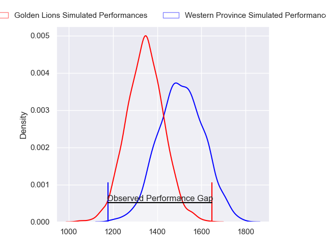
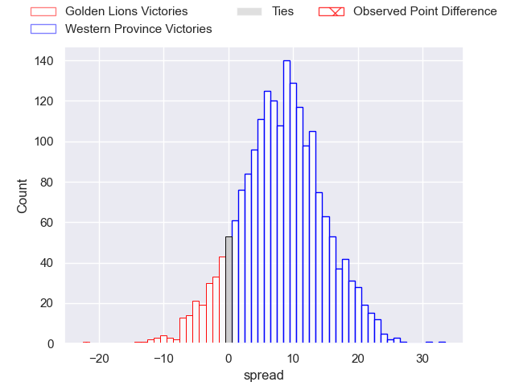
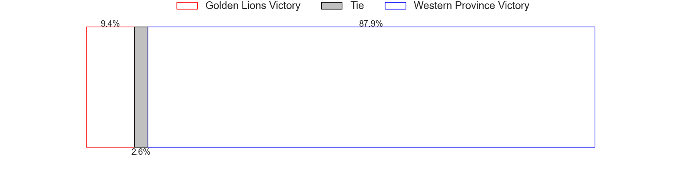

---  
layout: page  
title: Golden Lions at Western Province; 34-12  
date: 2023-05-26 17:00:00 18:00:00 -0500  
categories: match review  
---
# Golden Lions at Western Province; 34-12

# Club Level Predictions

The first set of predictions treats a club as the smallest object, as the club develops its members, organizes a gameplan, and deploys its players as needed for each match. This club model has a prediction of 0.711, which translates to predicting Western Province to win by 8.1.

Each club has a rating and a rating deviation (simiar to a Glicko system), and expected performances can be generated. This allows for simulated matches and spreads like the ones below.
## Projected Performances

## Projected Spreads

## Projected Results

# Player Level Predictions

Treating teams instead as an entity made up of the currently active players, I have ratings for each player in an altogether different system. These can be combined to form team ratings once teamsheets are announced, weighting starters a bit higher than the reserves. After the match is played, players can be weighted by their minutes on the field, allowing for an accurate measure of the team's composition. With these compiled team ratings, we can make predictions, measure inaccuracy, and update the individual player ratings.
## Prediction with Player Minutes: Golden Lions by 2.6

Golden Lions by 6.6 on a neutral field

There were 3 large changes in win probability in this match
## Prediction without Player Minutes: Golden Lions by 2.6

Golden Lions by 6.6 on a neutral pitch

|   Away Minutes | Away Player                |   Away elo |   Away Percentile |   Number |   Home Percentile |   Home elo | Home Player                       |   Home Minutes |
|---------------:|:---------------------------|-----------:|------------------:|---------:|------------------:|-----------:|:----------------------------------|---------------:|
|             80 | Ruan Martin Dreyer         |      73.74 |                39 |        1 |                36 |      72.46 | Kwenzokuhle Ndumiso Blose         |             80 |
|             80 | PJ Botha                   |      78.62 |                53 |        2 |                48 |      75.19 | Siyabonga Ntubeni                 |             80 |
|             80 | Asenathi Ntlabakanye       |      70    |                31 |        3 |                92 |     103.24 | Lee-Marvin Lofty Siyanda Mazibuko |             80 |
|             80 | Ruben (Hobo) Schoeman      |      85.57 |                66 |        4 |                34 |      71.19 | Adre Smith                        |             80 |
|             80 | Darrien-Lane Landsberg     |      95.32 |                82 |        5 |                31 |      69.81 | Connor Evans                      |             80 |
|             80 | Johannes JC Pretorius      |      84.68 |                66 |        6 |                23 |      64.55 | Junior Sipato Pokomela            |             80 |
|             80 | Ruan Venter                |      89.79 |                72 |        7 |                44 |      74.98 | Jarrod Taylor                     |             80 |
|             80 | Francke Horn               |      83.64 |                61 |        8 |                31 |      70.49 | Louw Nel                          |             80 |
|             80 | Sanele Nohamba             |      81.34 |                57 |        9 |                59 |      82.07 | Godlen Herschelle Derrick Masimla |             80 |
|             80 | Gianni Dean Lombard        |      76.9  |                45 |       10 |                43 |      75.68 | Jean-Luc du Plessis               |             80 |
|             80 | Edwill Charl van der Merwe |      78.67 |                52 |       11 |                41 |      73.76 | Thomas Nel                        |             80 |
|             80 | Marius Louw                |      75.53 |                45 |       12 |                74 |      92.32 | Cornel Smit                       |             80 |
|             80 | Rynardt Jonker             |      91.09 |                72 |       13 |                28 |      67.67 | Juan de Jongh                     |             80 |
|             80 | Boldwin Hansen             |      80.24 |                55 |       14 |                82 |      92.16 | Mnombo Zwelendaba                 |             80 |
|             80 | Quan Horn                  |      82.13 |                53 |       15 |                44 |      75.34 | Luke John Burger                  |             80 |

