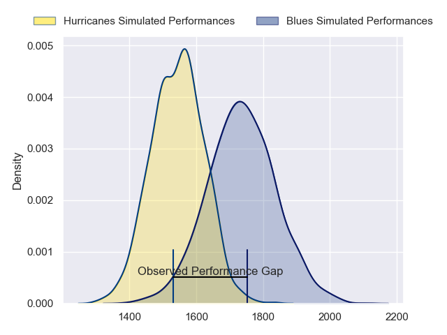
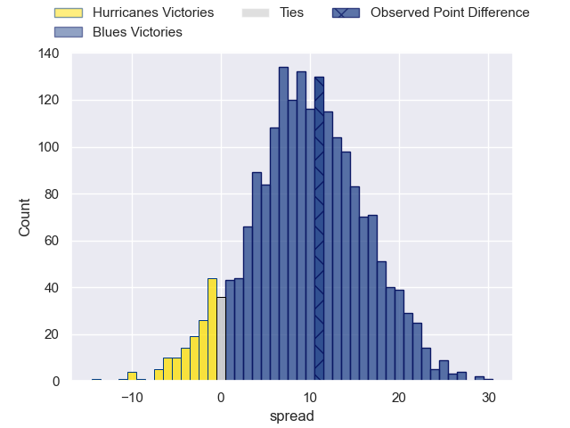

---  
layout: page  
title: Hurricanes at Blues; 25.0-36.0  
date: 2023-05-27 03:05:00 18:00:00 -0500  
categories: match review  
---
# Hurricanes at Blues; 25.0-36.0

# Club Level Predictions

The first set of predictions treats a club as the smallest object, as the club develops its members, organizes a gameplan, and deploys its players as needed for each match. This club model has a prediction of 0.741, which translates to predicting Blues to win by 9.4.

Each club has a rating and a rating deviation (simiar to a Glicko system), and expected performances can be generated. This allows for simulated matches and spreads like the ones below.
## Projected Performances

## Projected Spreads

## Projected Results

# Player Level Predictions

Treating teams instead as an entity made up of the currently active players, I have ratings for each player in an altogether different system. These can be combined to form team ratings once teamsheets are announced, weighting starters a bit higher than the reserves. After the match is played, players can be weighted by their minutes on the field, allowing for an accurate measure of the team's composition. With these compiled team ratings, we can make predictions, measure inaccuracy, and update the individual player ratings.
## Prediction with Player Minutes: Hurricanes by 1.1

Hurricanes by 5.1 on a neutral field

There were 11 large changes in win probability in this match
## Prediction without Player Minutes: Hurricanes by 2.6

Hurricanes by 6.6 on a neutral pitch

|   Away Minutes | Away Player          |   Away elo |   Away Percentile |   Number |   Home Percentile |   Home elo | Home Player       |   Home Minutes |
|---------------:|:---------------------|-----------:|------------------:|---------:|------------------:|-----------:|:------------------|---------------:|
|             60 | Xavier Numia         |     105.55 |                93 |        1 |                92 |     102.98 | Ofa Tu'ungafasi   |             54 |
|             75 | Asafo Aumua          |     112.45 |                96 |        2 |                69 |      84.91 | Ricky Riccitelli  |             60 |
|             60 | Tyrel Lomax          |     134.69 |                99 |        3 |                92 |     103.97 | Nepo Laulala      |             55 |
|             80 | James Blackwell      |      86.43 |                68 |        4 |                98 |     129.37 | Patrick Tuipulotu |             80 |
|             55 | Isaia Walker-Leawere |     105    |                90 |        5 |                86 |      99.86 | Cameron Suafoa    |             60 |
|             72 | Caleb Delany         |      98.82 |                83 |        6 |                94 |     110.51 | Akira Ioane       |             80 |
|             80 | Du'Plessis Kirifi    |      98.03 |                85 |        7 |                72 |      88.29 | Adrian Choat      |             54 |
|             80 | Ardie Savea          |     118.98 |                98 |        8 |                97 |     115.37 | Hoskins Sotutu    |             80 |
|             80 | Cam Roigard          |      98.46 |                83 |        9 |                82 |      98.21 | Finlay Christie   |             72 |
|             58 | Aidan Morgan         |      90.22 |                71 |       10 |                87 |     102.75 | Harry Plummer     |             54 |
|             80 | Kini Naholo          |     112.82 |                95 |       11 |                82 |      96.38 | Caleb Clarke      |             80 |
|             80 | Jordie Barrett       |     108.42 |                92 |       12 |                72 |      91.28 | Bryce Heem        |             80 |
|             80 | Billy Proctor        |     111.28 |                93 |       13 |                57 |      82    | Rieko Ioane       |             80 |
|              4 | Julian Savea         |     115.93 |                96 |       14 |                91 |     105.68 | Mark Telea        |             80 |
|             80 | Joshua Moorby        |      85.57 |                60 |       15 |                67 |      89.24 | Zarn Sullivan     |             80 |
|              5 | Hame Faiva           |      78    |                49 |       16 |                97 |     119.7  | Kurt Eklund       |             20 |
|             20 | Tevita Mafileo       |      98    |                87 |       17 |                30 |      69.23 | Jordan Lay        |             26 |
|             20 | Owen Franks          |     103.88 |                93 |       18 |                68 |      86.09 | Marcel Renata     |             25 |
|             25 | Justin Sangster      |     109.2  |                92 |       19 |                74 |      91.39 | James Tucker      |             20 |
|              8 | Brayden Iose         |      56.59 |                11 |       20 |                32 |      69.47 | Anton Segner      |             26 |
|             14 | Jamie Booth          |      53.01 |                 7 |       21 |                79 |      94.74 | Sam Nock          |              8 |
|             22 | Brett Cameron        |      96.24 |                79 |       22 |                87 |     104.78 | Stephen Perofeta  |             26 |
|             62 | Salesi Rayasi        |      86.36 |                65 |       23 |                34 |      70.8  | AJ Lam            |              0 |

