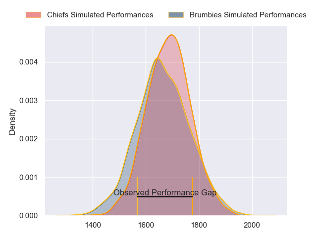
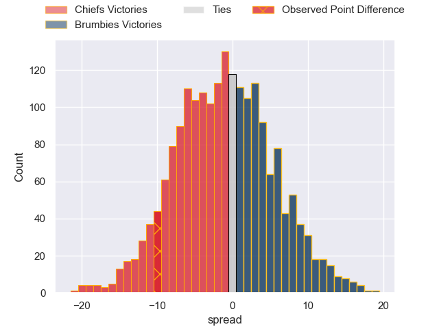

---  
layout: page  
title: Chiefs at Brumbies; 31.0-21.0  
date: 2023-05-27 05:35:00 18:00:00 -0500  
categories: match review  
---
# Chiefs at Brumbies; 31.0-21.0

# Club Level Predictions

The first set of predictions treats a club as the smallest object, as the club develops its members, organizes a gameplan, and deploys its players as needed for each match. This club model has a prediction of 0.473, which translates to predicting Chiefs to win by 1.0.

Each club has a rating and a rating deviation (simiar to a Glicko system), and expected performances can be generated. This allows for simulated matches and spreads like the ones below.
## Projected Performances

## Projected Spreads

## Projected Results

# Player Level Predictions

Treating teams instead as an entity made up of the currently active players, I have ratings for each player in an altogether different system. These can be combined to form team ratings once teamsheets are announced, weighting starters a bit higher than the reserves. After the match is played, players can be weighted by their minutes on the field, allowing for an accurate measure of the team's composition. With these compiled team ratings, we can make predictions, measure inaccuracy, and update the individual player ratings.
## Prediction with Player Minutes: Chiefs by 7.5

Chiefs by 11.5 on a neutral field

There were 6 large changes in win probability in this match
## Prediction without Player Minutes: Chiefs by 8.6

Chiefs by 12.6 on a neutral pitch

|   Away Minutes | Away Player         |   Away elo |   Away Percentile |   Number |   Home Percentile |   Home elo | Home Player      |   Home Minutes |
|---------------:|:--------------------|-----------:|------------------:|---------:|------------------:|-----------:|:-----------------|---------------:|
|             61 | Aidan Ross          |      89.65 |                76 |        1 |               100 |     144.62 | James Slipper    |             51 |
|             66 | Samisoni Taukei'aho |     115.52 |                97 |        2 |                24 |      64.15 | Lachlan Lonergan |             40 |
|             61 | George Dyer         |      84.83 |                66 |        3 |                99 |     126.33 | Allan Alaalatoa  |             51 |
|             82 | Brodie Retallick    |     117.77 |                96 |        4 |                30 |      69.41 | Nick Frost       |             64 |
|             56 | Laghlan McWhannell  |     100.91 |                86 |        5 |                34 |      71.69 | Tom Hooper       |             82 |
|             56 | Pita Gus Sowakula   |      97.91 |                85 |        6 |                92 |     105.71 | Rob Valetini     |             82 |
|             82 | Sam Cane            |     131.28 |                99 |        7 |                93 |     109.24 | Jahrome Brown    |             47 |
|             82 | Luke Jacobson       |     130.44 |                99 |        8 |                73 |      89.77 | Pete Samu        |             69 |
|             13 | Brad Weber          |     139.57 |               100 |        9 |                80 |      95.49 | Ryan Lonergan    |             68 |
|             59 | Josh Ioane          |      96.34 |                79 |       10 |                74 |      91.58 | Noah Lolesio     |             68 |
|             82 | Etene Nanai-Seturo  |      94.08 |                79 |       11 |                41 |      73.99 | Corey Toole      |             82 |
|             82 | Rameka Poihipi      |      97.14 |                80 |       12 |                77 |      94.45 | Tamati Tua       |             59 |
|             73 | Alex Nankivell      |     102.61 |                87 |       13 |                89 |     105.23 | Len Ikitau       |             82 |
|             82 | Emoni Narawa        |      84.68 |                64 |       14 |                87 |     104.25 | Andy Muirhead    |             82 |
|             82 | Damian McKenzie     |      85.04 |                59 |       15 |                77 |      95.25 | Tom Wright       |             82 |
|             16 | Bradley Slater      |     102.57 |                90 |       16 |                97 |     119.57 | Connal McInerney |             42 |
|             21 | Ollie Norris        |      94.16 |                84 |       17 |                74 |      88.86 | Blake Schoupp    |             31 |
|             21 | John Ryan           |     100.65 |                90 |       18 |                72 |      83.31 | Sefo Kautai      |             40 |
|             26 | Naitoa Ah Kuoi      |     104.64 |                91 |       19 |                50 |      78.63 | Darcy Swain      |             18 |
|             26 | Samipeni Finau      |     106.02 |                92 |       20 |                86 |      97.74 | Luke Reimer      |             39 |
|             69 | Cortez Ratima       |      99.3  |                85 |       21 |               nan |      87    | Klayton Thorn    |             14 |
|              9 | Daniel Rona         |      89.69 |                70 |       22 |                68 |      88.95 | Jack Debreczeni  |             14 |
|             23 | Shaun Stevenson     |      93.36 |                74 |       23 |                55 |      80.37 | Ollie Sapsford   |             23 |

