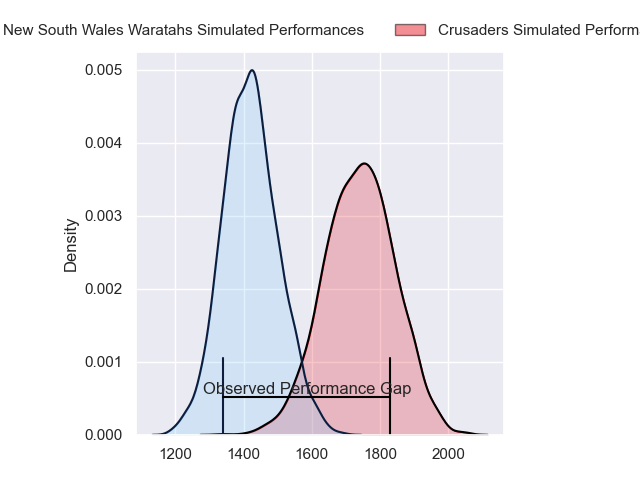
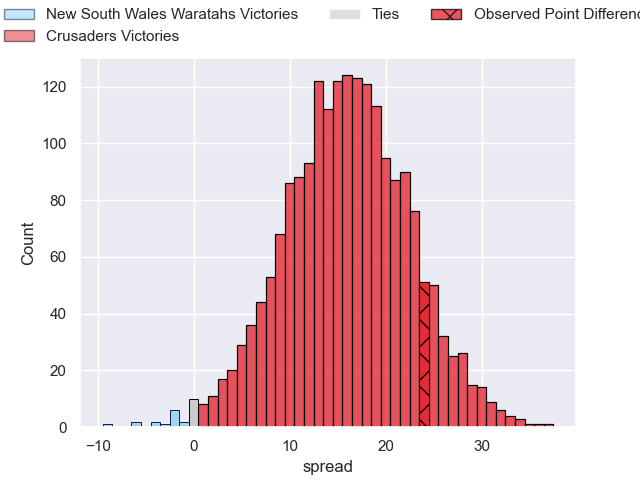
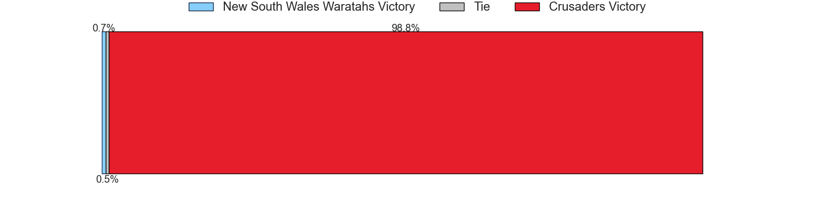

---  
layout: page  
title: New South Wales Waratahs at Crusaders; 18.0-42.0  
date: 2023-05-27 00:35:00 18:00:00 -0500  
categories: match review  
---
# New South Wales Waratahs at Crusaders; 18.0-42.0

# Club Level Predictions

The first set of predictions treats a club as the smallest object, as the club develops its members, organizes a gameplan, and deploys its players as needed for each match. This club model has a prediction of 0.856, which translates to predicting Crusaders to win by 16.0.

Each club has a rating and a rating deviation (simiar to a Glicko system), and expected performances can be generated. This allows for simulated matches and spreads like the ones below.
## Projected Performances

## Projected Spreads

## Projected Results

# Player Level Predictions

Treating teams instead as an entity made up of the currently active players, I have ratings for each player in an altogether different system. These can be combined to form team ratings once teamsheets are announced, weighting starters a bit higher than the reserves. After the match is played, players can be weighted by their minutes on the field, allowing for an accurate measure of the team's composition. With these compiled team ratings, we can make predictions, measure inaccuracy, and update the individual player ratings.
## Prediction with Player Minutes: Crusaders by 15.7

Crusaders by 11.7 on a neutral field

There were 5 large changes in win probability in this match
## Prediction without Player Minutes: Crusaders by 11.9

Crusaders by 7.9 on a neutral pitch

|   Away Minutes | Away Player          |   Away elo |   Away Percentile |   Number |   Home Percentile |   Home elo | Home Player            |   Home Minutes |
|---------------:|:---------------------|-----------:|------------------:|---------:|------------------:|-----------:|:-----------------------|---------------:|
|             45 | Tetera Faulkner      |      93.41 |                82 |        1 |                77 |      90.14 | Kershawl Sykes-Martin  |             57 |
|             58 | Dave Porecki         |     107.76 |                94 |        2 |                81 |      92.99 | Codie Taylor           |             57 |
|             58 | Harry Johnson-Holmes |      87.16 |                71 |        3 |                88 |      97.32 | Tamaiti Williams       |             80 |
|             46 | Jed Holloway         |      76.79 |                47 |        4 |                43 |      74.93 | Quinten Strange        |             80 |
|             80 | Hugh Sinclair        |      98.53 |                85 |        5 |                94 |     110.95 | Sam Whitelock          |             80 |
|             58 | Taleni Seu           |      87.27 |                70 |        6 |                58 |      81.63 | Christian Lio-Willie   |             61 |
|             80 | Charlie Gamble       |      86.97 |                67 |        7 |                87 |     101.32 | Tom Christie           |             80 |
|             80 | Langi Gleeson        |      85.5  |                65 |        8 |                96 |     114.64 | Cullen Grace           |             12 |
|             58 | Jake Gordon          |     109.34 |                93 |        9 |                65 |      87.34 | Mitchell Drummond      |             48 |
|             61 | Ben Donaldson        |      84    |                60 |       10 |                99 |     141.03 | Richie Mo'unga         |             80 |
|             80 | Dylan Pietsch        |     106.19 |                92 |       11 |                87 |     102.72 | Dallas McLeod          |             80 |
|             80 | Mosese Tuipulotu     |      90.41 |               nan |       12 |                95 |     113.95 | David Havili           |             66 |
|             80 | Joey Walton          |      84.01 |                61 |       13 |                51 |      78.24 | Leicester Fainga'anuku |             80 |
|             80 | Mark Nawaqanitawase  |      93.51 |                78 |       14 |                93 |     109.17 | Chay Fihaki            |             80 |
|             11 | Max Jorgensen        |     109.51 |                90 |       15 |                57 |      82.95 | Fergus Burke           |             74 |
|             22 | Mahe Vailanu         |      49.15 |                 6 |       16 |                92 |     104.7  | Brodie McAlister       |             23 |
|             35 | Tom Lambert          |      96.42 |                87 |       17 |               nan |      95.66 | Seb Calder             |             23 |
|             22 | Nephi Leatigaga      |      73.89 |               nan |       18 |               nan |      85.62 | Reuben O'Neill         |             31 |
|             34 | Ned Hanigan          |      98.01 |                84 |       19 |                73 |      90.36 | Zach Gallagher         |             19 |
|             22 | Will Harris          |      95.38 |                82 |       20 |                45 |      75.48 | Sione Havili           |             68 |
|             22 | Harrison Goddard     |      86.3  |               nan |       21 |                86 |     101.13 | Noah Hotham            |             32 |
|             19 | Tane Edmed           |      83.91 |                58 |       22 |                77 |      92.81 | Pepesana Patafilo      |              6 |
|             69 | Harry Wilson         |      87.12 |                61 |       23 |                26 |      66.96 | Willi Gualter          |             14 |

