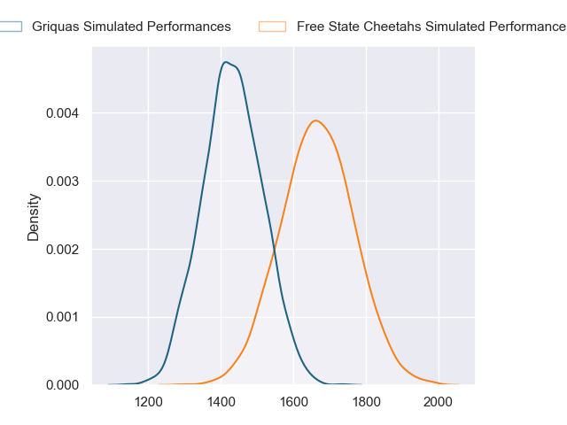
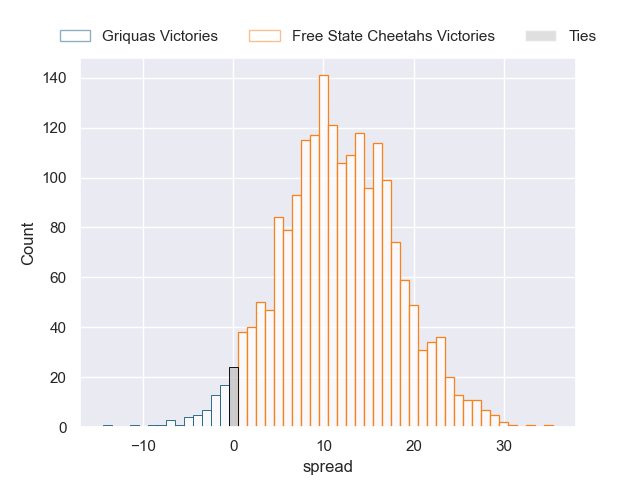
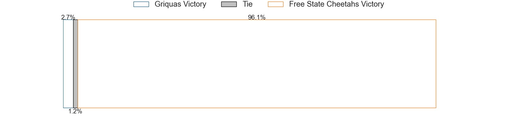

---  
layout: page  
title: Griquas at Free State Cheetahs; 29-29  
date: 2023-05-27 13:30:00 18:00:00 -0500  
categories: match review  
---
# Griquas at Free State Cheetahs; 29-29

# Club Level Predictions

The first set of predictions treats a club as the smallest object, as the club develops its members, organizes a gameplan, and deploys its players as needed for each match. This club model has a prediction of 0.793, which translates to predicting Free State Cheetahs to win by 12.0.

Each club has a rating and a rating deviation (simiar to a Glicko system), and expected performances can be generated. This allows for simulated matches and spreads like the ones below.
## Projected Performances

## Projected Spreads

## Projected Results

# Player Level Predictions

Treating teams instead as an entity made up of the currently active players, I have ratings for each player in an altogether different system. These can be combined to form team ratings once teamsheets are announced, weighting starters a bit higher than the reserves. After the match is played, players can be weighted by their minutes on the field, allowing for an accurate measure of the team's composition. With these compiled team ratings, we can make predictions, measure inaccuracy, and update the individual player ratings.
## Prediction with Player Minutes: Free State Cheetahs by 2.4

Griquas by 1.6 on a neutral field

There were 4 large changes in win probability in this match
## Prediction without Player Minutes: Free State Cheetahs by 2.5

Griquas by 1.5 on a neutral pitch

|   Away Minutes | Away Player                |   Away elo |   Away Percentile |   Number |   Home Percentile |   Home elo | Home Player              |   Home Minutes |
|---------------:|:---------------------------|-----------:|------------------:|---------:|------------------:|-----------:|:-------------------------|---------------:|
|             58 | Kudzwai Dube               |      77.76 |                50 |        1 |                31 |      69.77 | Schalk Ferreira          |             52 |
|             80 | Janco Uys                  |      69.68 |                35 |        2 |                83 |      94.96 | Marnus van der Merwe     |             55 |
|             24 | Janu Botha                 |      75.59 |                45 |        3 |                60 |      81.13 | Laurence Herbert Victor  |             80 |
|             69 | Dylan Sjoblom              |      76.03 |                45 |        4 |                15 |      60.08 | Rynier Mark Bernardo     |             55 |
|             80 | Derrick Pretorius          |      68.11 |                28 |        5 |                29 |      68.65 | Victor Kutlwano Sekekete |             80 |
|             52 | Thabo Ndimande             |      83.24 |                61 |        6 |                 7 |      52.09 | Gideon van der Merwe     |             52 |
|             80 | Hanru Sirgel               |      90.63 |                76 |        7 |                37 |      72.02 | Sibabalo Qoma            |             68 |
|             80 | Carl Els                   |      69.67 |                30 |        8 |                95 |     113.7  | Friedle Olivier          |             80 |
|             80 | Johan Mulder               |      73.26 |                39 |        9 |                70 |      87.15 | Rewan Kruger             |             80 |
|             80 | Lubabalo Dobela            |      84.23 |                59 |       10 |                32 |      70.29 | Ruan Pienaar             |             80 |
|             80 | Luther Obi                 |      74.96 |                43 |       11 |                43 |      75.18 | Cohen Jasper             |             80 |
|             80 | Tertius Kruger             |      78.27 |                49 |       12 |                11 |      51.01 | Evardi Boshoff           |             79 |
|             65 | Jay Cee Nel                |     102.87 |                87 |       13 |                41 |      74.15 | David Benjamin Brits     |             80 |
|             80 | Rosco Shane Specman        |      68.73 |                30 |       14 |                43 |      75.45 | Daniel Kasende Kalepula  |             80 |
|             80 | George Alexander Whitehead |      77.53 |                48 |       15 |                37 |      72.91 | Tapiwa Lloyd Mafura      |             80 |
|             56 | Cebolenkosi Dlamini        |      77.29 |                48 |       16 |                76 |      82.94 | Alulutho Tshakweni       |             28 |
|             28 | Stephan Smit               |      64.83 |                20 |       17 |                87 |      98.23 | Daniel Johannes Maartens |             28 |
|             22 | Justin Forwood             |      78.21 |                51 |       18 |                56 |      79.34 | Louis van der Westhuizen |             25 |
|             15 | Sango (Saida) Xamlashe     |      72.7  |                37 |       19 |                55 |      80.86 | George Cronje            |             25 |
|             11 | Johan Retief               |      65.67 |                21 |       20 |                58 |      82.38 | Anidisa Ntsila           |             12 |
|            nan | nan                        |     nan    |               nan |       21 |                27 |      67.46 | Robert Thompson Ebersohn |              1 |

