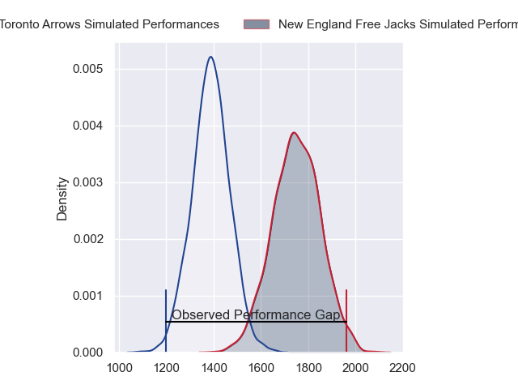
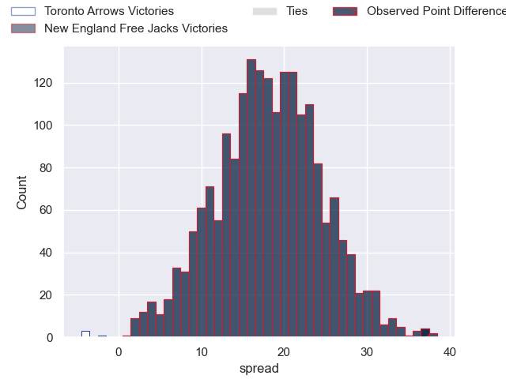
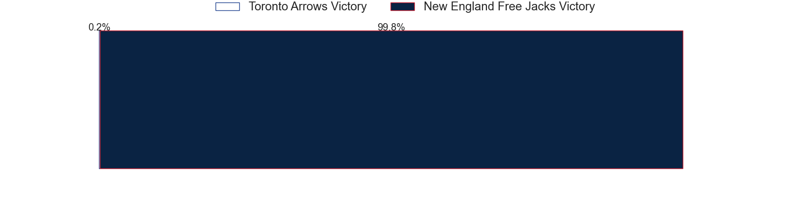

---  
layout: page  
title: Toronto Arrows at New England Free Jacks  
date: 2023-05-27 18:00:00 -0500  
categories: match review  
---
# Toronto Arrows at New England Free Jacks

# Club Level Predictions

The first set of predictions treats a club as the smallest object, as the club develops its members, organizes a gameplan, and deploys its players as needed for each match. This club model has a prediction of 0.882, which translates to predicting New England Free Jacks to win by 18.0.

Each club has a rating and a rating deviation (simiar to a Glicko system), and expected performances can be generated. This allows for simulated matches and spreads like the ones below.
## Projected Performances

## Projected Spreads

## Projected Results

# Player Level Predictions

Treating teams instead as an entity made up of the currently active players, I have ratings for each player in an altogether different system. These can be combined to form team ratings once teamsheets are announced, weighting starters a bit higher than the reserves. After the match is played, players can be weighted by their minutes on the field, allowing for an accurate measure of the team's composition. With these compiled team ratings, we can make predictions, measure inaccuracy, and update the individual player ratings.
## Prediction with Player Minutes: New England Free Jacks by 5.7

New England Free Jacks by 2.6 on a neutral field
## Prediction without Player Minutes: New England Free Jacks by 11.3

New England Free Jacks by 8.2 on a neutral pitch

|   Away Minutes | Away Player      |   Away elo |   Away variance |   Number |   Home variance |   Home elo | Home Player        |   Home Minutes |
|---------------:|:-----------------|-----------:|----------------:|---------:|----------------:|-----------:|:-------------------|---------------:|
|             67 | Connor Grindal   |      43.95 |           49.91 |        1 |           49.67 |      46.87 | Kianu Kereru-Symes |             49 |
|             45 | Ramon Ayarza     |      28.58 |           49.24 |        2 |           49.53 |      54.96 | Millenium Sanerivi |             49 |
|             60 | Tyler Rowland    |      39.36 |           49.54 |        3 |           49.73 |      67.17 | Tevita Sole        |             49 |
|             51 | Mason Flesch     |     -32.69 |           49.15 |        4 |           49.41 |      69.2  | Semisi Paea        |             52 |
|             80 | Shay Kerry       |      41.63 |           49.43 |        5 |           49.69 |      50.13 | Reegan O'Gorman    |             80 |
|             80 | Lucas Rumball    |      34.76 |           48.8  |        6 |           48.91 |      55.35 | Mitchell Jacobson  |             80 |
|             54 | Owain Ruttan     |      44    |           49.62 |        7 |           49.7  |      49.32 | Slade McDowall     |             80 |
|             80 | Travis Larsen    |       1.04 |           49.9  |        8 |           48.93 |      64.84 | Wian Conradie      |             57 |
|             60 | Will Grant       |      43.93 |           49.77 |        9 |           49.67 |      48.36 | Kieran McClea      |             60 |
|             44 | Peter Nelson     |      44.65 |           49.9  |       10 |           48.92 |      64.89 | Jayson Potroz      |             60 |
|             80 | Kobe Faust       |      24.74 |           49.07 |       11 |           49.62 |      48.71 | Taniela Filimone   |             80 |
|             80 | Dawson Fatoric   |      42.14 |           49.41 |       11 |           49.62 |      48.71 | Taniela Filimone   |             80 |
|             80 | Kobe Faust       |      24.74 |           49.07 |       11 |           49.62 |      48.71 | Taniela Filimone   |             80 |
|             80 | Liam Bowman      |      46.65 |           50    |       12 |           49.4  |      53.81 | Le Roux Malan      |             80 |
|             71 | Tautalatasi Tasi |      44.71 |           50    |       13 |           48.9  |      63.8  | Ben Lesage         |             57 |
|             80 | Kobe Faust       |      24.74 |           49.07 |       14 |           49.28 |      -8.86 | Mitchell Wilson    |             80 |
|             80 | Ciaran Breen     |      38.9  |           50    |       14 |           49.28 |      -8.86 | Mitchell Wilson    |             80 |
|             80 | Kobe Faust       |      24.74 |           49.07 |       14 |           49.28 |      -8.86 | Mitchell Wilson    |             80 |
|             80 | Ciaran Breen     |      38.9  |           50    |       14 |           49.28 |      -8.86 | Mitchell Wilson    |             80 |
|             80 | Shane O'Leary    |      42.64 |           49.31 |       15 |           49.7  |      43.7  | Beaudein Waaka     |             80 |
|             13 | Nik Hildebrand   |      40.61 |           49.81 |       16 |           49.24 |      25.49 | Kyle Ciquera       |             31 |
|             35 | Jack McRogers    |      13.51 |           49.86 |       17 |           49.49 |      56.41 | Andrew Quattrin    |             31 |
|             20 | Conan O'Donnell  |      43.59 |           50    |       18 |           49.95 |      46.85 | Conor Young        |             31 |
|             29 | Hank Stevenson   |      48.07 |           49.78 |       19 |           48.96 |      64.96 | Conor Keys         |             28 |
|             26 | James O'Neill    |      46.99 |           49.19 |       20 |           49.74 |      -1.1  | Cam Davidowicz     |             23 |
|             20 | Cole Brown       |     -15.92 |           50    |       21 |           49.68 |      -5.47 | Holden Yungert     |             20 |
|             36 | D'Shawn Bowen    |      42.99 |           49.25 |       22 |           49.76 |      59.08 | Isaac Olson        |             20 |
|              9 | Ciaran Breen     |      38.9  |           50    |       23 |           49.36 |      47.5  | Spencer Jones      |             23 |
|              9 | Ciaran Breen     |      38.9  |           50    |       23 |           49.36 |      47.5  | Spencer Jones      |             23 |

