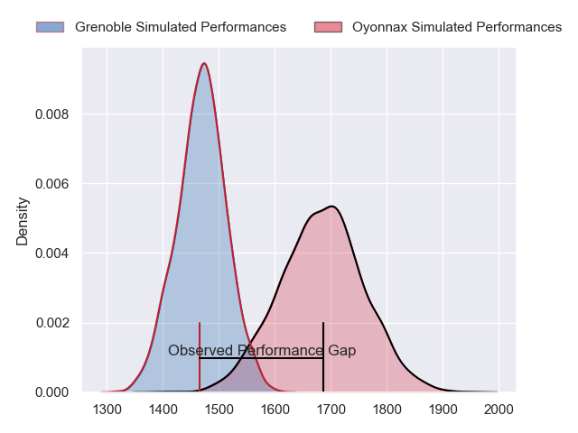
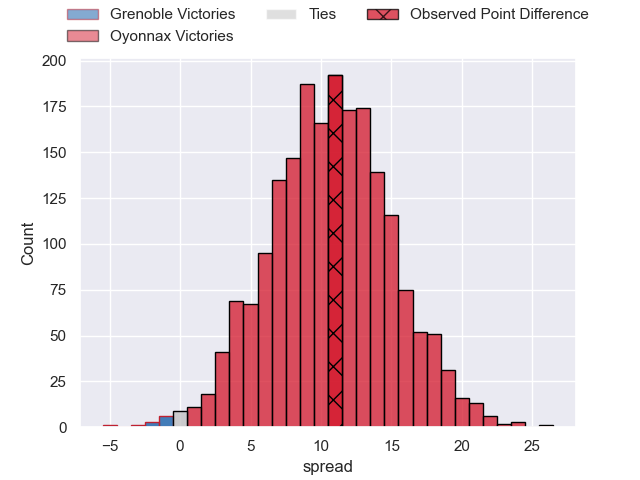
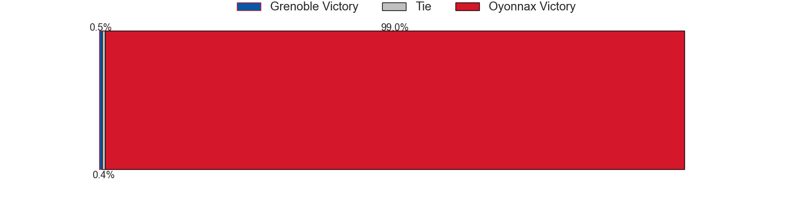

---  
layout: page  
title: Grenoble at Oyonnax; 3-14  
date: 2023-05-27 21:00:00 18:00:00 -0500  
categories: match review  
---
# Grenoble at Oyonnax; 3-14

# Club Level Predictions

The first set of predictions treats a club as the smallest object, as the club develops its members, organizes a gameplan, and deploys its players as needed for each match. This club model has a prediction of 0.771, which translates to predicting Oyonnax to win by 10.7.

Each club has a rating and a rating deviation (simiar to a Glicko system), and expected performances can be generated. This allows for simulated matches and spreads like the ones below.
## Projected Performances

## Projected Spreads

## Projected Results

# Player Level Predictions

Treating teams instead as an entity made up of the currently active players, I have ratings for each player in an altogether different system. These can be combined to form team ratings once teamsheets are announced, weighting starters a bit higher than the reserves. After the match is played, players can be weighted by their minutes on the field, allowing for an accurate measure of the team's composition. With these compiled team ratings, we can make predictions, measure inaccuracy, and update the individual player ratings.
## Prediction with Player Minutes: Oyonnax by 5.6

Oyonnax by 1.6 on a neutral field

There were 8 large changes in win probability in this match
## Prediction without Player Minutes: Grenoble by 4.9

Grenoble by 8.9 on a neutral pitch

|   Away Minutes | Away Player         |   Away elo |   Away Percentile |   Number |   Home Percentile |   Home elo | Home Player         |   Home Minutes |
|---------------:|:--------------------|-----------:|------------------:|---------:|------------------:|-----------:|:--------------------|---------------:|
|             52 | Luka Goginava       |      81.56 |                60 |        1 |                63 |      82.97 | Tommy Raynaud       |             66 |
|             60 | Jean-Charles Orioli |      82.74 |                62 |        2 |                 7 |      50.08 | Teddy Durand        |             43 |
|             52 | Irakli Aptsiauri    |      80.79 |                58 |        3 |                61 |      81.82 | Thomas Laclayat     |             80 |
|             49 | Thomas Lainault     |     125.3  |                97 |        4 |                53 |      79.66 | Phoenix Battye      |             31 |
|             54 | Tanginoa Halaifonua |      79.2  |                52 |        5 |                51 |      78.82 | Hugo Fabregue       |             80 |
|             57 | Thibaut Martel      |      74.13 |                42 |        6 |                96 |     119.43 | Kevin Lebreton      |             80 |
|             80 | Steeve Blanc-Mappaz |      89.02 |                74 |        7 |                93 |     107.48 | Loïc Credoz         |             80 |
|             80 | Pio Muarua          |     118.25 |                96 |        8 |                55 |      81.08 | Rory Grice          |             80 |
|             60 | Éric Escande        |      89.19 |                70 |        9 |                63 |      84.97 | Charlie Cassang     |             80 |
|             66 | Thomas Fortunel     |      88.73 |                66 |       10 |                82 |     100.91 | Jules Soulan        |             64 |
|             80 | Lucas Dupont        |      84.05 |                63 |       11 |                90 |     105.92 | Aurelien Callandret |             80 |
|             80 | Romain Barthélémy   |      81.3  |                56 |       12 |                66 |      86.86 | Théo Millet         |             80 |
|             80 | Romain Trouilloud   |      90.76 |                72 |       13 |                59 |      83.2  | Chris Farrell       |             80 |
|             80 | Karim Qadiri        |      69.88 |                32 |       14 |                43 |      74.74 | Gavin Stark         |             80 |
|             80 | Julien Farnoux      |      88.25 |                65 |       15 |                58 |      84.64 | Darren Sweetnam     |             80 |
|             28 | Zack Gauthier       |     107.22 |                94 |       16 |                60 |      83.39 | Steve Mafi          |             49 |
|             28 | Regis Montagne      |      93.43 |                83 |       17 |                72 |      85.57 | Benjamin Geledan    |             37 |
|             31 | José Duarte Madeira |      59.01 |                13 |       18 |                64 |      83.87 | Antoine Abraham     |             14 |
|             26 | Talalelei Gray      |      69.99 |                30 |       19 |                75 |      93.8  | Justin Bouraux      |             16 |
|             23 | Antonin Berruyer    |      93.7  |                79 |       20 |               nan |     nan    | nan                 |            nan |
|             20 | Mathis Sarragallet  |      60.44 |                16 |       21 |               nan |     nan    | nan                 |            nan |
|             20 | Bautista Ezcurra    |      72.91 |                38 |       22 |               nan |     nan    | nan                 |            nan |
|             14 | Romain Fusier       |      91.91 |                73 |       23 |               nan |     nan    | nan                 |            nan |

