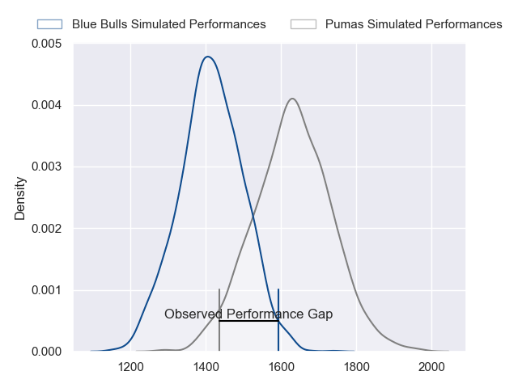
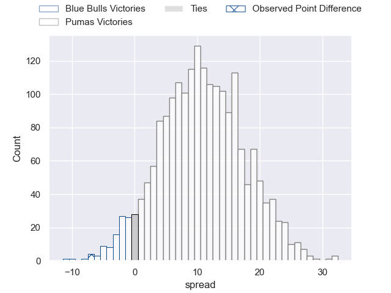
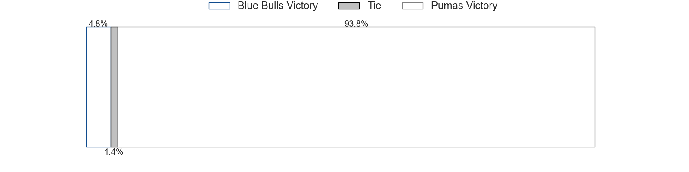

---  
layout: page  
title: Blue Bulls at Pumas; 24-17  
date: 2023-05-27 15:30:00 18:00:00 -0500  
categories: match review  
---
# Blue Bulls at Pumas; 24-17

# Club Level Predictions

The first set of predictions treats a club as the smallest object, as the club develops its members, organizes a gameplan, and deploys its players as needed for each match. This club model has a prediction of 0.766, which translates to predicting Pumas to win by 10.7.

Each club has a rating and a rating deviation (simiar to a Glicko system), and expected performances can be generated. This allows for simulated matches and spreads like the ones below.
## Projected Performances

## Projected Spreads

## Projected Results

# Player Level Predictions

Treating teams instead as an entity made up of the currently active players, I have ratings for each player in an altogether different system. These can be combined to form team ratings once teamsheets are announced, weighting starters a bit higher than the reserves. After the match is played, players can be weighted by their minutes on the field, allowing for an accurate measure of the team's composition. With these compiled team ratings, we can make predictions, measure inaccuracy, and update the individual player ratings.
## Prediction with Player Minutes: Pumas by 1.5

Blue Bulls by 2.5 on a neutral field

There were 10 large changes in win probability in this match
## Prediction without Player Minutes: Blue Bulls by 2.3

Blue Bulls by 6.3 on a neutral pitch

|   Away Minutes | Away Player                  |   Away elo |   Away Percentile |   Number |   Home Percentile |   Home elo | Home Player           |   Home Minutes |
|---------------:|:-----------------------------|-----------:|------------------:|---------:|------------------:|-----------:|:----------------------|---------------:|
|             60 | Gerhardus Cornelis Steenkamp |      87.91 |                73 |        1 |                53 |      78.83 | Cameron Dawson        |             52 |
|             40 | Cornelis Johannes Grobbelaar |      91.15 |                79 |        2 |                48 |      76.93 | Corne Fourie          |             60 |
|             40 | Mornay Jan Jakobus Smith     |      91.09 |                79 |        3 |                27 |      67.72 | Njabula Juice Gumede  |             46 |
|             56 | Ruan Vermaak                 |      82.51 |                58 |        4 |                24 |      65.98 | Deon Slabbert         |             60 |
|             80 | Ruan Nortje                  |      94.79 |                80 |        5 |                92 |     108.37 | Shane Monro Kirkwood  |             80 |
|             80 | Marcell Coetzee              |      81.82 |                58 |        6 |                20 |      63.48 | Andre Fouché          |             80 |
|             80 | Nizaam Carr                  |      78.72 |                52 |        7 |                43 |      74.78 | Francois Kleinhans    |             44 |
|             67 | Elrigh Louw                  |      95.55 |                81 |        8 |                77 |      92.53 | Kwanda Dimaza         |             60 |
|             67 | Embrose Cheldon Papier       |      77.44 |                47 |        9 |                12 |      62.68 | Giovanne Snyman       |             80 |
|             80 | Johannes Lodewikus Goosen    |      65.32 |                23 |       10 |                86 |     102.28 | Tinus de Beer         |             73 |
|             69 | Marco Jansen van Vuuren      |      68.44 |                30 |       11 |                78 |      94.69 | Etienne Taljaard      |             80 |
|             80 | Harold William Vorster       |      89.94 |                70 |       12 |                61 |      84    | Wian van Niekerk      |             80 |
|             80 | Stedman-Gee Rivett Gans      |      91.28 |                73 |       13 |                51 |      79.41 | Diego Appollis        |             80 |
|             56 | Sibongile Vukile Novuka      |      81.08 |                57 |       14 |                59 |      81.84 | Andrew Kota           |             80 |
|             80 | David Kriel                  |      88.32 |                65 |       15 |                44 |      77.35 | Devon Frank Williams  |             80 |
|             40 | Francois Klopper             |      66.51 |                28 |       16 |                25 |      66.14 | Jaco Labuschagne      |             36 |
|             40 | Jan Hendrik Wessels          |      56.66 |                14 |       17 |               nan |      53.39 | Simon Raw             |             34 |
|             24 | Charlie Ewels                |      58.5  |                14 |       18 |               nan |      87.01 | PJ Jacobs             |             28 |
|             24 | Chris Smit                   |      78.85 |                50 |       19 |                36 |      73.35 | Ruwald Van der Merwe  |             20 |
|             20 | Simphiwe Matanzima           |      72.42 |                37 |       20 |                44 |      75.84 | Malembe Mpofu         |             20 |
|             13 | Keagan Johannes              |      88.02 |                71 |       21 |               nan |      77.21 | Dewald Maritz         |             20 |
|             13 | WJ Steenkamp                 |      69.79 |                30 |       22 |                39 |      74.69 | Brandon Terry Thomson |              7 |
|             11 | Cornal Hendricks             |      83.25 |                65 |       23 |               nan |     nan    | nan                   |            nan |

