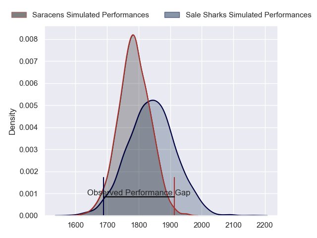
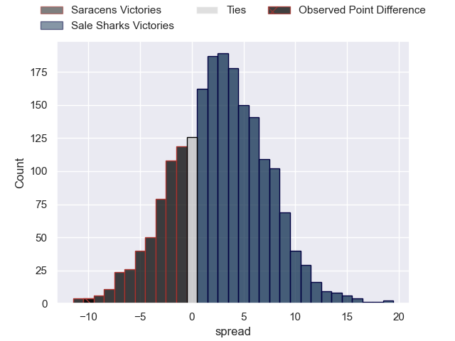

---  
layout: page  
title: Saracens at Sale Sharks; 35.0-25.0  
date: 2023-05-27 10:00:00 18:00:00 -0500  
categories: match review  
---
# Saracens at Sale Sharks; 35.0-25.0

# Club Level Predictions

The first set of predictions treats a club as the smallest object, as the club develops its members, organizes a gameplan, and deploys its players as needed for each match. This club model has a prediction of 0.575, which translates to predicting Sale Sharks to win by 2.7.

Each club has a rating and a rating deviation (simiar to a Glicko system), and expected performances can be generated. This allows for simulated matches and spreads like the ones below.
## Projected Performances

## Projected Spreads

## Projected Results

# Player Level Predictions

Treating teams instead as an entity made up of the currently active players, I have ratings for each player in an altogether different system. These can be combined to form team ratings once teamsheets are announced, weighting starters a bit higher than the reserves. After the match is played, players can be weighted by their minutes on the field, allowing for an accurate measure of the team's composition. With these compiled team ratings, we can make predictions, measure inaccuracy, and update the individual player ratings.
## Prediction with Player Minutes: Saracens by 3.1

Saracens by 7.1 on a neutral field

There were 10 large changes in win probability in this match
## Prediction without Player Minutes: Saracens by 3.6

Saracens by 7.6 on a neutral pitch

|   Away Minutes | Away Player        |   Away elo |   Away Percentile |   Number |   Home Percentile |   Home elo | Home Player         |   Home Minutes |
|---------------:|:-------------------|-----------:|------------------:|---------:|------------------:|-----------:|:--------------------|---------------:|
|             55 | Eroni Mawi         |      41.51 |                 1 |        1 |                93 |     104.5  | Simon McIntyre      |             46 |
|             11 | Jamie George       |     133.36 |               100 |        2 |                84 |      96.5  | Akker van der Merwe |             46 |
|             73 | Marco Riccioni     |      74.87 |                43 |        3 |                55 |      79.78 | Nic Schonert        |             46 |
|             80 | Maro Itoje         |      98.08 |                84 |        4 |                91 |     106.05 | Jean-Luc du Preez   |             73 |
|             62 | Hugh Tizard        |      59.74 |                15 |        5 |                65 |      84.71 | Jonny Hill          |             80 |
|             80 | Nick Isiekwe       |      85.78 |                67 |        6 |                40 |      73.37 | Tom Curry           |             80 |
|             80 | Ben Earl           |     105.42 |                91 |        7 |                68 |      86.12 | Sam Dugdale         |             73 |
|             76 | Jackson Wray       |     124.17 |                98 |        8 |                68 |      86.91 | Jono Ross           |             80 |
|             74 | Ivan van Zyl       |     121.28 |                98 |        9 |                81 |      96.72 | Gus Warr            |             51 |
|             80 | Owen Farrell       |     135.07 |                98 |       10 |                93 |     112.71 | George Ford         |             80 |
|             21 | Sean Maitland      |     115.98 |                96 |       11 |                91 |     105.92 | Arron Reed          |             80 |
|             80 | Nick Tompkins      |     144.63 |                99 |       12 |                93 |     109.98 | Manu Tuilagi        |             68 |
|             63 | Alex Lozowski      |      88.06 |                68 |       13 |                77 |      93.99 | Robert du Preez     |             80 |
|             80 | Max Malins         |      82.14 |                58 |       14 |                91 |     105.48 | Tom Roebuck         |             51 |
|             80 | Alex Goode         |     124.34 |                96 |       15 |                47 |      79.05 | Joe Carpenter       |             80 |
|             69 | Theo Dan           |      90.16 |                77 |       16 |                85 |      97.08 | Ewan Ashman         |             34 |
|             29 | Robin Hislop       |      87.12 |                69 |       17 |                92 |     103.79 | Bevan Rodd          |             34 |
|              7 | Christian Judge    |      80.62 |                57 |       18 |                95 |     109.56 | Coenie Oosthuizen   |             34 |
|             18 | Callum Hunter-Hill |      82.82 |                57 |       19 |                90 |     106.01 | Josh Beaumont       |              7 |
|              0 | Toby Knight        |      77.55 |                49 |       20 |                15 |      61.1  | Tom Ellis           |              7 |
|              6 | Aled Davies        |      90.53 |                74 |       21 |                90 |     105.3  | Raffi Quirke        |             29 |
|             17 | Duncan Taylor      |      99.01 |                83 |       22 |                97 |     126.25 | Sam James           |             12 |
|             59 | Elliot Daly        |     103.99 |                87 |       23 |                85 |     100.18 | Tom O'Flaherty      |             29 |

