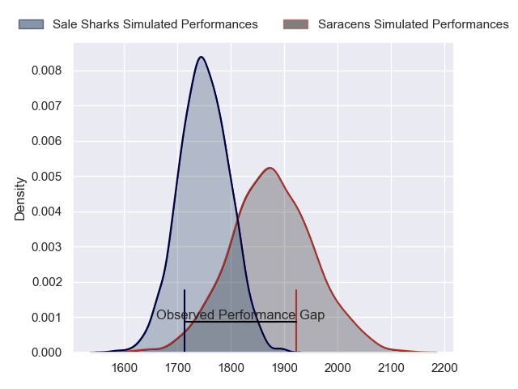
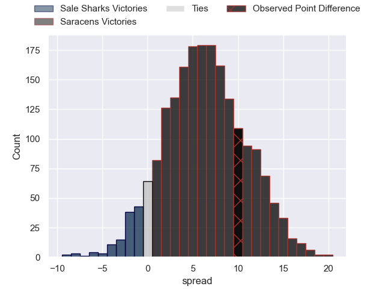

---  
layout: page  
title: Sale Sharks at Saracens; 25-35  
date: 2023-05-27 16:00:00 18:00:00 -0500  
categories: match review  
---
# Sale Sharks at Saracens; 25-35

# Club Level Predictions

The first set of predictions treats a club as the smallest object, as the club develops its members, organizes a gameplan, and deploys its players as needed for each match. This club model has a prediction of 0.673, which translates to predicting Saracens to win by 6.3.

Each club has a rating and a rating deviation (simiar to a Glicko system), and expected performances can be generated. This allows for simulated matches and spreads like the ones below.
## Projected Performances

## Projected Spreads

## Projected Results

# Player Level Predictions

Treating teams instead as an entity made up of the currently active players, I have ratings for each player in an altogether different system. These can be combined to form team ratings once teamsheets are announced, weighting starters a bit higher than the reserves. After the match is played, players can be weighted by their minutes on the field, allowing for an accurate measure of the team's composition. With these compiled team ratings, we can make predictions, measure inaccuracy, and update the individual player ratings.
## Prediction with Player Minutes: Saracens by 17.5

Saracens by 13.5 on a neutral field

There were 8 large changes in win probability in this match
## Prediction without Player Minutes: Saracens by 15.7

Saracens by 11.7 on a neutral pitch

|   Away Minutes | Away Player         |   Away elo |   Away Percentile |   Number |   Home Percentile |   Home elo | Home Player        |   Home Minutes |
|---------------:|:--------------------|-----------:|------------------:|---------:|------------------:|-----------:|:-------------------|---------------:|
|             45 | Simon McIntyre      |     102.75 |                91 |        1 |                 2 |      42.78 | Eroni Mawi         |             50 |
|             45 | Akker van der Merwe |      96.24 |                84 |        2 |               100 |     134.22 | Jamie George       |             10 |
|             45 | Nic Schonert        |      79.41 |                54 |        3 |                46 |      76.47 | Marco Riccioni     |             72 |
|             72 | Jean-Luc du Preez   |     105.55 |                90 |        4 |                85 |      99.67 | Maro Itoje         |             80 |
|             80 | Jonny Hill          |      84.12 |                62 |        5 |                25 |      66.38 | Hugh Tizard        |             61 |
|             80 | Tom Curry           |      72.71 |                39 |        6 |                70 |      87.03 | Nick Isiekwe       |             80 |
|             72 | Sam Dugdale         |      81.79 |                59 |        7 |                92 |     106.83 | Ben Earl           |             80 |
|             80 | Jono Ross           |      84.88 |                63 |        8 |                99 |     129.53 | Jackson Wray       |             80 |
|             50 | Gus Warr            |      94.54 |                79 |        9 |                98 |     122.53 | Ivan van Zyl       |             73 |
|             80 | George Ford         |     112.28 |                93 |       10 |                98 |     136.65 | Owen Farrell       |             80 |
|             80 | Arron Reed          |     102.91 |                88 |       11 |                96 |     116.89 | Sean Maitland      |             20 |
|             67 | Manu Tuilagi        |     109.67 |                93 |       12 |                99 |     145.84 | Nick Tompkins      |             80 |
|             80 | Robert du Preez     |      93.43 |                76 |       13 |                70 |      89.34 | Alex Lozowski      |             62 |
|             50 | Tom Roebuck         |     104.11 |                90 |       14 |                61 |      83.58 | Max Malins         |             80 |
|             80 | Joe Carpenter       |      75.91 |                43 |       15 |                96 |     125.81 | Alex Goode         |             80 |
|             35 | Bevan Rodd          |     103.55 |                92 |       16 |               nan |      96.34 | Robin Hislop       |             30 |
|             35 | Ewan Ashman         |      96.61 |                85 |       17 |                77 |      94.51 | Theo Dan           |             70 |
|             35 | Coenie Oosthuizen   |     109.37 |                95 |       18 |                65 |      84.63 | Christian Judge    |              8 |
|              8 | Tom Ellis           |      88.85 |               nan |       19 |                66 |      88.36 | Callum Hunter-Hill |             19 |
|              8 | Josh Beaumont       |      82.9  |               nan |       20 |               nan |      94.37 | Aled Davies        |              7 |
|             30 | Raffi Quirke        |     105.13 |                90 |       21 |                88 |     105.03 | Elliot Daly        |             60 |
|             13 | Luke James          |      90.04 |               nan |       22 |                83 |      99.27 | Duncan Taylor      |             18 |
|             30 | Tom O'Flaherty      |      98.4  |                85 |       23 |               nan |     nan    | nan                |            nan |

