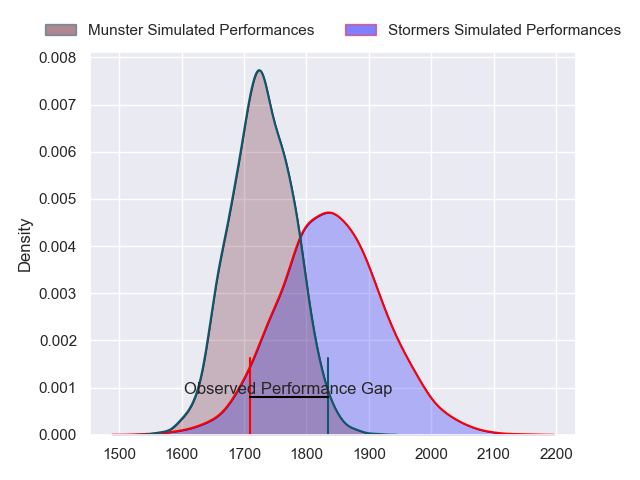
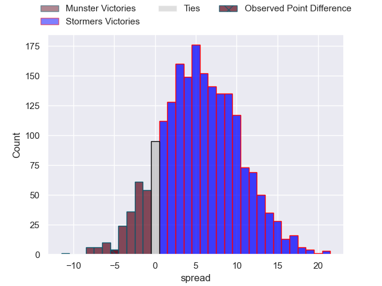
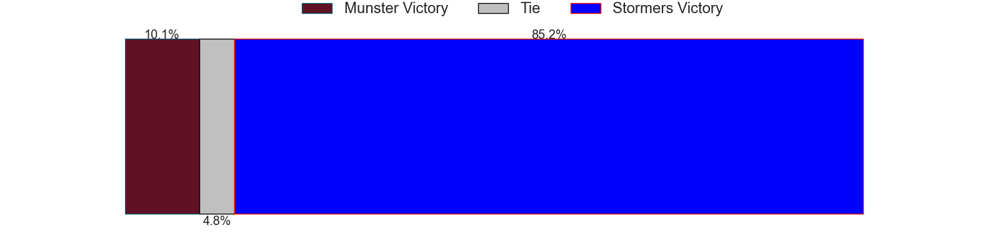

---  
layout: page  
title: Munster at Stormers; 19-14  
date: 2023-05-27 18:30:00 18:00:00 -0500  
categories: match review  
---
# Munster at Stormers; 19-14

# Club Level Predictions

The first set of predictions treats a club as the smallest object, as the club develops its members, organizes a gameplan, and deploys its players as needed for each match. This club model has a prediction of 0.649, which translates to predicting Stormers to win by 5.4.

Each club has a rating and a rating deviation (simiar to a Glicko system), and expected performances can be generated. This allows for simulated matches and spreads like the ones below.
## Projected Performances

## Projected Spreads

## Projected Results

# Player Level Predictions

Treating teams instead as an entity made up of the currently active players, I have ratings for each player in an altogether different system. These can be combined to form team ratings once teamsheets are announced, weighting starters a bit higher than the reserves. After the match is played, players can be weighted by their minutes on the field, allowing for an accurate measure of the team's composition. With these compiled team ratings, we can make predictions, measure inaccuracy, and update the individual player ratings.
## Prediction with Player Minutes: Stormers by 0.6

Munster by 3.4 on a neutral field

There were 6 large changes in win probability in this match
## Prediction without Player Minutes: Munster by 4.0

Munster by 8.0 on a neutral pitch

|   Away Minutes | Away Player              |   Away elo |   Away Percentile |   Number |   Home Percentile |   Home elo | Home Player                  |   Home Minutes |
|---------------:|:-------------------------|-----------:|------------------:|---------:|------------------:|-----------:|:-----------------------------|---------------:|
|             61 | Jeremy Loughman          |      95.91 |                85 |        1 |                84 |      94.48 | Steven Kitshoff              |             71 |
|             61 | Diarmuid Barron          |     105.26 |                92 |        2 |                76 |      89.47 | Joseph Dweba                 |             61 |
|             61 | Stephen Archer           |     101.25 |                90 |        3 |                75 |      88.99 | Jozua Francois Malherbe      |             61 |
|             68 | Jean Kleyn               |      93.37 |                78 |        4 |                62 |      84.11 | Ruben van Heerden            |             80 |
|             80 | Tadhg Beirne             |      95.11 |                81 |        5 |                70 |      88.67 | Marvin Orie                  |             80 |
|             33 | Peter O'Mahony           |      65.18 |                24 |        6 |                81 |      94.01 | Deon Fourie                  |             56 |
|             80 | John Hodnett             |      86.67 |                69 |        7 |                76 |      91.05 | Hacjivah Dayimani            |             48 |
|             80 | Gavin Coombes            |     101.17 |                87 |        8 |                75 |      91.65 | Evan Roos                    |             80 |
|             65 | Conor Murray             |     130.21 |                99 |        9 |                74 |      91.61 | Herschel Jerome Jantjies     |             65 |
|             80 | Jack Crowley             |      93.1  |                75 |       10 |                83 |      98.95 | Immanuel Libbok              |             80 |
|             80 | Shane Daly               |      81.81 |                58 |       11 |                76 |      92.42 | Leolin Lucien Zas            |             80 |
|             80 | Malakai Fekitoa          |      87.64 |                67 |       12 |                80 |      97.02 | Daniel Michael du Plessis    |             80 |
|             61 | Antoine Frisch           |      98.5  |                82 |       13 |                48 |      77.14 | Adriaan Ruhan Nel            |             80 |
|             69 | Calvin Nash              |      94.69 |                79 |       14 |                96 |     118.4  | Angelo Davids                |             80 |
|             80 | Michael Haley            |      97.44 |                79 |       15 |                79 |      97.87 | Damian Willemse              |             80 |
|             47 | Rudolph Gerhardus Snyman |      85.01 |                64 |       16 |                89 |     103.43 | Ben-Jason Dixon              |             32 |
|             19 | Niall Scannell           |      82.12 |                46 |       17 |                62 |      83.38 | Willem Gerhardus Engelbrecht |             24 |
|             19 | Ben Healy                |      85.14 |                60 |       18 |                46 |      79.5  | Johan Neethling Fouche       |             19 |
|             19 | Roman Salanoa            |     103.46 |                88 |       19 |                47 |      80.25 | JJ Kotze                     |             19 |
|             19 | Fineen Wycherley         |      95.15 |                65 |       20 |                53 |      80.8  | Albertus Paul de Wet         |             15 |
|             15 | Craig Casey              |      97.5  |                82 |       21 |                36 |      72.84 | Alistair Fernando Vermaak    |              9 |
|             12 | Alex Kendellen           |      91.99 |                74 |       22 |               nan |     nan    | nan                          |            nan |
|             11 | Keith Earls              |      85.72 |                66 |       23 |               nan |     nan    | nan                          |            nan |

