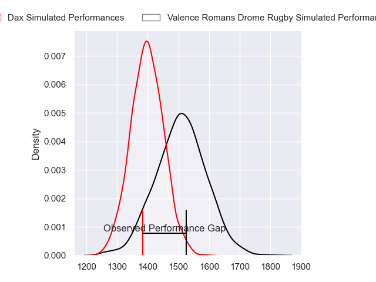
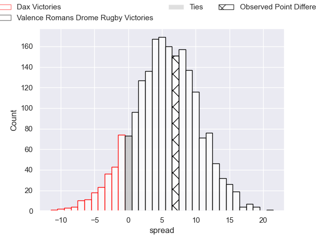
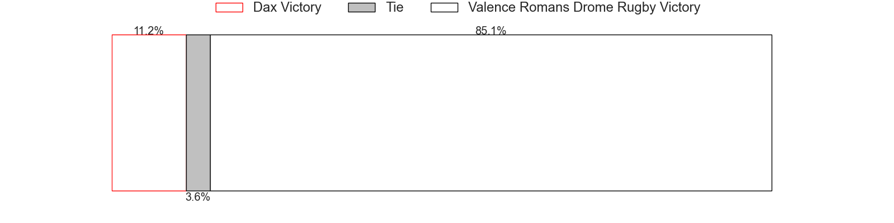

---  
layout: page  
title: Dax at Valence Romans Drome Rugby; 19-26  
date: 2023-05-27 17:00:00 18:00:00 -0500  
categories: match review  
---
# Dax at Valence Romans Drome Rugby; 19-26

# Club Level Predictions

The first set of predictions treats a club as the smallest object, as the club develops its members, organizes a gameplan, and deploys its players as needed for each match. This club model has a prediction of 0.649, which translates to predicting Valence Romans Drome Rugby to win by 5.4.

Each club has a rating and a rating deviation (simiar to a Glicko system), and expected performances can be generated. This allows for simulated matches and spreads like the ones below.
## Projected Performances

## Projected Spreads

## Projected Results

# Player Level Predictions

Treating teams instead as an entity made up of the currently active players, I have ratings for each player in an altogether different system. These can be combined to form team ratings once teamsheets are announced, weighting starters a bit higher than the reserves. After the match is played, players can be weighted by their minutes on the field, allowing for an accurate measure of the team's composition. With these compiled team ratings, we can make predictions, measure inaccuracy, and update the individual player ratings.
## Prediction with Player Minutes: Valence Romans Drome Rugby by 1.4

Dax by 2.6 on a neutral field

There were 8 large changes in win probability in this match
## Prediction without Player Minutes: Valence Romans Drome Rugby by 1.5

Dax by 2.5 on a neutral pitch

|   Away Minutes | Away Player          |   Away elo |   Away Percentile |   Number |   Home Percentile |   Home elo | Home Player                   |   Home Minutes |
|---------------:|:---------------------|-----------:|------------------:|---------:|------------------:|-----------:|:------------------------------|---------------:|
|             47 | Louis Mary           |      90.33 |                77 |        1 |                23 |      65.63 | Sami Zouhair                  |             49 |
|             47 | Louis Barrere        |      84.43 |                66 |        2 |                88 |     101.1  | Dorian Marco Pena             |             44 |
|             47 | Thibaud Dréan        |      90.21 |                77 |        3 |                49 |      76.95 | John Henry Fincham            |             49 |
|             47 | Mattieu Bidau        |      59.85 |                15 |        4 |                23 |      65.17 | François Uys                  |             80 |
|             80 | Étienne Loiret       |      80.97 |                56 |        5 |                24 |      65.67 | John Adriaan (Ian) Groenewald |             47 |
|             80 | Arnaud Aletti        |      98.59 |                86 |        6 |                79 |      92.25 | Alexis Armary                 |             80 |
|             57 | Jean Despiau         |      72.09 |                37 |        7 |                69 |      86.56 | Sven Bernat Girlando          |             47 |
|             80 | Brice Ferrer         |      78.76 |                49 |        8 |                52 |      80.14 | Ioane Iashagashvili           |             80 |
|             80 | Simon Garrouteigt    |      86.04 |                65 |        9 |                 3 |      46.97 | Tim Menzel                    |             80 |
|             41 | Hugo Cerisier        |      76.71 |                44 |       10 |                78 |      95.52 | Joris Moura                   |             52 |
|             80 | Rodrigo Marta        |      78.54 |                50 |       11 |                48 |      77.2  | Mason Emerson                 |             80 |
|             80 | Ilikena Bolakoro     |      80.95 |                55 |       12 |                88 |     104.26 | Ben Neiceru                   |             65 |
|             80 | Sylvère Reteau       |      74.32 |                50 |       13 |                45 |      76.4  | Charles Bouldoire             |             80 |
|             63 | Guillaume Bouche     |     113.17 |                96 |       14 |                57 |      80.77 | Adam Vargas                   |             80 |
|             80 | Théo Gatelier        |      79.51 |                54 |       15 |                42 |      76.05 | Quentin Gobet                 |             80 |
|             33 | Joaquin Rodon        |      74.12 |                36 |       16 |                78 |      90    | Anthony Aléo                  |             31 |
|             33 | Elvis Levi           |      99.18 |                88 |       17 |                75 |      88.64 | Yanis Gimenez                 |             36 |
|             33 | Diogo Hasse Ferreira |      73.87 |                40 |       18 |                49 |      77.07 | Kevin Goze                    |             31 |
|             33 | Matt Luamanu         |      81.15 |                63 |       19 |                95 |     114.48 | Darrell Dyer                  |             33 |
|             23 | Théo Tremeau         |      45.55 |                 4 |       20 |                 5 |      47.95 | Matthew Gicquel               |             33 |
|             39 | Gaëtan Robert        |      47.96 |                 5 |       21 |                26 |      68.31 | Lucas Méret                   |             28 |
|             17 | Julien Dechavanne    |      51.54 |                 9 |       22 |                60 |      83.02 | Akuila Joeli Tabualevu        |             15 |

