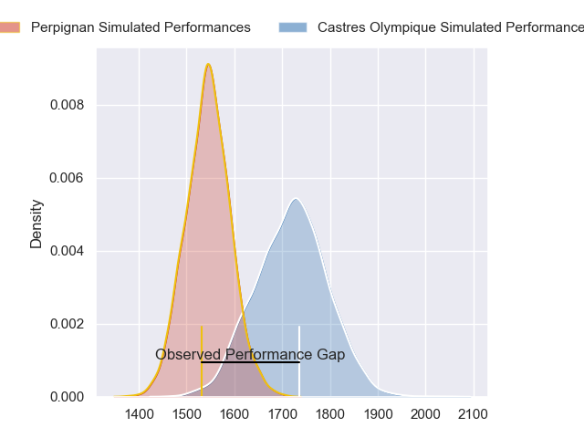
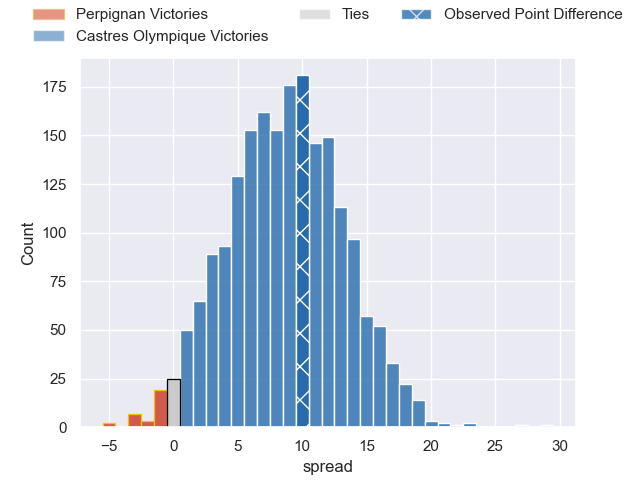
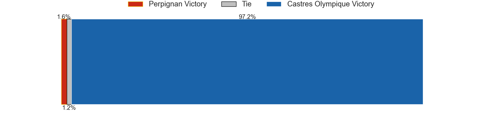

---  
layout: page  
title: Perpignan at Castres Olympique; 16-26  
date: 2023-05-28 21:05:00 18:00:00 -0500  
categories: match review  
---
# Perpignan at Castres Olympique; 16-26

# Club Level Predictions

The first set of predictions treats a club as the smallest object, as the club develops its members, organizes a gameplan, and deploys its players as needed for each match. This club model has a prediction of 0.728, which translates to predicting Castres Olympique to win by 8.6.

Each club has a rating and a rating deviation (simiar to a Glicko system), and expected performances can be generated. This allows for simulated matches and spreads like the ones below.
## Projected Performances

## Projected Spreads

## Projected Results

# Player Level Predictions

Treating teams instead as an entity made up of the currently active players, I have ratings for each player in an altogether different system. These can be combined to form team ratings once teamsheets are announced, weighting starters a bit higher than the reserves. After the match is played, players can be weighted by their minutes on the field, allowing for an accurate measure of the team's composition. With these compiled team ratings, we can make predictions, measure inaccuracy, and update the individual player ratings.
## Prediction with Player Minutes: Perpignan by 0.7

Perpignan by 4.7 on a neutral field

There were 12 large changes in win probability in this match
## Prediction without Player Minutes: Perpignan by 0.9

Perpignan by 4.9 on a neutral pitch

|   Away Minutes | Away Player               |   Away elo |   Away Percentile |   Number |   Home Percentile |   Home elo | Home Player          |   Home Minutes |
|---------------:|:--------------------------|-----------:|------------------:|---------:|------------------:|-----------:|:---------------------|---------------:|
|             54 | Sacha Lotrian             |      88.24 |                70 |        1 |                51 |      77.64 | Quentin Walcker      |             55 |
|             60 | Victor Montgaillard       |      76.58 |                47 |        2 |                36 |      71.25 | Pierre Colonna       |             51 |
|             54 | Ma'afu Fia                |      76.54 |                46 |        3 |                38 |      71.54 | Wilfried Hounkpatin  |             60 |
|             60 | Shahn Eru                 |      69.55 |               nan |        4 |                25 |      66.39 | Florent Vanverberghe |             80 |
|             49 | Piula Fa'asalele          |      77.11 |                43 |        5 |                62 |      82.82 | Leone Nakarawa       |             23 |
|             80 | Lucas Velarte             |      77.26 |                43 |        6 |                30 |      68.72 | Mathieu Babillot     |             60 |
|             80 | Alan Brazo                |      74.42 |                43 |        7 |                55 |      78.59 | Baptiste Delaporte   |             80 |
|             49 | Genesis Mamea Lemalu      |      72.81 |                35 |        8 |                60 |      82.63 | Baptiste Cope        |             80 |
|             80 | Tom Ecochard              |      75.91 |                44 |        9 |                35 |      72.17 | Jeremy Fernandez     |             79 |
|             40 | Tristan Tedder            |      84.43 |                57 |       10 |                58 |      84.4  | Benjamin Urdapilleta |             80 |
|             80 | Mathieu Acebes            |      82.6  |                60 |       11 |                25 |      66.1  | Josaia Raisuqe       |             80 |
|             80 | George Tilsley            |      81.78 |                58 |       12 |                40 |      73.63 | Adrea Cocagi         |             55 |
|             60 | Edward Sawailau           |      90.25 |                71 |       13 |                53 |      80.12 | Adrien Seguret       |             80 |
|             80 | Théo Forner               |      92.44 |                76 |       14 |                46 |      78.77 | Geoffrey Palis       |             80 |
|             80 | Boris Goutard             |      50.98 |                 8 |       15 |                43 |      76.12 | Julien Dumora        |             60 |
|             40 | Matteo Rodor              |      86    |                62 |       16 |                58 |      83.67 | Brice Humbert        |             29 |
|             31 | Joaquin Oviedo            |      85.06 |                64 |       17 |                52 |      78.75 | Antoine Tichit       |             25 |
|             31 | Tristan Labouteley        |      81.95 |                57 |       18 |                36 |      72.38 | Vilimoni Botitu      |             25 |
|             26 | Akato Fakatika            |      92.24 |                78 |       19 |               nan |      70.8  | Gauthier Maravat     |             20 |
|             26 | Siua Halanukonuka         |      73.28 |               nan |       20 |                53 |      79.08 | Antoine Zeghdar      |             20 |
|             20 | Seilala Lam               |      73.07 |                40 |       21 |                53 |      79.92 | Kevin Kornath        |             57 |
|             20 | Alvereti Freddy Duguivalu |      76.15 |               nan |       22 |                37 |      72.58 | Aurélien Azar        |             20 |
|             20 | Posolo Tuilagi            |     100.88 |                87 |       23 |               nan |      73.57 | Julien Blanc         |              1 |

