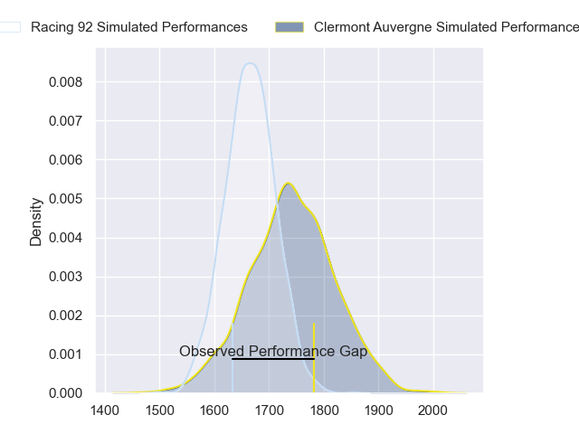
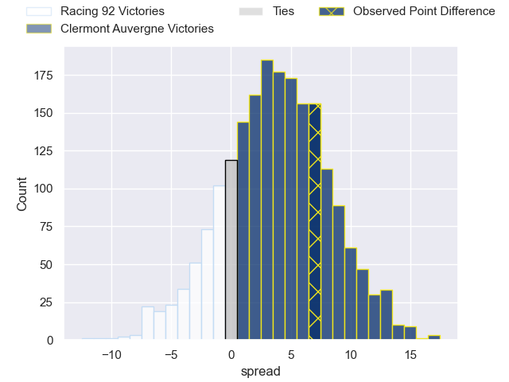
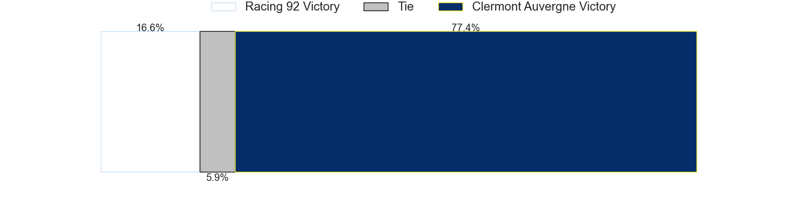

---  
layout: page  
title: Racing 92 at Clermont Auvergne; 25-32  
date: 2023-05-28 21:05:00 18:00:00 -0500  
categories: match review  
---
# Racing 92 at Clermont Auvergne; 25-32

# Club Level Predictions

The first set of predictions treats a club as the smallest object, as the club develops its members, organizes a gameplan, and deploys its players as needed for each match. This club model has a prediction of 0.609, which translates to predicting Clermont Auvergne to win by 3.9.

Each club has a rating and a rating deviation (simiar to a Glicko system), and expected performances can be generated. This allows for simulated matches and spreads like the ones below.
## Projected Performances

## Projected Spreads

## Projected Results

# Player Level Predictions

Treating teams instead as an entity made up of the currently active players, I have ratings for each player in an altogether different system. These can be combined to form team ratings once teamsheets are announced, weighting starters a bit higher than the reserves. After the match is played, players can be weighted by their minutes on the field, allowing for an accurate measure of the team's composition. With these compiled team ratings, we can make predictions, measure inaccuracy, and update the individual player ratings.
## Prediction with Player Minutes: Clermont Auvergne by 5.0

Clermont Auvergne by 1.0 on a neutral field

There were 6 large changes in win probability in this match
## Prediction without Player Minutes: Clermont Auvergne by 4.1

Clermont Auvergne by 0.1 on a neutral pitch

|   Away Minutes | Away Player           |   Away elo |   Away Percentile |   Number |   Home Percentile |   Home elo | Home Player         |   Home Minutes |
|---------------:|:----------------------|-----------:|------------------:|---------:|------------------:|-----------:|:--------------------|---------------:|
|             52 | Eddy Ben Arous        |      76.29 |                23 |        1 |                35 |      71.88 | Etienne Falgoux     |             68 |
|             52 | Camille Chat          |      76.09 |                46 |        2 |                41 |      73.15 | Étienne Fourcade    |             80 |
|             52 | Trevor Ntando Nyakane |      82.56 |                62 |        3 |                38 |      73.2  | Rabah Slimani       |             78 |
|             52 | Boris Palu            |      64.41 |               nan |        4 |                51 |      78.78 | Thibault Lanen      |             53 |
|             80 | Veikoso Poloniati     |      72.37 |                35 |        5 |                63 |      84.76 | Tomas Lavanini      |             80 |
|             80 | Wenceslas Lauret      |      67.79 |                19 |        6 |                25 |      66.01 | Arthur Iturria      |             80 |
|             80 | Cameron Woki          |      71.37 |                30 |        7 |                37 |      71.93 | Judicael Cancoriet  |             80 |
|             80 | Kitione Kamikamica    |      85.26 |                64 |        8 |                42 |      75.21 | Fritz Lee           |             53 |
|             49 | Teddy Iribaren        |      72.68 |               nan |        9 |                60 |      83.02 | Baptiste Jauneau    |             80 |
|             59 | Antoine Gibert        |      74.67 |                33 |       10 |                25 |      66.99 | Jules Plisson       |             60 |
|             80 | Juan Imhoff           |      81.2  |                57 |       11 |                18 |      61.35 | Alivereti Raka      |             80 |
|             80 | Francis Saili         |      75.54 |                39 |       12 |                56 |      81.29 | George Moala        |             80 |
|             59 | Olivier Klemenczak    |      62.74 |                19 |       13 |                27 |      67.58 | Irae Simone         |             80 |
|             80 | Donovan Taofifenua    |      56.7  |                12 |       14 |                79 |      94.29 | Damian Penaud       |             68 |
|             80 | Warrick Wayne Gelant  |      66.46 |                16 |       15 |                36 |      72.45 | Alex Newsome        |             80 |
|             31 | Nolann Le Garrec      |      88.47 |                69 |       16 |                50 |      77.65 | Lucas Dessaigne     |             27 |
|             28 | Janick Tarrit         |      70.37 |                32 |       17 |                37 |      73.01 | Paul Jedrasiak      |             27 |
|             28 | Thomas Moukoro        |      83.03 |                67 |       18 |                54 |      79.05 | Anthony Belleau     |             20 |
|             28 | Cedate Gomes Sa       |      72.85 |               nan |       19 |                37 |      70.36 | Giorgi Beria        |             12 |
|             28 | Fabien Sanconnie      |      87.02 |                68 |       20 |                55 |      79.94 | Bautista Delguy     |             12 |
|             21 | Gael Fickou           |      98.92 |                83 |       21 |                70 |      85.35 | Giorgi Dzmanashvili |              2 |
|             21 | Finn Russell          |      92.39 |                73 |       22 |               nan |     nan    | nan                 |            nan |

