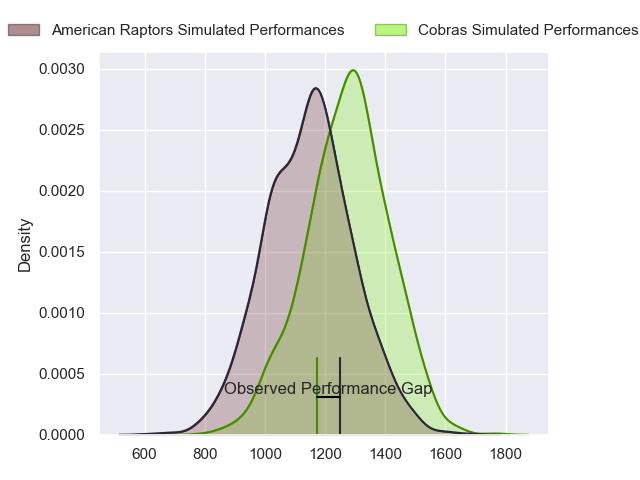
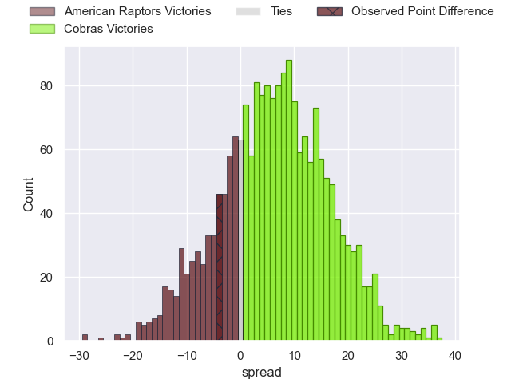

---  
layout: page  
title: American Raptors at Cobras; 38-34  
date: 2023-05-28 17:00:00 18:00:00 -0500  
categories: match review  
---
# American Raptors at Cobras; 38-34

# Club Level Predictions

The first set of predictions treats a club as the smallest object, as the club develops its members, organizes a gameplan, and deploys its players as needed for each match. This club model has a prediction of 0.657, which translates to predicting Cobras to win by 6.2.

Each club has a rating and a rating deviation (simiar to a Glicko system), and expected performances can be generated. This allows for simulated matches and spreads like the ones below.
## Projected Performances

## Projected Spreads

## Projected Results

# Player Level Predictions

Treating teams instead as an entity made up of the currently active players, I have ratings for each player in an altogether different system. These can be combined to form team ratings once teamsheets are announced, weighting starters a bit higher than the reserves. After the match is played, players can be weighted by their minutes on the field, allowing for an accurate measure of the team's composition. With these compiled team ratings, we can make predictions, measure inaccuracy, and update the individual player ratings.
## Prediction with Player Minutes: American Raptors by 1.5

American Raptors by 5.5 on a neutral field

There were 4 large changes in win probability in this match
## Prediction without Player Minutes: American Raptors by 1.5

American Raptors by 5.5 on a neutral pitch

|   Away Minutes | Away Player              |   Away elo |   Away Percentile |   Number |   Home Percentile |   Home elo | Home Player                   |   Home Minutes |
|---------------:|:-------------------------|-----------:|------------------:|---------:|------------------:|-----------:|:------------------------------|---------------:|
|             80 | Payton Telea-Ilalio      |      62.03 |                17 |        1 |                 2 |      43.66 | Levy Marinho                  |             80 |
|             80 | Diego Fortuny            |      67.84 |                31 |        2 |                 4 |      45.83 | Endy Willian                  |             80 |
|             80 | Ma'ake Muti              |      56.08 |                10 |        3 |                 6 |      51.97 | Henrique Ribeiro Ferreira     |             80 |
|             80 | Diego Magno              |      48.29 |                 5 |        4 |                 8 |      52.01 | Gabriel Paganini              |             80 |
|             80 | Will Crawford            |      29    |                 0 |        5 |                25 |      63.08 | Ben Donald                    |             80 |
|             80 | Shawn Clark              |      45.95 |                 4 |        6 |                 5 |      47.3  | Adrio Luiz de Melo            |             80 |
|             80 | Tommy Clark              |      69.62 |                26 |        7 |                 5 |      48.18 | Matheus Claudio               |             80 |
|             80 | Ronan Murphy             |      59.1  |                15 |        8 |                15 |      58.91 | Andre Arruda                  |             80 |
|             80 | Ethan McVeigh            |      74.75 |                45 |        9 |                10 |      55.97 | Douglas Rauth                 |             80 |
|             80 | Lucas Gonzalez Amorosino |      52.5  |                 8 |       10 |                 7 |      51.03 | Lucas Ferrer Spago            |             80 |
|             80 | Ramiro Moyano            |      42.69 |                 3 |       11 |                 5 |      45.85 | Alain Andres Altahona Fulleda |             80 |
|             80 | Aki Pulu                 |      60.12 |                16 |       12 |                10 |      55.02 | Victor Silva                  |             80 |
|             80 | Watson Filikitonga       |      49.27 |                 5 |       13 |                 5 |      48.91 | Robson Alves de Morais        |             80 |
|             80 | Ryan James               |      47.94 |                 6 |       14 |                16 |      59.45 | Ariel Rodrigues               |             80 |
|             80 | Line Latu                |      53.72 |                10 |       15 |                 2 |      36.94 | Daniel Lima                   |             80 |

