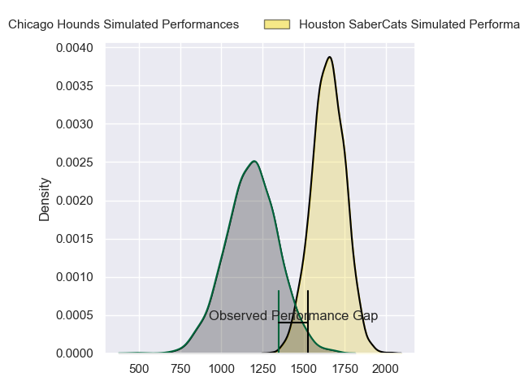
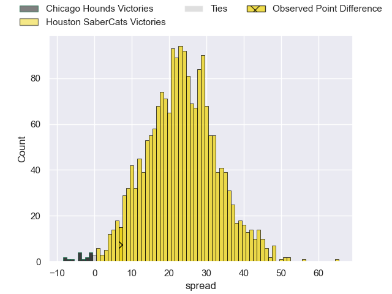
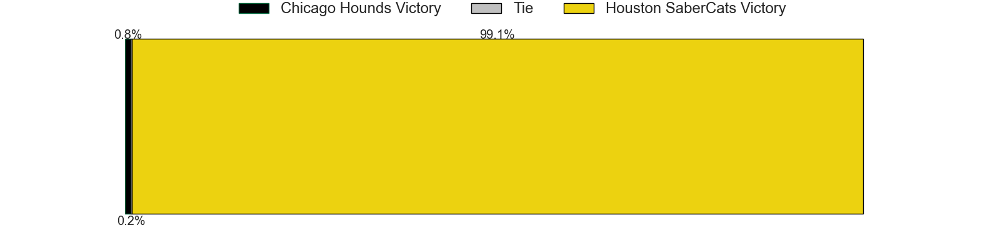

---  
layout: page  
title: Chicago Hounds at Houston SaberCats  
date: 2023-05-28 18:00:00 -0500  
categories: match review  
---
# Chicago Hounds at Houston SaberCats

# Club Level Predictions

The first set of predictions treats a club as the smallest object, as the club develops its members, organizes a gameplan, and deploys its players as needed for each match. This club model has a prediction of 0.912, which translates to predicting Houston SaberCats to win by 22.8.

Each club has a rating and a rating deviation (simiar to a Glicko system), and expected performances can be generated. This allows for simulated matches and spreads like the ones below.
## Projected Performances

## Projected Spreads

## Projected Results

# Player Level Predictions

Treating teams instead as an entity made up of the currently active players, I have ratings for each player in an altogether different system. These can be combined to form team ratings once teamsheets are announced, weighting starters a bit higher than the reserves. After the match is played, players can be weighted by their minutes on the field, allowing for an accurate measure of the team's composition. With these compiled team ratings, we can make predictions, measure inaccuracy, and update the individual player ratings.
## Prediction with Player Minutes: Houston SaberCats by 20.6

Houston SaberCats by 17.4 on a neutral field
## Prediction without Player Minutes: Houston SaberCats by 20.6

Houston SaberCats by 17.4 on a neutral pitch

|   Away Minutes | Away Player      |   Away elo |   Away variance |   Number |   Home variance |   Home elo | Home Player              |   Home Minutes |
|---------------:|:-----------------|-----------:|----------------:|---------:|----------------:|-----------:|:-------------------------|---------------:|
|             80 | George Thornton  |      30.92 |           49.14 |        1 |           49.3  |      50.17 | Rob Cobb                 |             80 |
|             80 | Lindsey Stevens  |      33.39 |           49.57 |        2 |           49.82 |      43.58 | Joseph Taufete'e         |             80 |
|             80 | Paddy Ryan       |      37.41 |           49.73 |        3 |           49.56 |      57.79 | Pono Davis               |             80 |
|             80 | John Cullen      |     -52.4  |           49.55 |        4 |           48.66 |      47.69 | Marno Redelinghuys       |             80 |
|             80 | Cam Dodson       |      54.26 |           47.38 |        5 |           48.38 |      41.63 | Nathan Den Hoedt         |             80 |
|             80 | Mike Matarazzo   |     -71.01 |           49.13 |        6 |           49.58 |      48.73 | Malon Maurice Al-Jiboori |             80 |
|             80 | Maclean Jones    |      29.55 |           49.21 |        7 |           49.01 |      46.89 | Wynand Grassmann         |             80 |
|             80 | Luke White       |      -6.27 |           48.88 |        8 |           49.39 |      55.89 | Gideon van Wyk           |             80 |
|             80 | Sean Yacoubian   |      44.64 |           49.71 |        9 |           50    |      46.65 | Dillon Smit              |             80 |
|             80 | Luke Carty       |      29.82 |           49.26 |       10 |           50    |      46.65 | Robert Povey             |             80 |
|             80 | Julian Dominguez |      28.43 |           49.3  |       11 |           49.45 |      52.63 | Vereniki Tikoisolomone   |             80 |
|             80 | Bill Meakes      |      27.35 |           49.04 |       12 |           48.84 |      62.16 | Louritz van der Schyff   |             80 |
|             80 | Bryce Campbell   |      28.96 |           49.11 |       13 |           48.34 |      54.8  | Dominic Akina            |             80 |
|             80 | Matai Leuta      |      44.97 |           49.92 |       14 |           48.89 |      50.56 | Christian Dyer           |             80 |
|             80 | Chris Mattina    |      74.14 |           48.72 |       15 |           49.21 |      49.73 | Drew Wild                |             80 |

