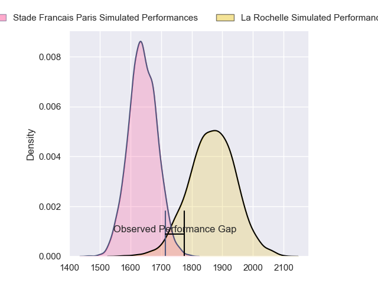
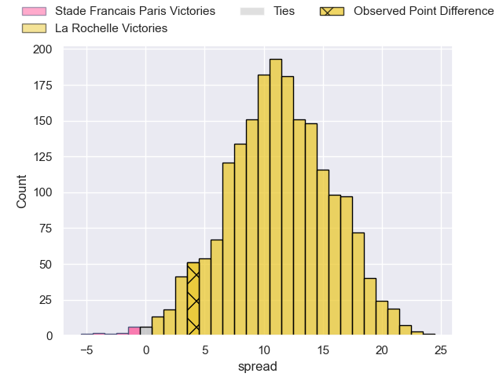
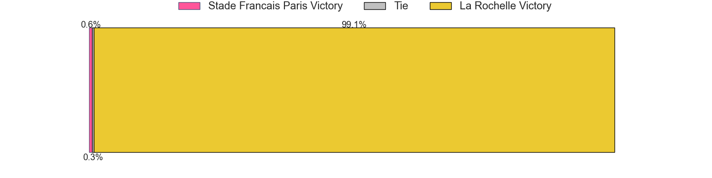

---  
layout: page  
title: Stade Francais Paris at La Rochelle; 10-14  
date: 2023-05-28 21:05:00 18:00:00 -0500  
categories: match review  
---
# Stade Francais Paris at La Rochelle; 10-14

# Club Level Predictions

The first set of predictions treats a club as the smallest object, as the club develops its members, organizes a gameplan, and deploys its players as needed for each match. This club model has a prediction of 0.786, which translates to predicting La Rochelle to win by 11.4.

Each club has a rating and a rating deviation (simiar to a Glicko system), and expected performances can be generated. This allows for simulated matches and spreads like the ones below.
## Projected Performances

## Projected Spreads

## Projected Results

# Player Level Predictions

Treating teams instead as an entity made up of the currently active players, I have ratings for each player in an altogether different system. These can be combined to form team ratings once teamsheets are announced, weighting starters a bit higher than the reserves. After the match is played, players can be weighted by their minutes on the field, allowing for an accurate measure of the team's composition. With these compiled team ratings, we can make predictions, measure inaccuracy, and update the individual player ratings.
## Prediction with Player Minutes: La Rochelle by 22.5

La Rochelle by 18.5 on a neutral field

There were 9 large changes in win probability in this match
## Prediction without Player Minutes: La Rochelle by 22.7

La Rochelle by 18.7 on a neutral pitch

|   Away Minutes | Away Player            |   Away elo |   Away Percentile |   Number |   Home Percentile |   Home elo | Home Player              |   Home Minutes |
|---------------:|:-----------------------|-----------:|------------------:|---------:|------------------:|-----------:|:-------------------------|---------------:|
|             57 | Vasil Kakovin          |      66.75 |                20 |        1 |                88 |      92.84 | Hayden Thompson-Stringer |             50 |
|             47 | Lucas Peyresblanques   |      68.62 |                32 |        2 |                67 |      84.97 | Samuel Lagrange          |             53 |
|             47 | Vincent Philip Koch    |      70.28 |                24 |        3 |                77 |      83.83 | Aleksandre Kuntelia      |             53 |
|             47 | Pierre-Henri Azagoh    |      69.05 |                32 |        4 |               nan |      82.86 | Thomas Ployet            |             80 |
|             80 | Sitakeli Timani        |      66.03 |               nan |        5 |                20 |      63.6  | Rémi Picquette           |             80 |
|             80 | Julien Ory             |      65.88 |               nan |        6 |                39 |      73.13 | Kyle Hatherell           |             80 |
|             49 | Mathieu Hirigoyen      |      72.62 |                38 |        7 |                34 |      71.35 | Rémi Bourdeau            |             50 |
|             80 | Giovanni Habel Kuffner |      73.59 |                38 |        8 |                46 |      76.92 | Yoan Tanga Mangene       |             36 |
|             56 | Morgan Parra           |      62.2  |                18 |        9 |                51 |      78.72 | Jules Le Bail            |             55 |
|             50 | Léo Barré              |      64.39 |                22 |       10 |                45 |      77.27 | Hugo Reus                |             80 |
|             80 | Lester Etien           |      71.98 |                37 |       11 |                54 |      79.46 | Martin Alonso Munoz      |             80 |
|             64 | Alex Arrate            |      63.98 |                21 |       12 |                81 |      97.7  | Jules Favre              |             80 |
|             80 | Paolo Odogwu           |      69.21 |                28 |       13 |                43 |      75.18 | Victor Olivier           |             80 |
|             80 | Nadir Megdoud          |      66.96 |                27 |       14 |                77 |      92.8  | Pierre Boudehent         |             53 |
|             80 | Kylan Hamdaoui         |      78.11 |                45 |       15 |               nan |      78.83 | Thibault Rabourdin       |             64 |
|             33 | Laurent Panis          |      66.4  |                24 |       16 |               nan |      94.98 | Noé Della Schiava        |             44 |
|             33 | Mathieu De Giovanni    |      65.73 |               nan |       17 |                58 |      80.69 | Thierry Paiva            |             30 |
|             33 | Giorgi Melikidze       |      62.96 |                21 |       18 |               nan |      78.64 | Oscar Jegou              |             30 |
|             31 | Ryan Chapuis           |      68.79 |                26 |       19 |               nan |      83.44 | Sacha Idoumi             |             27 |
|             30 | Joris Segonds          |      76.71 |                45 |       20 |               nan |      78.46 | Léo Aouf                 |             27 |
|             24 | Arthur Coville         |      81.69 |                56 |       21 |               nan |      82.66 | Hoani Bosmorin           |             27 |
|             23 | Nemo Gunther Roelofse  |      65.21 |               nan |       22 |               nan |      88.38 | Lucas Zamora             |             25 |
|             16 | Sefanaia Naivalu       |      70.69 |                33 |       23 |                82 |      98.79 | Harry Glynn              |             16 |

