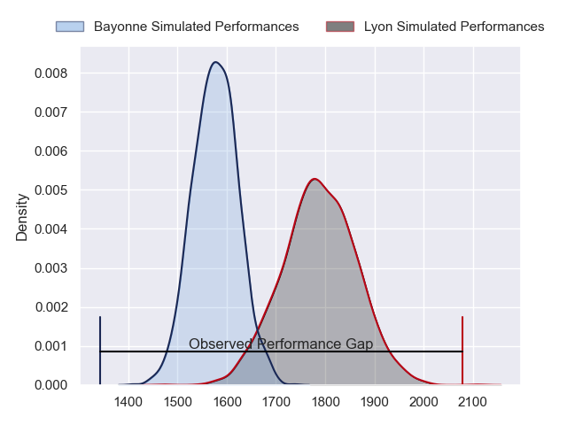
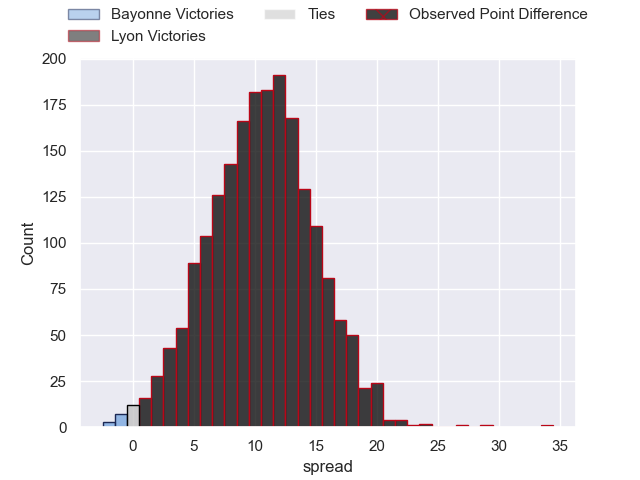
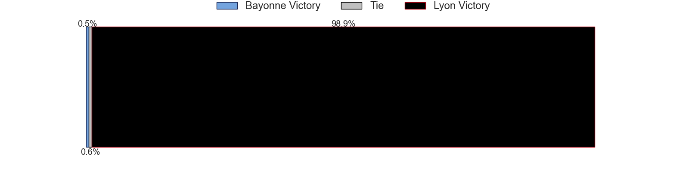

---  
layout: page  
title: Bayonne at Lyon; 19-53  
date: 2023-05-28 21:05:00 18:00:00 -0500  
categories: match review  
---
# Bayonne at Lyon; 19-53

# Club Level Predictions

The first set of predictions treats a club as the smallest object, as the club develops its members, organizes a gameplan, and deploys its players as needed for each match. This club model has a prediction of 0.771, which translates to predicting Lyon to win by 10.6.

Each club has a rating and a rating deviation (simiar to a Glicko system), and expected performances can be generated. This allows for simulated matches and spreads like the ones below.
## Projected Performances

## Projected Spreads

## Projected Results

# Player Level Predictions

Treating teams instead as an entity made up of the currently active players, I have ratings for each player in an altogether different system. These can be combined to form team ratings once teamsheets are announced, weighting starters a bit higher than the reserves. After the match is played, players can be weighted by their minutes on the field, allowing for an accurate measure of the team's composition. With these compiled team ratings, we can make predictions, measure inaccuracy, and update the individual player ratings.
## Prediction with Player Minutes: Lyon by 2.7

Bayonne by 1.3 on a neutral field

There were 8 large changes in win probability in this match
## Prediction without Player Minutes: Lyon by 0.8

Bayonne by 3.2 on a neutral pitch

|   Away Minutes | Away Player           |   Away elo |   Away Percentile |   Number |   Home Percentile |   Home elo | Home Player               |   Home Minutes |
|---------------:|:----------------------|-----------:|------------------:|---------:|------------------:|-----------:|:--------------------------|---------------:|
|             46 | Quentin Béthune       |      91.76 |                84 |        1 |                44 |      75.35 | Sébastien Taofifenua      |             56 |
|             46 | Torsten van Jaarsveld |      82.2  |               nan |        2 |                52 |      78.04 | Yanis Charcosset          |             48 |
|             46 | Tevita Tatafu         |      94.03 |                83 |        3 |                46 |      76.4  | Demba Bamba               |             56 |
|             80 | Thomas Ceyte          |     113.11 |                94 |        4 |                58 |      82.05 | Félix Lambey              |             80 |
|             46 | Konstantin Mikautadze |      83.96 |                62 |        5 |                89 |     103.31 | Romain Taofifenua         |             52 |
|             46 | Pierre Huguet         |      80.57 |                56 |        6 |               nan |      74.63 | Patrick Sobela            |             52 |
|             80 | Baptiste Heguy        |      69.03 |                31 |        7 |                63 |      83.76 | Beka Saghinadze           |             80 |
|             80 | Uzair Cassiem         |      74.27 |                40 |        8 |                47 |      77.06 | Liam Allen                |             80 |
|             80 | Hugo Camacho          |      77.54 |               nan |        9 |                63 |      85.14 | Baptiste Couilloud        |             60 |
|             80 | Camille Lopez         |      66.69 |                25 |       10 |                40 |      77.97 | Lima Sopoaga              |             69 |
|             80 | Arthur Duhau          |      77.91 |                50 |       11 |                82 |      96.77 | Ethan Dumortier           |             80 |
|             55 | Yann David            |      90.35 |                71 |       12 |                50 |      81.07 | Josua Tuisova             |             69 |
|             46 | Sireli Maqala         |     104.59 |                88 |       13 |                53 |      79.56 | Thibaut Regard            |             80 |
|             80 | Rémy Baget            |      71.98 |                36 |       14 |                45 |      75.43 | Tavite Veredamu           |             80 |
|             53 | Tom Spring            |      73.33 |                38 |       15 |                23 |      66.5  | Toby Arnold               |             80 |
|             34 | Peyo Muscarditz       |      83.03 |                59 |       16 |                50 |      79.17 | Guillaume Marchand        |             32 |
|             34 | Manuel Leindekar      |      87.6  |               nan |       17 |                40 |      75.09 | Temo Sukayawa Mayanavanua |             28 |
|             34 | Matis Perchaud        |      71.46 |                34 |       18 |                44 |      74.25 | Mickael Guillard          |             28 |
|             34 | Facundo Bosch         |      74.12 |                42 |       19 |               nan |      81.78 | Feao Fotuaika             |             24 |
|             34 | Pascal Cotet          |      76.05 |                45 |       20 |                61 |      82.63 | Francisco Gomez Kodela    |             24 |
|             34 | Denis Marchois        |      73.33 |                39 |       21 |                61 |      84.3  | Jonathan Pelissié         |             20 |
|             27 | Thomas Dolhagaray     |      86.59 |                69 |       22 |               nan |      76.23 | Alfred Parisien           |             11 |
|             25 | Guillaume Martocq     |      69.68 |                30 |       23 |                43 |      75.01 | Jean-Marc Doussain        |             11 |

