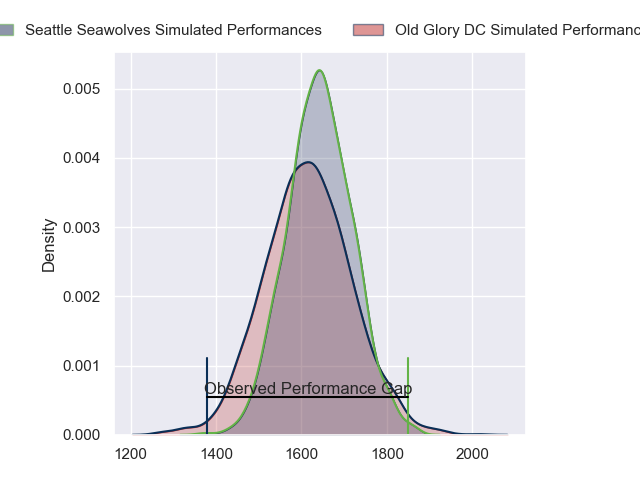
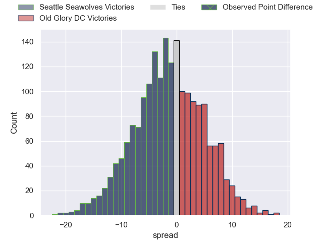

---  
layout: page  
title: Seattle Seawolves at Old Glory DC; 41-19  
date: 2023-05-28 01:00:00 18:00:00 -0500  
categories: match review  
---
# Seattle Seawolves at Old Glory DC; 41-19

# Club Level Predictions

The first set of predictions treats a club as the smallest object, as the club develops its members, organizes a gameplan, and deploys its players as needed for each match. This club model has a prediction of 0.465, which translates to predicting Seattle Seawolves to win by 1.3.

Each club has a rating and a rating deviation (simiar to a Glicko system), and expected performances can be generated. This allows for simulated matches and spreads like the ones below.
## Projected Performances

## Projected Spreads

## Projected Results

# Player Level Predictions

Treating teams instead as an entity made up of the currently active players, I have ratings for each player in an altogether different system. These can be combined to form team ratings once teamsheets are announced, weighting starters a bit higher than the reserves. After the match is played, players can be weighted by their minutes on the field, allowing for an accurate measure of the team's composition. With these compiled team ratings, we can make predictions, measure inaccuracy, and update the individual player ratings.
## Prediction with Player Minutes: Seattle Seawolves by 5.8

Seattle Seawolves by 9.8 on a neutral field

There were 4 large changes in win probability in this match
## Prediction without Player Minutes: Seattle Seawolves by 5.8

Seattle Seawolves by 9.8 on a neutral pitch

|   Away Minutes | Away Player          |   Away elo |   Away Percentile |   Number |   Home Percentile |   Home elo | Home Player              |   Home Minutes |
|---------------:|:---------------------|-----------:|------------------:|---------:|------------------:|-----------:|:-------------------------|---------------:|
|             80 | Jake Turnbull        |      81.82 |                62 |        1 |                 0 |      27.5  | Jack Iscaro              |             80 |
|             80 | James Malcolm        |      54.61 |                 9 |        2 |                31 |      67.75 | Nic Souchon              |             80 |
|             80 | Sam Matenga          |      61.63 |                19 |        3 |                12 |      58.09 | Kyle Stewart             |             80 |
|             80 | Samu Manoa           |      62.4  |                18 |        4 |                 4 |      46.53 | Tevita Naqali            |             80 |
|             80 | Taylor Krumrei       |      72.88 |                38 |        5 |                16 |      60.76 | Kyle Baillie             |             80 |
|             80 | Ben Landry           |      59.61 |                15 |        6 |                47 |      76.21 | Lautaro Ezequiel Bavaro  |             80 |
|             80 | Charles Elton        |      74.65 |                44 |        7 |                35 |      70.6  | Niko Jones               |             80 |
|             80 | Ronan Foley          |      49.85 |                 6 |        8 |                80 |      94.92 | Jamason Fa'anana Schultz |             80 |
|             80 | JP Smith             |      84.55 |                62 |        9 |                 8 |      53.29 | Danny Joseph Tusitala    |             80 |
|             80 | AJ Alatimu           |      56.41 |                11 |       10 |                11 |      57.3  | Joaquin Diaz Bonilla     |             80 |
|             80 | Conner Mooneyham     |      23.99 |                 0 |       11 |               nan |      61.02 | John Rizzo               |             80 |
|             80 | Lauina Futi          |     125.47 |                98 |       12 |                30 |      70.01 | Gradyn Bowd              |             80 |
|             80 | Tevita Lopeti        |      60.5  |                16 |       13 |                 1 |      38.89 | William Talataina-Mu     |             80 |
|             80 | Martin Iosefo        |      60.75 |                17 |       14 |                22 |      63.94 | Peni Lasaqa              |             80 |
|             80 | Adriaan John Carelse |      73.88 |                38 |       15 |                14 |      58.4  | Kurt Baker               |             80 |

