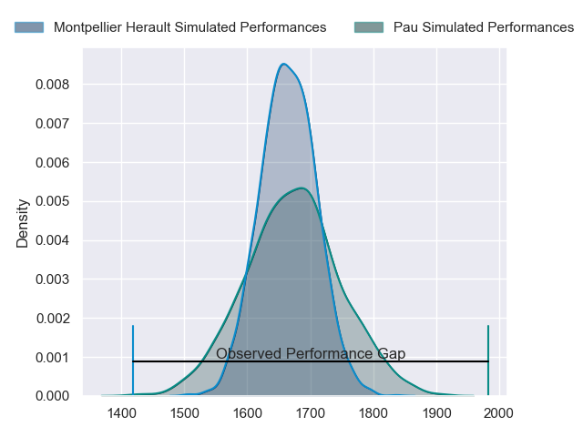
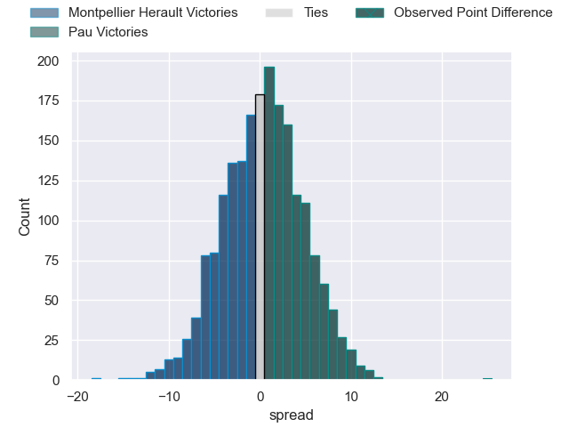

---  
layout: page  
title: Montpellier Herault at Pau; 10-35  
date: 2023-05-28 21:05:00 18:00:00 -0500  
categories: match review  
---
# Montpellier Herault at Pau; 10-35

# Club Level Predictions

The first set of predictions treats a club as the smallest object, as the club develops its members, organizes a gameplan, and deploys its players as needed for each match. This club model has a prediction of 0.515, which translates to predicting Pau to win by 0.5.

Each club has a rating and a rating deviation (simiar to a Glicko system), and expected performances can be generated. This allows for simulated matches and spreads like the ones below.
## Projected Performances

## Projected Spreads

## Projected Results

# Player Level Predictions

Treating teams instead as an entity made up of the currently active players, I have ratings for each player in an altogether different system. These can be combined to form team ratings once teamsheets are announced, weighting starters a bit higher than the reserves. After the match is played, players can be weighted by their minutes on the field, allowing for an accurate measure of the team's composition. With these compiled team ratings, we can make predictions, measure inaccuracy, and update the individual player ratings.
## Prediction with Player Minutes: Montpellier Herault by 3.1

Montpellier Herault by 7.1 on a neutral field

There were 3 large changes in win probability in this match
## Prediction without Player Minutes: Montpellier Herault by 3.6

Montpellier Herault by 7.6 on a neutral pitch

|   Away Minutes | Away Player              |   Away elo |   Away Percentile |   Number |   Home Percentile |   Home elo | Home Player              |   Home Minutes |
|---------------:|:-------------------------|-----------:|------------------:|---------:|------------------:|-----------:|:-------------------------|---------------:|
|             41 | Grégory Fichten          |      92.6  |                76 |        1 |                24 |      66.97 | Ignacio David Calles     |             50 |
|             43 | Adrien Sonzogni          |      78.41 |               nan |        2 |                69 |      83.45 | Lucas Rey                |             58 |
|             41 | Henry Thomas             |      88.01 |                73 |        3 |                41 |      74.2  | Guram Papidze            |             41 |
|             43 | Florian Verhaeghe        |      80.12 |                53 |        4 |                52 |      76.8  | Lekima Vuda Tagitagivalu |             50 |
|             80 | Tyler Evan Duguid        |      85.41 |                65 |        5 |               nan |      71.97 | Mickael Capelli          |             80 |
|             80 | Clément Doumenc          |      82.22 |                57 |        6 |                76 |      88.13 | Luke Whitelock           |             80 |
|             80 | Alexandre Bécognée       |      74.95 |                44 |        7 |                39 |      72.72 | Reece Hewat              |             50 |
|             73 | Lenni Nouchi             |      80.12 |                55 |        8 |                55 |      80.92 | Beka Gorgadze            |             80 |
|             80 | Aubin Eymeri             |     103.89 |                88 |        9 |                45 |      76    | Thibault Daubagna        |             58 |
|             55 | Louis Carbonel           |      88.89 |                69 |       10 |               nan |      70.75 | Thibault Debaes          |             65 |
|             49 | Gabin Rocher             |      79    |               nan |       11 |                35 |      71.17 | Daniel Ikpefan           |             80 |
|             80 | Paolo Garbisi            |      82.54 |                56 |       12 |                57 |      81.47 | Tumua Manu               |             80 |
|             67 | Thomas Darmon            |      80.88 |                55 |       13 |                80 |      97.1  | Émilien Gailleton        |             80 |
|             80 | Gabriel Ngandebe         |      73.69 |                40 |       14 |                70 |      88.05 | Clément Laporte          |             63 |
|             80 | Julien Tisseron          |      72.6  |                38 |       15 |                50 |      80.77 | Jack Maddocks            |             80 |
|             39 | Luca Tabarot             |      79.22 |               nan |       16 |               nan |      64.01 | Nicolas Corato           |             39 |
|             39 | Adam Moutanga Bouare     |      78.6  |               nan |       17 |               nan |      80.11 | Rémi Seneca              |             30 |
|             37 | Bastien Chalureau        |      92.01 |                76 |       18 |                 2 |      41.7  | Sacha Zegueur            |             30 |
|             37 | Curtis Langdon           |      70.16 |                34 |       19 |                35 |      71.81 | Santiago Grondona        |             30 |
|             31 | Pierre Lucas             |      80.18 |               nan |       20 |                37 |      72.69 | Dan Robson               |             22 |
|             25 | Louis Foursans-Bourdette |      78.8  |               nan |       21 |                33 |      69    | Youri Delhommel          |             22 |
|             13 | Anthony Bouthier         |      89.42 |                67 |       22 |                32 |      74.65 | Nathan Decron            |             17 |
|              7 | Romain Delemarle         |      78.23 |               nan |       23 |                63 |      84.22 | Clement Mondinat         |             15 |

