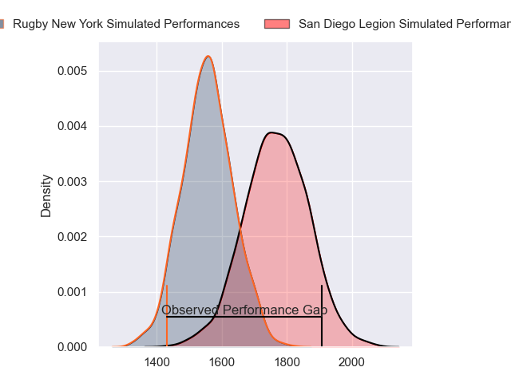
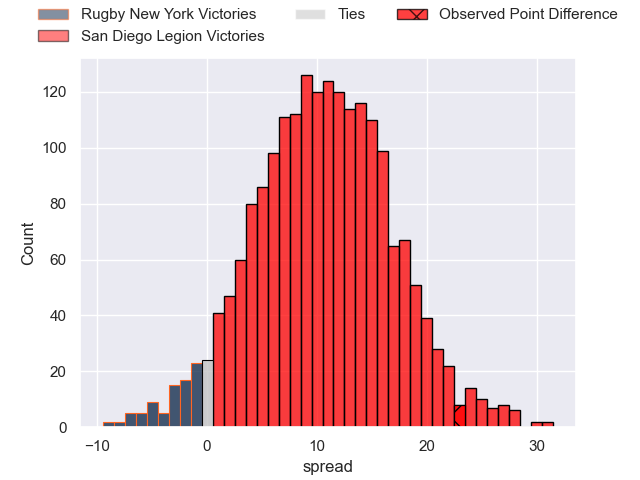
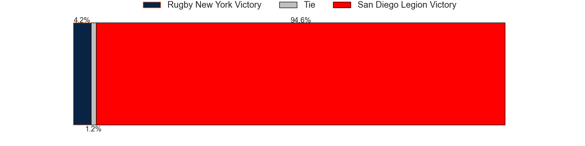

---  
layout: page  
title: Rugby New York at San Diego Legion; 13-36  
date: 2023-05-28 22:00:00 18:00:00 -0500  
categories: match review  
---
# Rugby New York at San Diego Legion; 13-36

# Club Level Predictions

The first set of predictions treats a club as the smallest object, as the club develops its members, organizes a gameplan, and deploys its players as needed for each match. This club model has a prediction of 0.767, which translates to predicting San Diego Legion to win by 10.7.

Each club has a rating and a rating deviation (simiar to a Glicko system), and expected performances can be generated. This allows for simulated matches and spreads like the ones below.
## Projected Performances

## Projected Spreads

## Projected Results

# Player Level Predictions

Treating teams instead as an entity made up of the currently active players, I have ratings for each player in an altogether different system. These can be combined to form team ratings once teamsheets are announced, weighting starters a bit higher than the reserves. After the match is played, players can be weighted by their minutes on the field, allowing for an accurate measure of the team's composition. With these compiled team ratings, we can make predictions, measure inaccuracy, and update the individual player ratings.
## Prediction with Player Minutes: San Diego Legion by 16.1

San Diego Legion by 12.1 on a neutral field

There were 6 large changes in win probability in this match
## Prediction without Player Minutes: San Diego Legion by 16.1

San Diego Legion by 12.1 on a neutral pitch

|   Away Minutes | Away Player       |   Away elo |   Away Percentile |   Number |   Home Percentile |   Home elo | Home Player          |   Home Minutes |
|---------------:|:------------------|-----------:|------------------:|---------:|------------------:|-----------:|:---------------------|---------------:|
|             80 | Chance Wenglewski |      65.3  |                21 |        1 |                 0 |      31.02 | Faka'osi Pifeleti    |             80 |
|             80 | Dylan Fawsitt     |      54.84 |                10 |        2 |                78 |      89.59 | Sama Malolo          |             80 |
|             80 | Kaleb Geiger      |     112.26 |                96 |        3 |                25 |      67.54 | Luke Green           |             80 |
|             80 | Nate Brakeley     |      51.88 |                 7 |        4 |                73 |      90.27 | Ben Grant            |             80 |
|             80 | Hamish Dalzell    |      62.18 |                17 |        5 |                30 |      69.26 | Isaac Ross           |             80 |
|             80 | Brad Tucker       |      59.4  |                14 |        6 |                41 |      73.58 | Tupou Afungia        |             80 |
|             80 | Akuei Monate      |      70.15 |                33 |        7 |                30 |      68.91 | Blair Cowan          |             80 |
|             80 | Pago Haini        |      62.39 |                19 |        8 |                17 |      61.76 | David Tameilau       |             80 |
|             80 | Connor Buckley    |      66.43 |                25 |        9 |                61 |      84.46 | Richard Judd         |             80 |
|             80 | Jason Emery       |      60.31 |                16 |       10 |                26 |      68.64 | Will Hooley          |             80 |
|             80 | Teofilo Ed Fidow  |      70.93 |                34 |       11 |                23 |      64.45 | Nathaniel Augspurger |             80 |
|             80 | Teihorangi Walden |      65.6  |                23 |       12 |                58 |      82.89 | Ma'a Nonu            |             80 |
|             80 | Fa'asiu Fuatai    |      51.62 |                 6 |       13 |                64 |      86.12 | Marcel Brache        |             80 |
|             80 | Brooklyn Hardaker |      61.46 |               nan |       14 |                48 |      77.49 | Tomas Aoake          |             80 |
|             80 | Andrew Coe        |      60.5  |                17 |       15 |                56 |      79.89 | Mike Te'o            |             80 |

