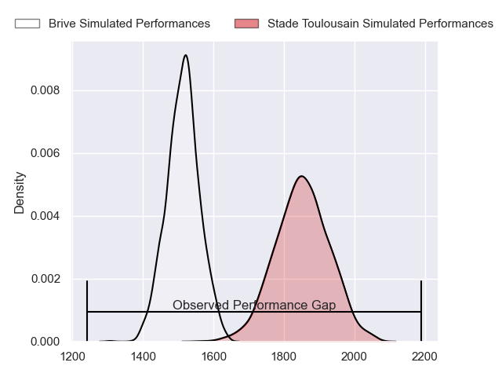
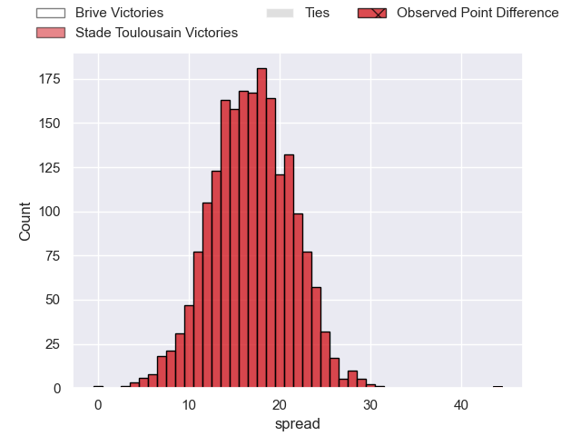
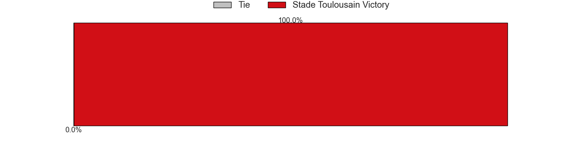

---  
layout: page  
title: Brive at Stade Toulousain; 10-54  
date: 2023-05-28 21:05:00 18:00:00 -0500  
categories: match review  
---
# Brive at Stade Toulousain; 10-54

# Club Level Predictions

The first set of predictions treats a club as the smallest object, as the club develops its members, organizes a gameplan, and deploys its players as needed for each match. This club model has a prediction of 0.874, which translates to predicting Stade Toulousain to win by 17.0.

Each club has a rating and a rating deviation (simiar to a Glicko system), and expected performances can be generated. This allows for simulated matches and spreads like the ones below.
## Projected Performances

## Projected Spreads

## Projected Results

# Player Level Predictions

Treating teams instead as an entity made up of the currently active players, I have ratings for each player in an altogether different system. These can be combined to form team ratings once teamsheets are announced, weighting starters a bit higher than the reserves. After the match is played, players can be weighted by their minutes on the field, allowing for an accurate measure of the team's composition. With these compiled team ratings, we can make predictions, measure inaccuracy, and update the individual player ratings.
## Prediction with Player Minutes: Stade Toulousain by 18.0

Stade Toulousain by 14.0 on a neutral field

There were 2 large changes in win probability in this match
## Prediction without Player Minutes: Stade Toulousain by 20.0

Stade Toulousain by 16.0 on a neutral pitch

|   Away Minutes | Away Player               |   Away elo |   Away Percentile |   Number |   Home Percentile |   Home elo | Home Player         |   Home Minutes |
|---------------:|:--------------------------|-----------:|------------------:|---------:|------------------:|-----------:|:--------------------|---------------:|
|             46 | Daniel Brennan            |      69.2  |                30 |        1 |                33 |      67.19 | Rodrigue Neti       |             53 |
|             11 | Motu Farao Matu'u         |      73.3  |                41 |        2 |                76 |      89.58 | Julien Marchand     |             51 |
|             46 | Marcel van der Merwe      |      72.06 |                35 |        3 |                56 |      79.98 | Paul Mallez         |             45 |
|             80 | Renger Van Eerten         |      69.65 |                26 |        4 |                22 |      64.43 | Richie Arnold       |             80 |
|             51 | Julien Delannoy           |      61.96 |                15 |        5 |                25 |      66.18 | Emmanuel Meafou     |             51 |
|             80 | Esteban Abadie            |      71.81 |                36 |        6 |                94 |     112.4  | Jack Willis         |             46 |
|             51 | Ross Moriarty             |      81.96 |                58 |        7 |                99 |     142.89 | Francois Cros       |             56 |
|             46 | Rodrigo Bruni             |      77.31 |                51 |        8 |                 6 |      50.32 | Alexandre Roumat    |             80 |
|             46 | Vasil Lobzhanidze         |      78.28 |                51 |        9 |                97 |     115.1  | Antoine Dupont      |             80 |
|             80 | Nicolas Sanchez           |      74.41 |                41 |       10 |                92 |     110.04 | Romain Ntamack      |             80 |
|             80 | Setareki Bituniyata       |      54.74 |                10 |       11 |                71 |      88.43 | Arthur Retière      |             80 |
|             34 | Sam Arnold                |      68.74 |                30 |       12 |                30 |      68.81 | Pita Ahki           |             56 |
|             80 | Setariki Tuicuvu          |      76.57 |                47 |       13 |                 4 |      48.5  | Santiago Chocobares |             80 |
|             80 | Arthur Bonneval           |      80.11 |                54 |       14 |                26 |      67.7  | Juan Cruz Mallia    |             11 |
|             80 | Mathis Ferté              |      95.32 |                80 |       15 |                95 |     117.9  | Thomas Ramos        |             80 |
|             69 | Lucas Da Silva            |      68.38 |                31 |       16 |                10 |      54.68 | Matthis Lebel       |             69 |
|             46 | Thomas Laranjeira         |      68.93 |                28 |       17 |               nan |      76.35 | Charlie Faumuina    |             35 |
|             34 | Wesley Tapueluelu         |      71.49 |                37 |       18 |               nan |      76.18 | Selevasio Tolofua   |             34 |
|             34 | Paul Abadie               |      66.23 |               nan |       19 |                30 |      64.97 | Peato Mauvaka       |             29 |
|             34 | Francisco Coria Marchetti |      68.94 |                32 |       20 |                26 |      63.23 | Rynhard Elstadt     |             29 |
|             34 | Sasha Gue                 |      67.8  |                19 |       21 |                32 |      70.41 | David Ainu'u        |             27 |
|             29 | Saïd Hireche              |      68.63 |                31 |       22 |                20 |      63.44 | Alban Placines      |             24 |
|             29 | Noe Bedou                 |      76.5  |                56 |       23 |                57 |      81.68 | Sofiane Guitoune    |             24 |

