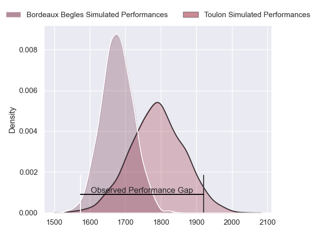
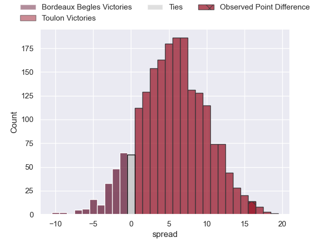

---  
layout: page  
title: Bordeaux Begles at Toulon; 19-35  
date: 2023-05-28 21:05:00 18:00:00 -0500  
categories: match review  
---
# Bordeaux Begles at Toulon; 19-35

# Club Level Predictions

The first set of predictions treats a club as the smallest object, as the club develops its members, organizes a gameplan, and deploys its players as needed for each match. This club model has a prediction of 0.656, which translates to predicting Toulon to win by 5.7.

Each club has a rating and a rating deviation (simiar to a Glicko system), and expected performances can be generated. This allows for simulated matches and spreads like the ones below.
## Projected Performances

## Projected Spreads

## Projected Results

# Player Level Predictions

Treating teams instead as an entity made up of the currently active players, I have ratings for each player in an altogether different system. These can be combined to form team ratings once teamsheets are announced, weighting starters a bit higher than the reserves. After the match is played, players can be weighted by their minutes on the field, allowing for an accurate measure of the team's composition. With these compiled team ratings, we can make predictions, measure inaccuracy, and update the individual player ratings.
## Prediction with Player Minutes: Toulon by 2.4

Bordeaux Begles by 1.6 on a neutral field

There were 7 large changes in win probability in this match
## Prediction without Player Minutes: Toulon by 0.5

Bordeaux Begles by 3.5 on a neutral pitch

|   Away Minutes | Away Player               |   Away elo |   Away Percentile |   Number |   Home Percentile |   Home elo | Home Player         |   Home Minutes |
|---------------:|:--------------------------|-----------:|------------------:|---------:|------------------:|-----------:|:--------------------|---------------:|
|             53 | Jefferson Poirot          |      87.07 |                67 |        1 |                42 |      77.43 | Jean-Baptiste Gros  |             58 |
|             53 | Maxime Lamothe            |      90.39 |                78 |        2 |                63 |      82.99 | Christopher Tolofua |             80 |
|             36 | Vadim Cobilas             |      88.3  |                74 |        3 |                42 |      74.69 | Beka Gigashvili     |             61 |
|             80 | Thomas Jolmes             |      84.45 |                63 |        4 |                49 |      78.44 | Mathieu Tanguy      |             53 |
|             56 | Jan Andre Marais          |      89.52 |                71 |        5 |                44 |      75.42 | Brian Alainu'uese   |             80 |
|             80 | Mahamadou Diaby           |      76.74 |                47 |        6 |                19 |      66.09 | Mathieu Bastareaud  |             56 |
|             80 | Pierre Bochaton           |      92.69 |                79 |        7 |                97 |     124.42 | Charles Ollivon     |             80 |
|             59 | Tom Willis                |      91.55 |                75 |        8 |                62 |      84.82 | Sergio Parisse      |             60 |
|             59 | Maxime Lucu               |      89.32 |                70 |        9 |                50 |      81.56 | Benoit Paillaugue   |             61 |
|             59 | Matthieu Jalibert         |      81.37 |                53 |       10 |                47 |      84.36 | Ihaia West          |             80 |
|             80 | Santiago Cordero          |      87.74 |                70 |       11 |                77 |      92.68 | Jiuta Wainiqolo     |             80 |
|             80 | Yoram Moefana             |      85.77 |                64 |       12 |                60 |      83.45 | Duncan Paia'aua     |             53 |
|             53 | Jean-Baptiste Dubié       |      85.68 |                60 |       13 |                70 |      89.7  | Waisea Nayacavelu   |             80 |
|             80 | Madosh Tambwe             |      72.74 |                32 |       14 |                79 |      97.15 | Cheslin Kolbe       |             80 |
|             80 | Louis Bielle Biarrey      |      96.43 |                82 |       15 |                19 |      62.94 | Marius Domon        |             70 |
|             44 | Sipili Falatea            |      84.98 |                62 |       16 |                77 |      91.27 | Cornell du Preez    |             27 |
|             27 | Ugo Boniface              |      76.92 |               nan |       17 |                48 |      81.57 | Jérémy Sinzelle     |             27 |
|             27 | Nicolas Depoortere        |      93.6  |                76 |       18 |                69 |      91.61 | Facundo Isa         |             24 |
|             27 | Gabriel Oghre             |      81.72 |                57 |       19 |                73 |      87.81 | Dany Priso          |             22 |
|             21 | Hugo Zabalza              |      81.1  |               nan |       20 |                30 |      68.9  | Raphaël Lakafia     |             20 |
|             21 | Zack Holmes               |      75.42 |                40 |       21 |               nan |      79.72 | Jules Danglot       |             19 |
|             21 | Bastien Vergnes Taillefer |      81.28 |               nan |       22 |               nan |      79.77 | Emerick Setiano     |             19 |
|             24 | Kane Douglas              |      84.39 |                58 |       23 |               nan |      90.37 | Yanis Boulassel     |             10 |

