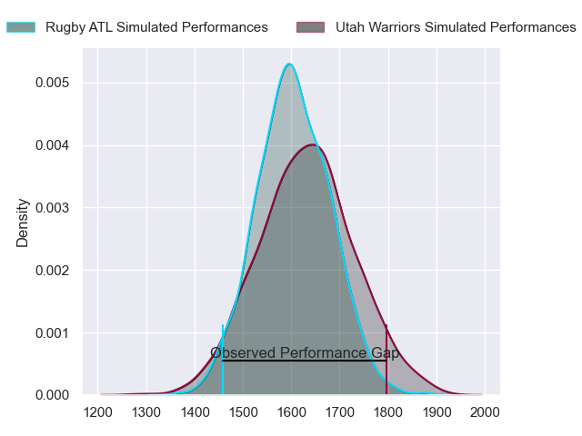
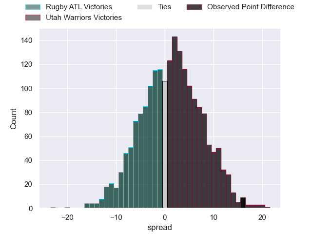

---  
layout: page  
title: Rugby ATL at Utah Warriors; 12-28  
date: 2023-05-28 03:30:00 18:00:00 -0500  
categories: match review  
---
# Rugby ATL at Utah Warriors; 12-28

# Club Level Predictions

The first set of predictions treats a club as the smallest object, as the club develops its members, organizes a gameplan, and deploys its players as needed for each match. This club model has a prediction of 0.54, which translates to predicting Utah Warriors to win by 1.4.

Each club has a rating and a rating deviation (simiar to a Glicko system), and expected performances can be generated. This allows for simulated matches and spreads like the ones below.
## Projected Performances

## Projected Spreads

## Projected Results

# Player Level Predictions

Treating teams instead as an entity made up of the currently active players, I have ratings for each player in an altogether different system. These can be combined to form team ratings once teamsheets are announced, weighting starters a bit higher than the reserves. After the match is played, players can be weighted by their minutes on the field, allowing for an accurate measure of the team's composition. With these compiled team ratings, we can make predictions, measure inaccuracy, and update the individual player ratings.
## Prediction with Player Minutes: Utah Warriors by 5.6

Utah Warriors by 1.6 on a neutral field

There were 8 large changes in win probability in this match
## Prediction without Player Minutes: Utah Warriors by 5.6

Utah Warriors by 1.6 on a neutral pitch

|   Away Minutes | Away Player            |   Away elo |   Away Percentile |   Number |   Home Percentile |   Home elo | Home Player             |   Home Minutes |
|---------------:|:-----------------------|-----------:|------------------:|---------:|------------------:|-----------:|:------------------------|---------------:|
|             80 | Will Burke             |      38.37 |                 1 |        1 |                17 |      60.18 | Emerson Prior           |             80 |
|             80 | Sidney Tobias          |      47.53 |                 5 |        2 |                12 |      56.54 | Henry Bell              |             80 |
|             80 | John Roy Jenkinson     |      45.99 |                 3 |        3 |                11 |      56.08 | Angus McLellan          |             80 |
|             80 | Justin Johan Basson    |      44.87 |                 3 |        4 |                 4 |      46.75 | Jamie Lane              |             80 |
|             80 | Christian Nahuel Milan |      56.49 |                14 |        5 |                12 |      57.09 | Onehunga Havili Kaufusi |             80 |
|             80 | Connor Cook            |      33.87 |                11 |        6 |                33 |      69.86 | Bailey Wilson           |             80 |
|             80 | Matthew Heaton         |      37.4  |                 1 |        7 |                73 |      89.23 | Lance Williams          |             80 |
|             80 | Vili Helu              |     100.4  |                87 |        8 |                42 |      75.22 | Thomas Tu'avao          |             80 |
|             80 | Ryan Rees              |      63.62 |                25 |        9 |                19 |      63.78 | Zion Going              |             80 |
|             80 | Christopher Hilsenbeck |      74.92 |                36 |       10 |                10 |      54.91 | Joel Hodgson            |             80 |
|             80 | Jack Shaw              |      61.13 |                18 |       11 |                 3 |      42.43 | Joseph Mano             |             80 |
|             80 | Martini Talapusi       |      80.92 |                56 |       12 |                 7 |      51.89 | Calvin Whiting          |             80 |
|             80 | Will Leonard           |     143.6  |                99 |       13 |                92 |     109.55 | Tyler Luke Fisher       |             80 |
|             80 | Te Rangatira Waitokia  |      36.91 |                 2 |       14 |                 9 |      52.65 | Mika Kruse              |             80 |
|             80 | Rewita Biddle          |      55.88 |                12 |       15 |                 9 |      51.34 | Caleb Makene            |             80 |

