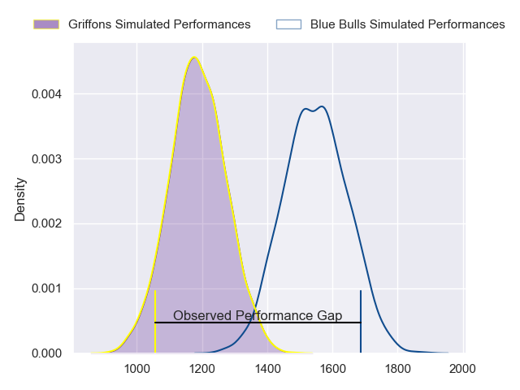
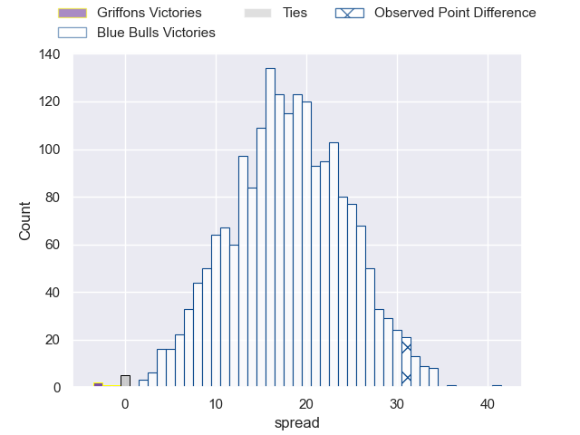
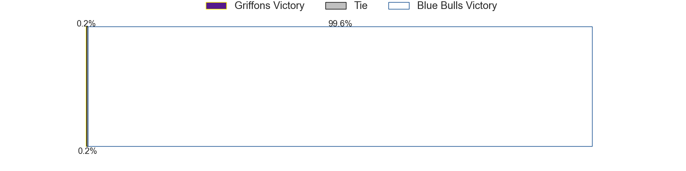

---  
layout: page  
title: Griffons at Blue Bulls; 33-64  
date: 2023-06-02 17:00:00 18:00:00 -0500  
categories: match review  
---
# Griffons at Blue Bulls; 33-64

# Club Level Predictions

The first set of predictions treats a club as the smallest object, as the club develops its members, organizes a gameplan, and deploys its players as needed for each match. This club model has a prediction of 0.882, which translates to predicting Blue Bulls to win by 18.1.

Each club has a rating and a rating deviation (simiar to a Glicko system), and expected performances can be generated. This allows for simulated matches and spreads like the ones below.
## Projected Performances

## Projected Spreads

## Projected Results

# Player Level Predictions

Treating teams instead as an entity made up of the currently active players, I have ratings for each player in an altogether different system. These can be combined to form team ratings once teamsheets are announced, weighting starters a bit higher than the reserves. After the match is played, players can be weighted by their minutes on the field, allowing for an accurate measure of the team's composition. With these compiled team ratings, we can make predictions, measure inaccuracy, and update the individual player ratings.
## Prediction with Player Minutes: Blue Bulls by 25.2

Blue Bulls by 21.2 on a neutral field

There were 6 large changes in win probability in this match
## Prediction without Player Minutes: Blue Bulls by 22.8

Blue Bulls by 18.8 on a neutral pitch

|   Away Minutes | Away Player                 |   Away elo |   Away Percentile |   Number |   Home Percentile |   Home elo | Home Player                  |   Home Minutes |
|---------------:|:----------------------------|-----------:|------------------:|---------:|------------------:|-----------:|:-----------------------------|---------------:|
|             53 | Xolani Jacobs               |      57.55 |                11 |        1 |                71 |      86.75 | Gerhardus Cornelis Steenkamp |             66 |
|             58 | Hendrik Petrus van Schoor   |      65.08 |                24 |        2 |                 9 |      56.64 | Jan Hendrik Wessels          |             80 |
|             25 | Doctor Booysen              |      83.52 |                64 |        3 |                29 |      70.42 | Francois Klopper             |             42 |
|             80 | Rian Olivier                |      57.72 |                13 |        4 |                71 |      88.38 | Ruan Vermaak                 |             80 |
|             52 | Michael Benadie             |      51.14 |                 7 |        5 |                35 |      71.09 | Janko Swanepoel              |             80 |
|             80 | Thato Siward Mavundla       |     112.75 |                94 |        6 |                40 |      72.83 | Marcell Coetzee              |             80 |
|             80 | Thomas Ongera               |      70.31 |                34 |        7 |                42 |      72.26 | Mihlali Langa Mosi           |             42 |
|             80 | Sokuphumla (Soso) Xakalashe |      53.26 |                 7 |        8 |                71 |      86.5  | Nizaam Carr                  |             80 |
|             80 | Jaywinn Juries              |      81.14 |                57 |        9 |                63 |      84.7  | Embrose Cheldon Papier       |             62 |
|             55 | Robbie Petzer               |      41.88 |                 3 |       10 |                58 |      83.2  | Chris Smith                  |             80 |
|             80 | Randy Fillies               |      61.5  |                19 |       11 |                70 |      90.64 | David Kriel                  |             80 |
|             60 | Marquit Virgil September    |      41.17 |                 1 |       12 |                48 |      79.12 | Chris Smit                   |             80 |
|             80 | Carel-Jan Coetzee           |      68.05 |                28 |       13 |                83 |      98.77 | Stedman-Gee Rivett Gans      |             66 |
|             80 | Domenic Smit                |      51.4  |                 8 |       14 |                44 |      73.45 | Cornal Hendricks             |             80 |
|             80 | Duan Pretorius              |      93.29 |                75 |       15 |                35 |      72.7  | Johannes Lodewikus Goosen    |             80 |
|             55 | Buhle Nojekwa               |      67.66 |                32 |       16 |                78 |      90.32 | Mornay Jan Jakobus Smith     |             38 |
|             28 | Wikus Nieuwenhuis           |      74.07 |               nan |       17 |                84 |      98.02 | Ruan Nortje                  |             38 |
|             27 | Stephan de Jager            |      65.94 |                25 |       18 |                68 |      87.15 | Keagan Johannes              |             18 |
|             25 | Duren Hoffman               |      38.09 |                 2 |       19 |                50 |      78.96 | Simphiwe Matanzima           |             14 |
|             20 | Keanu Armandio Vers         |      37.89 |                 1 |       20 |                43 |      74.63 | Wandisile Simelane           |             14 |
|             22 | Dandré Delport              |      81.95 |                63 |       21 |               nan |     nan    | nan                          |            nan |

