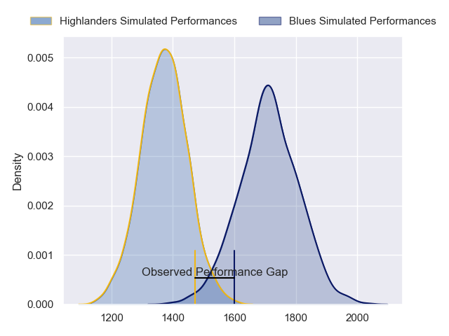
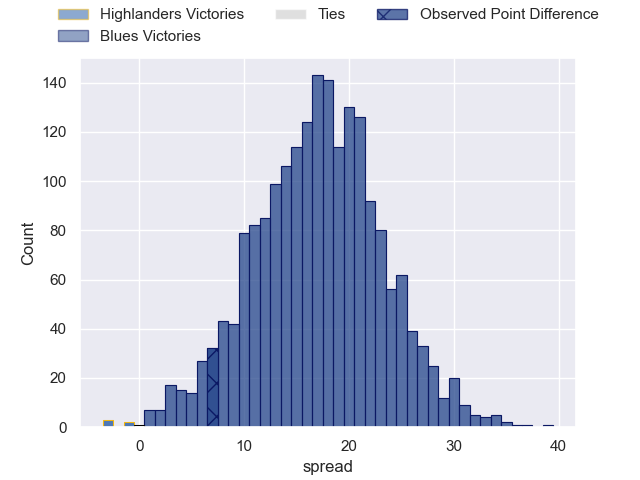

---  
layout: page  
title: Highlanders at Blues; 9.0-16.0  
date: 2023-06-02 03:05:00 18:00:00 -0500  
categories: match review  
---
# Highlanders at Blues; 9.0-16.0

# Club Level Predictions

The first set of predictions treats a club as the smallest object, as the club develops its members, organizes a gameplan, and deploys its players as needed for each match. This club model has a prediction of 0.871, which translates to predicting Blues to win by 17.1.

Each club has a rating and a rating deviation (simiar to a Glicko system), and expected performances can be generated. This allows for simulated matches and spreads like the ones below.
## Projected Performances

## Projected Spreads

## Projected Results

# Player Level Predictions

Treating teams instead as an entity made up of the currently active players, I have ratings for each player in an altogether different system. These can be combined to form team ratings once teamsheets are announced, weighting starters a bit higher than the reserves. After the match is played, players can be weighted by their minutes on the field, allowing for an accurate measure of the team's composition. With these compiled team ratings, we can make predictions, measure inaccuracy, and update the individual player ratings.
## Prediction with Player Minutes: Blues by 15.7

Blues by 11.7 on a neutral field

There were 7 large changes in win probability in this match
## Prediction without Player Minutes: Blues by 15.0

Blues by 11.0 on a neutral pitch

|   Away Minutes | Away Player          |   Away elo |   Away Percentile |   Number |   Home Percentile |   Home elo | Home Player         |   Home Minutes |
|---------------:|:---------------------|-----------:|------------------:|---------:|------------------:|-----------:|:--------------------|---------------:|
|             63 | Ethan de Groot       |      85.97 |                68 |        1 |                92 |     103.69 | Ofa Tu'ungafasi     |             63 |
|             55 | Andrew Makalio       |      88.91 |                74 |        2 |                69 |      85.7  | Ricky Riccitelli    |             63 |
|             69 | Jermaine Ainsley     |      86.22 |                69 |        3 |                93 |     104.69 | Nepo Laulala        |             63 |
|             65 | Pari Pari Parkinson  |     131.9  |                99 |        4 |                98 |     130.42 | Patrick Tuipulotu   |             80 |
|             51 | Max Hicks            |      81.5  |                56 |        5 |                75 |      91.65 | James Tucker        |             52 |
|             80 | Shannon Frizell      |      99.11 |                86 |        6 |                85 |      93.53 | Tom Robinson        |             80 |
|             80 | Billy Harmon         |     107.93 |                93 |        7 |                32 |      70.63 | Anton Segner        |             80 |
|             80 | Hugh Renton          |      53.37 |                 7 |        8 |                89 |     102.52 | Dalton Papali'i     |             75 |
|             65 | Aaron Smith          |      94.18 |                78 |        9 |                84 |      99.16 | Finlay Christie     |             63 |
|             75 | Freddie Burns        |     107.76 |                91 |       10 |                87 |     105.12 | Stephen Perofeta    |             80 |
|             80 | Jona Nareki          |      84.15 |                62 |       11 |                83 |      97.44 | Caleb Clarke        |             55 |
|             80 | Sam Gilbert          |      79.98 |                53 |       12 |                88 |     105.17 | Harry Plummer       |             67 |
|             59 | Matt Whaanga         |      72.92 |                39 |       13 |                59 |      83.06 | Rieko Ioane         |             80 |
|             80 | Scott Gregory        |      81.33 |                57 |       14 |                91 |     106.74 | Mark Telea          |             80 |
|             80 | Mitch Hunt           |      98.99 |                81 |       15 |                74 |      92.82 | Zarn Sullivan       |             80 |
|             25 | Rhys Marshall        |      89.95 |                78 |       16 |                97 |     119.97 | Kurt Eklund         |             17 |
|             17 | Dan Lienert-Brown    |      89.57 |                77 |       17 |                30 |      69.57 | Jordan Lay          |             17 |
|             21 | Saula Mau            |      84.95 |                69 |       18 |                69 |      86.42 | Marcel Renata       |             17 |
|             15 | Marino Mikaele-Tu'u  |      79.04 |                49 |       19 |               nan |      90.61 | Rob Rush            |              5 |
|             29 | Sean Withy           |      72.14 |                39 |       20 |                94 |     111.56 | Akira Ioane         |             28 |
|             15 | Folau Fakatava       |      79.34 |                54 |       21 |                79 |      94.85 | Sam Nock            |             17 |
|             11 | Fetuli Paea          |      93.56 |                76 |       22 |                37 |      72.84 | Roger Tuivasa-Sheck |             13 |
|              5 | Connor Garden-Bachop |      98.76 |                81 |       23 |                35 |      70.8  | AJ Lam              |             25 |

