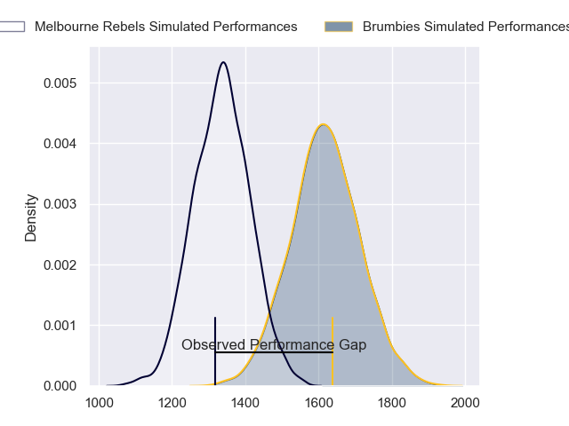
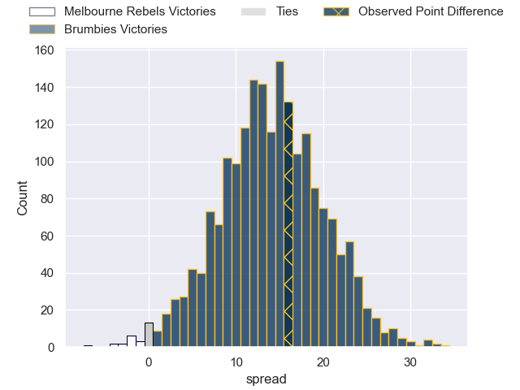
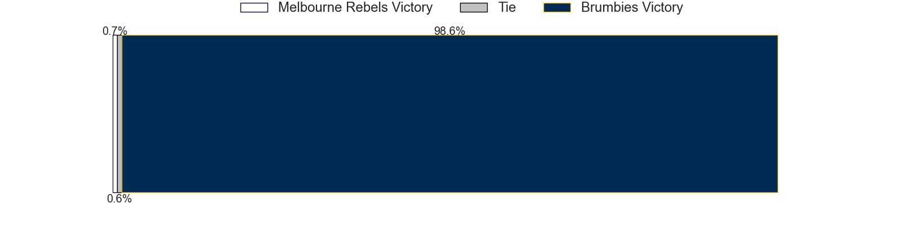

---  
layout: page  
title: Melbourne Rebels at Brumbies; 17.0-33.0  
date: 2023-06-02 05:35:00 18:00:00 -0500  
categories: match review  
---
# Melbourne Rebels at Brumbies; 17.0-33.0

# Club Level Predictions

The first set of predictions treats a club as the smallest object, as the club develops its members, organizes a gameplan, and deploys its players as needed for each match. This club model has a prediction of 0.83, which translates to predicting Brumbies to win by 14.2.

Each club has a rating and a rating deviation (simiar to a Glicko system), and expected performances can be generated. This allows for simulated matches and spreads like the ones below.
## Projected Performances

## Projected Spreads

## Projected Results

# Player Level Predictions

Treating teams instead as an entity made up of the currently active players, I have ratings for each player in an altogether different system. These can be combined to form team ratings once teamsheets are announced, weighting starters a bit higher than the reserves. After the match is played, players can be weighted by their minutes on the field, allowing for an accurate measure of the team's composition. With these compiled team ratings, we can make predictions, measure inaccuracy, and update the individual player ratings.
## Prediction with Player Minutes: Brumbies by 6.1

Brumbies by 2.1 on a neutral field

There were 5 large changes in win probability in this match
## Prediction without Player Minutes: Brumbies by 7.5

Brumbies by 3.5 on a neutral pitch

|   Away Minutes | Away Player       |   Away elo |   Away Percentile |   Number |   Home Percentile |   Home elo | Home Player      |   Home Minutes |
|---------------:|:------------------|-----------:|------------------:|---------:|------------------:|-----------:|:-----------------|---------------:|
|             41 | Matt Gibbon       |      95.89 |                85 |        1 |               nan |      80.66 | Fred Kaihea      |             40 |
|             19 | Jordan Uelese     |      79.21 |                53 |        2 |                97 |     119.24 | Connal McInerney |             45 |
|             56 | Sam Talakai       |      93.79 |                83 |        3 |                72 |      81.58 | Sefo Kautai      |             45 |
|             80 | Josh Canham       |      91.51 |                75 |        4 |                29 |      68.92 | Nick Frost       |             80 |
|             62 | Matt Philip       |      85.99 |                66 |        5 |                94 |     110.3  | Cadeyrn Neville  |             41 |
|             80 | Josh Kemeny       |      76.94 |                48 |        6 |                27 |      68.14 | Tom Hooper       |             80 |
|             80 | Brad Wilkin       |      91.86 |                78 |        7 |                93 |     108.02 | Jahrome Brown    |             57 |
|             80 | Richard Hardwick  |      83.8  |                60 |        8 |                91 |     105.08 | Rob Valetini     |             80 |
|             65 | Ryan Louwrens     |     105.96 |                91 |        9 |                98 |     126.15 | Nic White        |             61 |
|             80 | Carter Gordon     |      90.72 |                72 |       10 |                68 |      88.59 | Jack Debreczeni  |             80 |
|             80 | Monty Ioane       |     119.94 |                97 |       11 |                33 |      70.44 | Corey Toole      |             61 |
|             53 | Nick Jooste       |      81.73 |                47 |       12 |                55 |      79.77 | Ollie Sapsford   |             80 |
|             80 | Reece Hodge       |     102.53 |                87 |       13 |                89 |     104.6  | Len Ikitau       |             75 |
|             80 | Lachie Anderson   |      83.88 |                62 |       14 |                88 |     102.12 | Andy Muirhead    |             80 |
|             32 | Andrew Kellaway   |     105.52 |                88 |       15 |                77 |      94.63 | Tom Wright       |             80 |
|             17 | Alex Mafi         |      84.55 |                66 |       16 |                67 |      84.7  | Billy Pollard    |             35 |
|             39 | Isaac Aedo Kailea |      90.61 |               nan |       17 |                75 |      87.52 | Blake Schoupp    |             40 |
|             39 | Pone Fa'amausili  |      85.46 |                67 |       18 |                62 |      82.66 | Rhys Van Nek     |             35 |
|             18 | Trevor Hosea      |      78.36 |                46 |       19 |                72 |      89.24 | Pete Samu        |             39 |
|             29 | Vaiolini Ekuasi   |      79.04 |                52 |       20 |                87 |      96.05 | Luke Reimer      |             23 |
|             15 | James Tuttle      |      94.61 |               nan |       21 |                77 |      93.72 | Ryan Lonergan    |             19 |
|             27 | Stacey Ili        |      79.63 |                52 |       22 |                75 |      92.91 | Tamati Tua       |              5 |
|             48 | Joe Pincus        |      80.62 |                49 |       23 |               nan |     125.56 | Jesse Mogg       |             19 |

