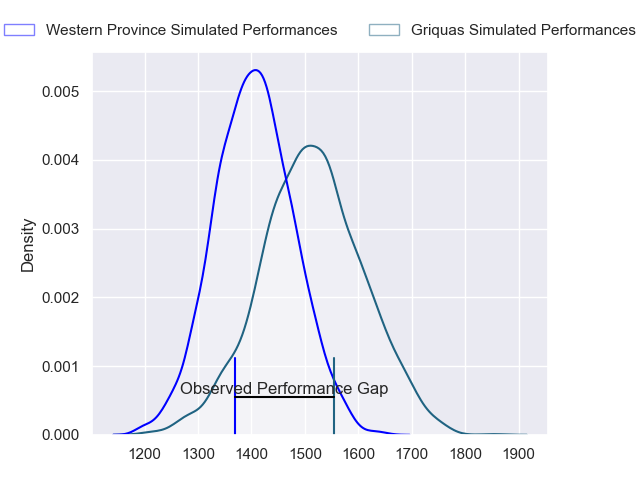
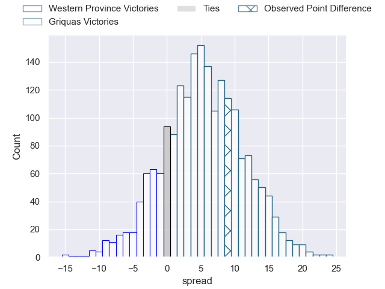
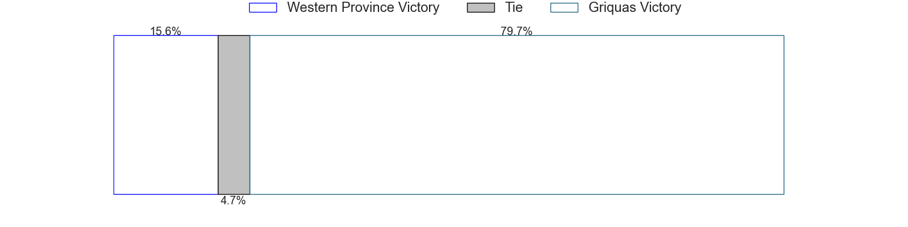

---  
layout: page  
title: Western Province at Griquas; 29-38  
date: 2023-06-02 15:00:00 18:00:00 -0500  
categories: match review  
---
# Western Province at Griquas; 29-38

# Club Level Predictions

The first set of predictions treats a club as the smallest object, as the club develops its members, organizes a gameplan, and deploys its players as needed for each match. This club model has a prediction of 0.647, which translates to predicting Griquas to win by 5.4.

Each club has a rating and a rating deviation (simiar to a Glicko system), and expected performances can be generated. This allows for simulated matches and spreads like the ones below.
## Projected Performances

## Projected Spreads

## Projected Results

# Player Level Predictions

Treating teams instead as an entity made up of the currently active players, I have ratings for each player in an altogether different system. These can be combined to form team ratings once teamsheets are announced, weighting starters a bit higher than the reserves. After the match is played, players can be weighted by their minutes on the field, allowing for an accurate measure of the team's composition. With these compiled team ratings, we can make predictions, measure inaccuracy, and update the individual player ratings.
## Prediction with Player Minutes: Western Province by 3.5

Western Province by 7.5 on a neutral field

There were 16 large changes in win probability in this match
## Prediction without Player Minutes: Western Province by 5.4

Western Province by 9.4 on a neutral pitch

|   Away Minutes | Away Player                       |   Away elo |   Away Percentile |   Number |   Home Percentile |   Home elo | Home Player                |   Home Minutes |
|---------------:|:----------------------------------|-----------:|------------------:|---------:|------------------:|-----------:|:---------------------------|---------------:|
|             43 | Alistair Fernando Vermaak         |      72.12 |                34 |        1 |                57 |      80.65 | Kudzwai Dube               |             62 |
|             43 | Siyabonga Ntubeni                 |      92.23 |                80 |        2 |                41 |      73.67 | Janco Uys                  |             56 |
|             66 | Johan Neethling Fouche            |      78.78 |                47 |        3 |                51 |      79.31 | Justin Forwood             |             43 |
|             51 | Adre Smith                        |      88.02 |                70 |        4 |                52 |      79.46 | Dylan Sjoblom              |             71 |
|             51 | Connor Evans                      |      92.59 |                77 |        5 |                35 |      72.1  | Derrick Pretorius          |             80 |
|             80 | Marcel Theunissen                 |      76.59 |                47 |        6 |                68 |      85.83 | Thabo Ndimande             |             53 |
|             80 | Ben-Jason Dixon                   |     101.83 |                89 |        7 |                82 |      94.61 | Hanru Sirgel               |             80 |
|             66 | Hacjivah Dayimani                 |      88.74 |                73 |        8 |                38 |      73.66 | Carl Els                   |             80 |
|             67 | Albertus Paul de Wet              |      80.75 |                52 |        9 |                46 |      77.25 | Johan Mulder               |             80 |
|             80 | Jurie Matthee                     |      84.49 |               nan |       10 |                65 |      88.22 | Lubabalo Dobela            |             77 |
|             80 | Leolin Lucien Zas                 |      87.38 |                70 |       11 |                53 |      78.95 | Luther Obi                 |             80 |
|             55 | Juan de Jongh                     |      82.06 |                57 |       12 |                57 |      82.26 | Tertius Kruger             |             80 |
|             80 | Adriaan Ruhan Nel                 |      74.05 |                41 |       13 |                90 |     106.11 | Jay Cee Nel                |             67 |
|             80 | Angelo Davids                     |     114.66 |                95 |       14 |                39 |      72.72 | Rosco Shane Specman        |             80 |
|             80 | Clayton Blommetjies               |      75.72 |                41 |       15 |                51 |      81.52 | George Alexander Whitehead |             80 |
|             37 | Andre-Hugo Venter                 |      74.68 |                38 |       16 |                47 |      80.08 | Cebolenkosi Dlamini        |             37 |
|             37 | Leon Lyons                        |      79.58 |                53 |       17 |                20 |      66.22 | Stephan Smit               |             27 |
|             29 | Ruben van Heerden                 |      81.34 |                57 |       18 |                59 |      81.85 | Sean Swart                 |             24 |
|             29 | Willem Gerhardus Engelbrecht      |      82.61 |                62 |       19 |                84 |     102.25 | Ashlon Davids              |             18 |
|             25 | Cornel Smit                       |     104.78 |                89 |       20 |                37 |      73.45 | Sango (Saida) Xamlashe     |             13 |
|             14 | Lee-Marvin Lofty Siyanda Mazibuko |     121.81 |                98 |       21 |                21 |      66.22 | Johan Retief               |              9 |
|             14 | Louw Nel                          |      79.7  |                50 |       22 |                76 |      94.28 | Eduard (Eddie) Fouche      |              3 |
|             13 | Godlen Herschelle Derrick Masimla |     101.85 |                88 |       23 |               nan |     nan    | nan                        |            nan |

