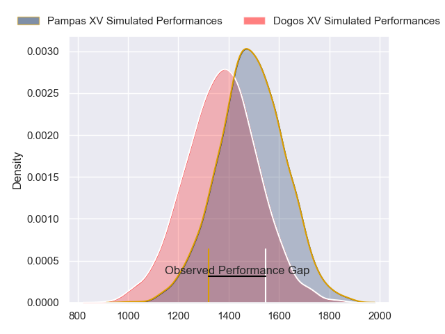
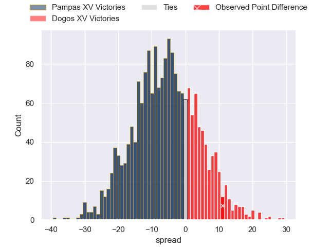

---  
layout: page  
title: Pampas XV at Dogos XV; 16-27  
date: 2023-06-03 02:30:00 18:00:00 -0500  
categories: match review  
---
# Pampas XV at Dogos XV; 16-27

# Club Level Predictions

The first set of predictions treats a club as the smallest object, as the club develops its members, organizes a gameplan, and deploys its players as needed for each match. This club model has a prediction of 0.357, which translates to predicting Pampas XV to win by 5.6.

Each club has a rating and a rating deviation (simiar to a Glicko system), and expected performances can be generated. This allows for simulated matches and spreads like the ones below.
## Projected Performances

## Projected Spreads

## Projected Results

# Player Level Predictions

Treating teams instead as an entity made up of the currently active players, I have ratings for each player in an altogether different system. These can be combined to form team ratings once teamsheets are announced, weighting starters a bit higher than the reserves. After the match is played, players can be weighted by their minutes on the field, allowing for an accurate measure of the team's composition. With these compiled team ratings, we can make predictions, measure inaccuracy, and update the individual player ratings.
## Prediction with Player Minutes: Pampas XV by 3.3

Pampas XV by 7.3 on a neutral field

There were 11 large changes in win probability in this match
## Prediction without Player Minutes: Pampas XV by 5.5

Pampas XV by 9.5 on a neutral pitch

|   Away Minutes | Away Player                    |   Away elo |   Away Percentile |   Number |   Home Percentile |   Home elo | Home Player               |   Home Minutes |
|---------------:|:-------------------------------|-----------:|------------------:|---------:|------------------:|-----------:|:--------------------------|---------------:|
|             68 | Javier Corvalan                |      61.5  |                16 |        1 |                38 |      71.05 | Santiago Pulella          |             57 |
|             72 | Ramiro Gurovich                |      66.71 |                26 |        2 |                 4 |      43.91 | Boris Wenger              |             80 |
|             50 | Javier Angel Coronel           |      63.93 |                19 |        3 |                11 |      57.46 | Octavio Filippa           |             57 |
|             59 | Manuel Bernstein               |      63.42 |                21 |        4 |                20 |      63.22 | Gregorio Hernandez        |             80 |
|             48 | Eliseo Fourcade                |      31.47 |                 1 |        5 |                 5 |      46.86 | Lautaro Simes             |             80 |
|             33 | Nicolas Damorim                |      72.81 |                40 |        6 |                24 |      65.72 | Ignacio Jose Gandini      |             80 |
|             80 | Jeronimo Ureta                 |      54.13 |                 9 |        7 |                16 |      60.57 | Efrain Elias              |             80 |
|             80 | Santiago Ruiz                  |      61.14 |                15 |        8 |                 3 |      45.6  | Juan Bautista Mernes      |             54 |
|             57 | Mateo Albanese                 |      62.17 |                19 |        9 |                17 |      60.29 | Agustin Moyano            |             72 |
|             80 | Joaquin de la Vega Mendia      |      39.74 |                 2 |       10 |                 9 |      54.68 | Julian Ignacio Hernandez  |             80 |
|             80 | Juan Ignacio Lando             |      87.53 |                65 |       11 |                20 |      62.23 | Ernesto Giudice           |             80 |
|             80 | Felipe de la Vega              |      62.73 |                19 |       12 |                10 |      54.97 | Leonardo Gea Salim        |             63 |
|             80 | Santiago Castro                |      63.91 |                21 |       13 |                24 |      65.61 | Agustin Segura            |             80 |
|             80 | Benjamin Elizalde              |      62.63 |                21 |       14 |                 5 |      47.74 | Lautaro Cipriani          |             57 |
|             50 | Eliseo Nicolas Morales Abraham |      48.62 |                 7 |       15 |                 7 |      48.01 | Mateo Soler               |             80 |
|             47 | Eliseo Chiavassa               |      52.05 |                 7 |       16 |                23 |      61.41 | Valentin Cabral           |             26 |
|             32 | Rodrigo Fernandez Criado       |      85.61 |                68 |       17 |                 8 |      51.67 | Juan Baronio              |             23 |
|             30 | Renzo Zanella                  |      61.45 |               nan |       18 |               nan |      65.72 | Octavio Barbatti          |             23 |
|             30 | Joaquin Lamas                  |      57.85 |                12 |       19 |                 2 |      43.47 | Tomas Bartolini           |             23 |
|             23 | Rafael Iriarte                 |      81.08 |                57 |       20 |                17 |      60.76 | Faustino Sánchez Valarolo |             17 |
|             21 | Lorenzo Colidio                |      67.99 |                28 |       21 |                12 |      55.53 | Juan Cruz Strada          |              8 |
|             12 | Matias Medrano                 |      74.2  |                47 |       22 |               nan |     nan    | nan                       |            nan |
|              8 | Valentin Minoyetti             |      62.11 |                19 |       23 |               nan |     nan    | nan                       |            nan |

