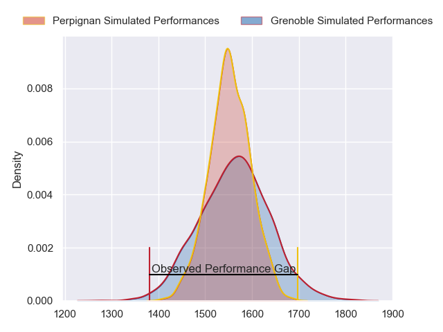
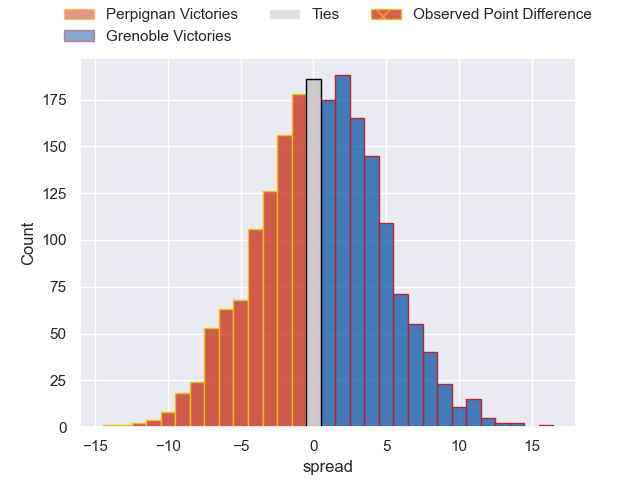

---  
layout: page  
title: Perpignan at Grenoble; 33-19  
date: 2023-06-03 21:00:00 18:00:00 -0500  
categories: match review  
---
# Perpignan at Grenoble; 33-19

# Club Level Predictions

The first set of predictions treats a club as the smallest object, as the club develops its members, organizes a gameplan, and deploys its players as needed for each match. This club model has a prediction of 0.513, which translates to predicting Grenoble to win by 0.5.

Each club has a rating and a rating deviation (simiar to a Glicko system), and expected performances can be generated. This allows for simulated matches and spreads like the ones below.
## Projected Performances

## Projected Spreads

## Projected Results

# Player Level Predictions

Treating teams instead as an entity made up of the currently active players, I have ratings for each player in an altogether different system. These can be combined to form team ratings once teamsheets are announced, weighting starters a bit higher than the reserves. After the match is played, players can be weighted by their minutes on the field, allowing for an accurate measure of the team's composition. With these compiled team ratings, we can make predictions, measure inaccuracy, and update the individual player ratings.
## Prediction with Player Minutes: Grenoble by 6.3

Grenoble by 2.3 on a neutral field

There were 7 large changes in win probability in this match
## Prediction without Player Minutes: Grenoble by 9.1

Grenoble by 5.1 on a neutral pitch

|   Away Minutes | Away Player          |   Away elo |   Away Percentile |   Number |   Home Percentile |   Home elo | Home Player         |   Home Minutes |
|---------------:|:---------------------|-----------:|------------------:|---------:|------------------:|-----------:|:--------------------|---------------:|
|             51 | Giorgi Tetrashvili   |      75.71 |                44 |        1 |                94 |     106.55 | Zack Gauthier       |             49 |
|             62 | Seilala Lam          |      71.64 |                40 |        2 |                55 |      79.58 | Jean-Charles Orioli |             49 |
|             62 | Arthur Joly          |      81.97 |                60 |        3 |                60 |      81.74 | Irakli Aptsiauri    |             40 |
|             80 | Tristan Labouteley   |      79.73 |                57 |        4 |                51 |      78.94 | Tanginoa Halaifonua |             80 |
|             70 | Posolo Tuilagi       |      99.45 |                87 |        5 |                95 |     110.81 | Pio Muarua          |             49 |
|             80 | Brad Shields         |      76.18 |                47 |        6 |                69 |      86.68 | Steeve Blanc-Mappaz |             62 |
|             60 | Kélian Galletier     |      86.65 |                69 |        7 |                78 |      91.8  | Antonin Berruyer    |             80 |
|             47 | Genesis Mamea Lemalu |      69.31 |                29 |        8 |                32 |      69.39 | Talalelei Gray      |             61 |
|             70 | Sadek Deghmache      |      75.74 |                43 |        9 |                41 |      74.67 | Felipe Ezcurra      |             58 |
|             80 | Jake McIntyre        |      76.26 |                44 |       10 |                48 |      77.17 | Romain Barthélémy   |             66 |
|             80 | Mathieu Acebes       |      76.87 |                48 |       11 |                53 |      79.26 | Lucas Dupont        |             80 |
|             80 | Dorian Laborde       |      86.18 |                64 |       12 |                33 |      68.92 | Bautista Ezcurra    |             80 |
|             70 | Edward Sawailau      |      85.96 |                64 |       13 |                69 |      89.14 | Romain Trouilloud   |             80 |
|             80 | Lucas Dubois         |      88.77 |                72 |       14 |                70 |      89.32 | Romain Fusier       |             80 |
|             80 | Tristan Tedder       |      81.57 |                54 |       15 |                57 |      84.68 | Julien Farnoux      |             80 |
|             33 | Joaquin Oviedo       |      82.84 |                63 |       16 |                45 |      76.89 | Sam Nixon           |             40 |
|             29 | Sacha Lotrian        |      84.37 |                66 |       17 |                52 |      78.94 | Luka Goginava       |             31 |
|             20 | Lucas Bachelier      |      79.97 |                53 |       18 |                11 |      56.03 | Mathis Sarragallet  |             31 |
|             18 | Mike Tadjer          |      59.9  |                15 |       19 |                13 |      58.71 | José Duarte Madeira |             31 |
|             18 | Siua Halanukonuka    |      71.42 |               nan |       20 |                62 |      84.68 | Éric Escande        |             22 |
|             10 | Tom Ecochard         |      70.19 |                31 |       21 |                43 |      74.2  | Marnus Schoeman     |             18 |
|             10 | Shahn Eru            |      65.25 |                23 |       22 |                63 |      86.23 | Thomas Fortunel     |             14 |
|             10 | George Tilsley       |      76.05 |                46 |       23 |                54 |      80.78 | Marko Gazzotti      |             19 |

