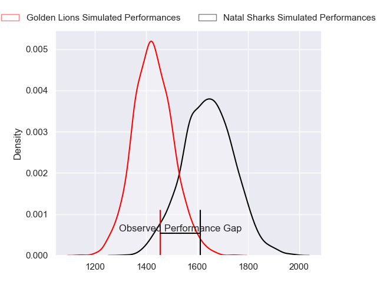
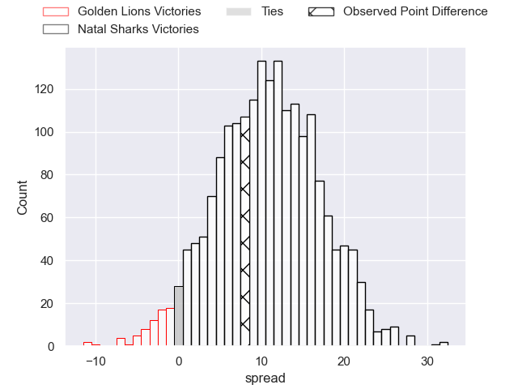
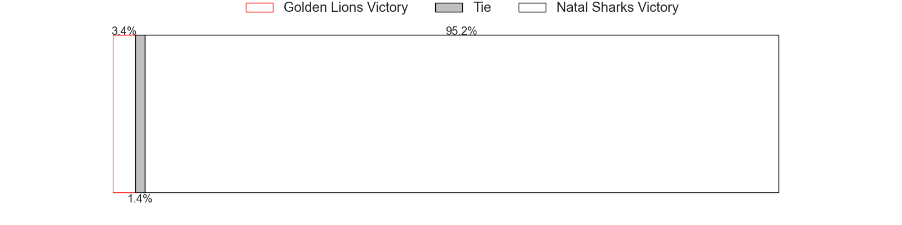

---  
layout: page  
title: Golden Lions at Natal Sharks; 21-29  
date: 2023-06-03 19:00:00 18:00:00 -0500  
categories: match review  
---
# Golden Lions at Natal Sharks; 21-29

# Club Level Predictions

The first set of predictions treats a club as the smallest object, as the club develops its members, organizes a gameplan, and deploys its players as needed for each match. This club model has a prediction of 0.769, which translates to predicting Natal Sharks to win by 10.8.

Each club has a rating and a rating deviation (simiar to a Glicko system), and expected performances can be generated. This allows for simulated matches and spreads like the ones below.
## Projected Performances

## Projected Spreads

## Projected Results

# Player Level Predictions

Treating teams instead as an entity made up of the currently active players, I have ratings for each player in an altogether different system. These can be combined to form team ratings once teamsheets are announced, weighting starters a bit higher than the reserves. After the match is played, players can be weighted by their minutes on the field, allowing for an accurate measure of the team's composition. With these compiled team ratings, we can make predictions, measure inaccuracy, and update the individual player ratings.
## Prediction with Player Minutes: Natal Sharks by 1.8

Golden Lions by 2.2 on a neutral field
## Prediction without Player Minutes: Natal Sharks by 1.8

Golden Lions by 2.2 on a neutral pitch

|   Away Minutes | Away Player                 |   Away elo |   Away Percentile |   Number |   Home Percentile |   Home elo | Home Player                   |   Home Minutes |
|---------------:|:----------------------------|-----------:|------------------:|---------:|------------------:|-----------:|:------------------------------|---------------:|
|             80 | Rhynardt Rijnsburger        |     105.79 |                92 |        1 |                70 |      86.45 | Khwezi Jongamazizi Mona       |             80 |
|             80 | Morné Brandon               |      64.27 |               nan |        2 |                64 |      85.17 | Fezokuhle Mbatha              |             80 |
|             80 | Ruan Martin Dreyer          |      84.6  |                66 |        3 |                87 |      97.47 | Khuthuzani Kingdom Mchunu     |             80 |
|             80 | Ruben (Hobo) Schoeman       |      90.89 |                74 |        4 |                87 |     100.4  | Ockie Barnard                 |             80 |
|             80 | Darrien-Lane Landsberg      |     109.21 |                93 |        5 |                58 |      82.33 | Daniel Pieter (Reniel) Hugo   |             80 |
|             80 | Johannes JC Pretorius       |      97.91 |                85 |        6 |                59 |      81.76 | Dylan Richardson              |             80 |
|             80 | Ruan Venter                 |      96.92 |                84 |        7 |                63 |      83.73 | James Venter                  |             80 |
|             80 | Francke Horn                |      95.65 |                81 |        8 |                76 |      92.43 | Hendrik Petrus (Henco) Venter |             80 |
|             80 | Sanele Nohamba              |      92.14 |                75 |        9 |                71 |      90.22 | Tiaan Fourie                  |             80 |
|             80 | Gianni Dean Lombard         |      85.59 |                61 |       10 |                65 |      87.6  | Lionel Cronje                 |             80 |
|             80 | Edwill Charl van der Merwe  |      92.11 |                76 |       11 |                30 |      71.06 | Aphelele Onke Okuhle Fassi    |             80 |
|             80 | Marius Louw                 |      85.16 |                63 |       12 |                98 |     122.29 | Alwayno Visagie               |             80 |
|             80 | Manuel Johern (Mannie) Rass |      68.15 |                29 |       13 |                53 |      79.86 | Murray Koster                 |             80 |
|             80 | Boldwin Hansen              |      94.13 |                79 |       14 |                60 |      82.84 | Yaw Osei Penxe                |             80 |
|             80 | Quan Horn                   |      91.27 |                72 |       15 |                65 |      88.64 | Nevaldo Fleurs                |             80 |

