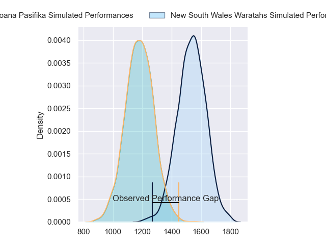
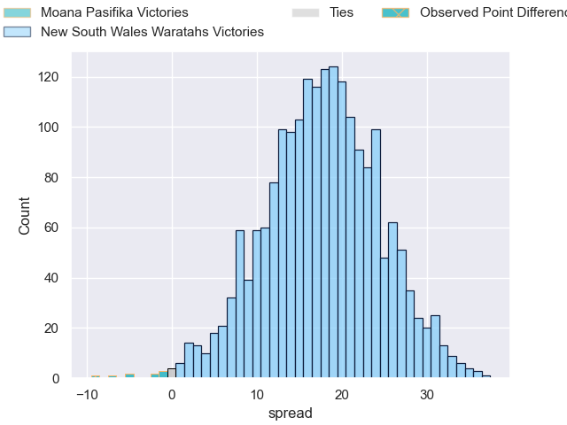
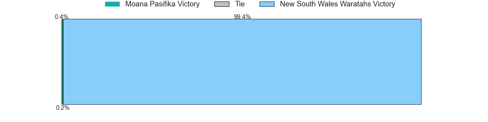

---  
layout: page  
title: Moana Pasifika at New South Wales Waratahs; 33.0-24.0  
date: 2023-06-03 05:35:00 18:00:00 -0500  
categories: match review  
---
# Moana Pasifika at New South Wales Waratahs; 33.0-24.0

# Club Level Predictions

The first set of predictions treats a club as the smallest object, as the club develops its members, organizes a gameplan, and deploys its players as needed for each match. This club model has a prediction of 0.876, which translates to predicting New South Wales Waratahs to win by 17.7.

Each club has a rating and a rating deviation (simiar to a Glicko system), and expected performances can be generated. This allows for simulated matches and spreads like the ones below.
## Projected Performances

## Projected Spreads

## Projected Results

# Player Level Predictions

Treating teams instead as an entity made up of the currently active players, I have ratings for each player in an altogether different system. These can be combined to form team ratings once teamsheets are announced, weighting starters a bit higher than the reserves. After the match is played, players can be weighted by their minutes on the field, allowing for an accurate measure of the team's composition. With these compiled team ratings, we can make predictions, measure inaccuracy, and update the individual player ratings.
## Prediction with Player Minutes: New South Wales Waratahs by 17.3

New South Wales Waratahs by 13.3 on a neutral field

There were 11 large changes in win probability in this match
## Prediction without Player Minutes: New South Wales Waratahs by 13.3

New South Wales Waratahs by 9.3 on a neutral pitch

|   Away Minutes | Away Player           |   Away elo |   Away Percentile |   Number |   Home Percentile |   Home elo | Home Player          |   Home Minutes |
|---------------:|:----------------------|-----------:|------------------:|---------:|------------------:|-----------:|:---------------------|---------------:|
|             53 | Abraham Pole          |      83.34 |                60 |        1 |               nan |      76.27 | Nephi Leatigaga      |             33 |
|             53 | Luteru Tolai          |      93.39 |                82 |        2 |                 6 |      48.36 | Mahe Vailanu         |             53 |
|             53 | Joe Apikotoa          |      97.08 |                87 |        3 |                71 |      86.77 | Harry Johnson-Holmes |             46 |
|             68 | Michael Curry         |      98.61 |                84 |        4 |                88 |     101.37 | Ned Hanigan          |             81 |
|             81 | Samuel Slade          |      59.72 |                15 |        5 |                81 |      95.11 | Hugh Sinclair        |             81 |
|             81 | Miracle Faiilagi      |      68.57 |                27 |        6 |                74 |      89.01 | Lachlan Swinton      |             53 |
|             53 | Penitoa Finau         |      65.21 |                22 |        7 |                99 |     143.35 | Michael Hooper       |             81 |
|             81 | Solomone Funaki       |      81.22 |                54 |        8 |                67 |      85.38 | Taleni Seu           |             53 |
|             58 | Jonathan Taumateine   |      64.47 |                21 |        9 |               nan |      84.81 | Harrison Goddard     |             77 |
|             69 | Christian Leali'ifano |     101.42 |                86 |       10 |                66 |      87.98 | Ben Donaldson        |             81 |
|             81 | Timoci Tavatavanawai  |      76.47 |                46 |       11 |                88 |     102.44 | Dylan Pietsch        |             81 |
|             81 | Henry Taefu           |      50.21 |                 6 |       12 |                64 |      86.03 | Mosese Tuipulotu     |             68 |
|             81 | Levi Aumua            |     116.24 |                96 |       13 |                54 |      80.73 | Joey Walton          |             81 |
|             59 | Tima Fainga'anuku     |     104.32 |                89 |       14 |                47 |      76.71 | Izaia Perese         |             59 |
|             81 | William Havili        |     106.7  |                89 |       15 |                77 |      93.06 | Mark Nawaqanitawase  |             81 |
|             28 | Samiuela Moli         |      55.77 |                10 |       16 |               nan |     110.15 | Tolu Latu            |             28 |
|             28 | Ezekiel Lindenmuth    |      74.68 |                42 |       17 |                85 |      94.01 | Tom Lambert          |             48 |
|             28 | Chris Apoua           |      72.57 |                32 |       18 |                73 |      88.89 | Archer Holz          |             35 |
|             13 | Mike McKee            |      74.13 |                39 |       19 |                63 |      83.71 | Charlie Gamble       |             28 |
|             28 | Alamanda Motuga       |      69.84 |                33 |       20 |                73 |      90.03 | Langi Gleeson        |             28 |
|             23 | Ere Enari             |     101.32 |                86 |       21 |                93 |     109.88 | Jake Gordon          |              4 |
|             12 | Lincoln McClutchie    |      90.45 |                71 |       22 |                56 |      82.64 | Tane Edmed           |             13 |
|             22 | Fine Inisi            |      69.2  |                30 |       23 |                61 |      83.24 | Harry Wilson         |             22 |

