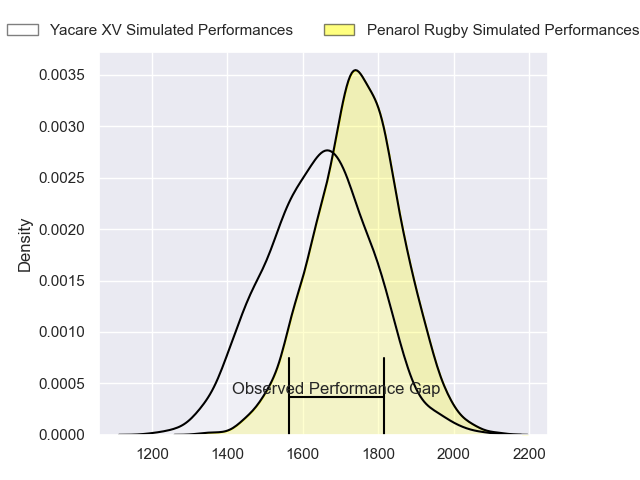
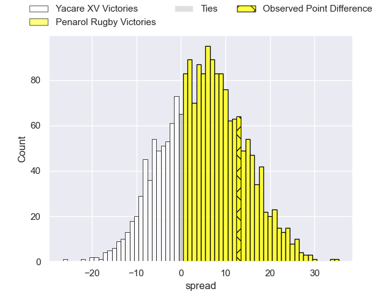
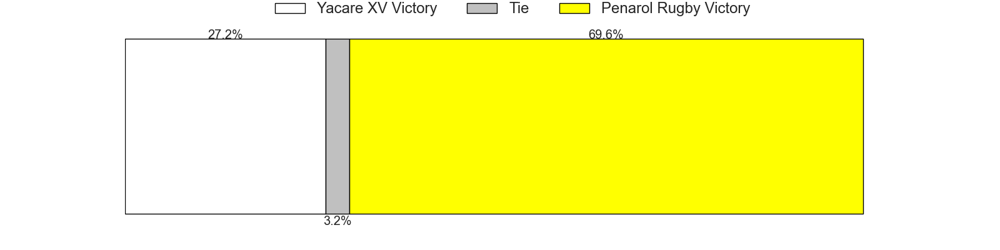

---  
layout: page  
title: Yacare XV at Penarol Rugby; 17-30  
date: 2023-06-03 00:00:00 18:00:00 -0500  
categories: match review  
---
# Yacare XV at Penarol Rugby; 17-30

# Club Level Predictions

The first set of predictions treats a club as the smallest object, as the club develops its members, organizes a gameplan, and deploys its players as needed for each match. This club model has a prediction of 0.637, which translates to predicting Penarol Rugby to win by 5.3.

Each club has a rating and a rating deviation (simiar to a Glicko system), and expected performances can be generated. This allows for simulated matches and spreads like the ones below.
## Projected Performances

## Projected Spreads

## Projected Results

# Player Level Predictions

Treating teams instead as an entity made up of the currently active players, I have ratings for each player in an altogether different system. These can be combined to form team ratings once teamsheets are announced, weighting starters a bit higher than the reserves. After the match is played, players can be weighted by their minutes on the field, allowing for an accurate measure of the team's composition. With these compiled team ratings, we can make predictions, measure inaccuracy, and update the individual player ratings.
## Prediction with Player Minutes: Yacare XV by 5.9

Yacare XV by 9.9 on a neutral field

There were 11 large changes in win probability in this match
## Prediction without Player Minutes: Penarol Rugby by 4.6

Penarol Rugby by 0.6 on a neutral pitch

|   Away Minutes | Away Player             |   Away elo |   Away Percentile |   Number |   Home Percentile |   Home elo | Home Player                        |   Home Minutes |
|---------------:|:------------------------|-----------:|------------------:|---------:|------------------:|-----------:|:-----------------------------------|---------------:|
|             10 | Lucas Noguera Paz       |      65.6  |                22 |        1 |                11 |      59.05 | Matteo Sanguinetti                 |             53 |
|             80 | Julian Martin           |      46.9  |                 2 |        2 |                27 |      67.28 | Guillermo Pujadas Leon             |             59 |
|             80 | Facundo Pomponio        |      80.56 |                58 |        3 |                53 |      78.64 | Ignacio Alfredo Peculo Rodriguez   |             53 |
|             80 | Lucas Sommer            |     102.24 |                88 |        4 |                15 |      59.71 | Ignacio Dotti                      |             50 |
|             80 | Mariano Garcete Elli    |      67.17 |                27 |        5 |                48 |      76.16 | Felipe Aliaga                      |             80 |
|             80 | Juan Cruz Perez Rachel  |      57.47 |                12 |        6 |                 5 |      50.18 | Manuel Ardao                       |             80 |
|             80 | Felipe Puertas          |      98.57 |                86 |        7 |                 8 |      54.04 | Carlos Manuel Deus Lopes de Amorin |             80 |
|             80 | Marcos Riquelme         |      54.79 |                 6 |        8 |                31 |      72.27 | Manuel Diana                       |             80 |
|             80 | Ignacio Inchauspe       |      90.97 |                74 |        9 |                38 |      73.23 | Santiago Álvarez Viera Da Cunha    |             76 |
|             44 | Federico Cacciabúe      |      68.71 |                27 |       10 |                34 |      72.24 | Felipe Etcheverry                  |             80 |
|             33 | Juan Daniel Gonzalez    |      46.85 |                 5 |       11 |                24 |      66.3  | Juan Manuel Alonso                 |             80 |
|             80 | Juan David Agudelo Rojo |      69.06 |                30 |       12 |                22 |      64.42 | Juan Zuccarino                     |             67 |
|             80 | Ramiro Amarilla         |      73.61 |                40 |       13 |                35 |      71.18 | Tomas Inciarte Rachetti            |             80 |
|             80 | Tomas Acosta Pimentel   |      89.53 |                73 |       14 |                28 |      67.3  | Alfonso Silva                      |             76 |
|             80 | Nicolas Picasso Cerdera |      68.2  |                26 |       15 |                18 |      64.95 | Rodrigo Silva                      |             80 |
|             70 | Emilio Gorostiaga       |      68.33 |                17 |       16 |                46 |      76.85 | Juan Manuel Rodriguez              |             21 |
|             47 | Sebastian Urbieta       |      76.39 |                46 |       17 |                14 |      59.77 | Mateo Perillo                      |             27 |
|             36 | Estanislao Gomez        |      54.44 |                11 |       18 |                 9 |      57.58 | Diego Arbelo                       |             27 |
|            nan | nan                     |     nan    |               nan |       19 |                15 |      59.45 | Emiliano Faccennini                |             21 |
|            nan | nan                     |     nan    |               nan |       20 |                30 |      69.86 | Guillermo Storace                  |             13 |
|            nan | nan                     |     nan    |               nan |       21 |                30 |      70.76 | Agustin Morales                    |              9 |
|            nan | nan                     |     nan    |               nan |       22 |               nan |      68.43 | Juan Francisco Torres Burwood      |              4 |
|            nan | nan                     |     nan    |               nan |       23 |                35 |      71.96 | Santiago Manuel Del Cerro Lawlor   |              4 |

