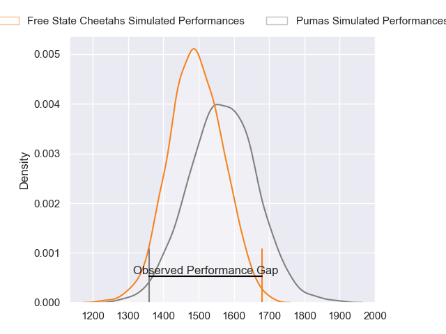
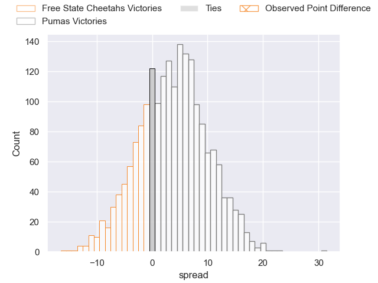
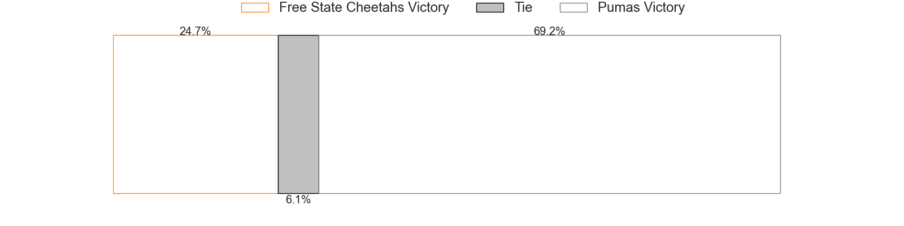

---  
layout: page  
title: Free State Cheetahs at Pumas; 29-14  
date: 2023-06-03 17:00:00 18:00:00 -0500  
categories: match review  
---
# Free State Cheetahs at Pumas; 29-14

# Club Level Predictions

The first set of predictions treats a club as the smallest object, as the club develops its members, organizes a gameplan, and deploys its players as needed for each match. This club model has a prediction of 0.602, which translates to predicting Pumas to win by 3.7.

Each club has a rating and a rating deviation (simiar to a Glicko system), and expected performances can be generated. This allows for simulated matches and spreads like the ones below.
## Projected Performances

## Projected Spreads

## Projected Results

# Player Level Predictions

Treating teams instead as an entity made up of the currently active players, I have ratings for each player in an altogether different system. These can be combined to form team ratings once teamsheets are announced, weighting starters a bit higher than the reserves. After the match is played, players can be weighted by their minutes on the field, allowing for an accurate measure of the team's composition. With these compiled team ratings, we can make predictions, measure inaccuracy, and update the individual player ratings.
## Prediction with Player Minutes: Pumas by 6.8

Pumas by 2.8 on a neutral field

There were 11 large changes in win probability in this match
## Prediction without Player Minutes: Pumas by 6.5

Pumas by 2.5 on a neutral pitch

|   Away Minutes | Away Player                    |   Away elo |   Away Percentile |   Number |   Home Percentile |   Home elo | Home Player          |   Home Minutes |
|---------------:|:-------------------------------|-----------:|------------------:|---------:|------------------:|-----------:|:---------------------|---------------:|
|             40 | Schalk Ferreira                |      68.36 |                27 |        1 |                43 |      74.92 | Cameron Dawson       |             80 |
|             62 | Marnus van der Merwe           |      92.59 |                81 |        2 |                38 |      72.03 | Corne Fourie         |             56 |
|             44 | Jacobus Conradus van Vuuren    |      72.02 |               nan |        3 |               nan |      51.5  | Simon Raw            |             51 |
|             80 | Rynier Mark Bernardo           |      54.72 |                10 |        4 |                16 |      61.13 | Deon Slabbert        |             62 |
|             80 | Victor Kutlwano Sekekete       |      64.48 |                21 |        5 |                92 |     107.67 | Shane Monro Kirkwood |             80 |
|             54 | Gideon van der Merwe           |      55.61 |                10 |        6 |                12 |      56.72 | Andre Fouché         |             69 |
|             62 | Sibabalo Qoma                  |      69.32 |                31 |        7 |                36 |      71.72 | Francois Kleinhans   |             46 |
|             62 | Friedle Olivier                |     108.75 |                94 |        8 |                69 |      88.29 | Kwanda Dimaza        |             80 |
|             80 | Rewan Kruger                   |      81.82 |                58 |        9 |                10 |      56.44 | Giovanne Snyman      |             62 |
|             80 | Ruan Pienaar                   |      67.29 |                25 |       10 |                79 |      95.75 | Tinus de Beer        |             80 |
|             80 | Cohen Jasper                   |      71.25 |                35 |       11 |                71 |      88.74 | Etienne Taljaard     |             80 |
|             80 | Reinhardt Fortuin              |      89.76 |                70 |       12 |                52 |      79.34 | Wian van Niekerk     |             77 |
|             80 | David Benjamin Brits           |      73.53 |                40 |       13 |                40 |      73.55 | Diego Appollis       |             80 |
|             80 | Daniel Kasende Kalepula        |      74.8  |                42 |       14 |                46 |      76.44 | Andrew Kota          |             80 |
|             80 | Tapiwa Lloyd Mafura            |      70.92 |                32 |       15 |                34 |      71.82 | Devon Frank Williams |             80 |
|             40 | Alulutho Tshakweni             |      81.64 |                76 |       16 |               nan |      75.58 | Dewald Maritz        |             29 |
|             36 | Hencus van Wyk                 |      75.1  |                43 |       17 |                34 |      71.95 | Ruwald Van der Merwe |             34 |
|             26 | Daniel Johannes Maartens       |      95.5  |                87 |       18 |               nan |      90.12 | Etienne Janeke       |             24 |
|             18 | Marko Louis Janse van Rensburg |      70.77 |                35 |       19 |                83 |      98.36 | Chriswill September  |             18 |
|             18 | George Cronje                  |      74.95 |                42 |       20 |                43 |      73.96 | Malembe Mpofu        |             18 |
|             18 | Jeandre Rudolph                |      74.98 |                39 |       21 |                23 |      62.85 | Jaco Labuschagne     |             11 |
|            nan | nan                            |     nan    |               nan |       22 |                27 |      68.41 | Gene Willemse        |              3 |

