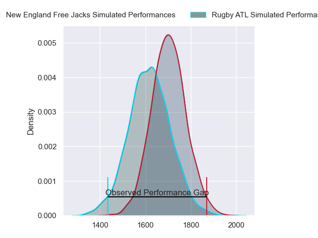
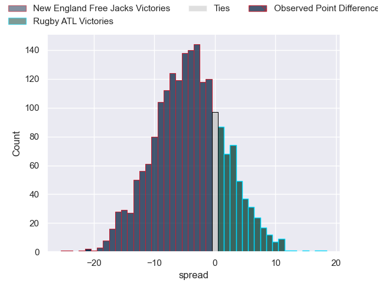

---  
layout: page  
title: New England Free Jacks at Rugby ATL; 35-14  
date: 2023-06-03 01:00:00 18:00:00 -0500  
categories: match review  
---
# New England Free Jacks at Rugby ATL; 35-14

# Club Level Predictions

The first set of predictions treats a club as the smallest object, as the club develops its members, organizes a gameplan, and deploys its players as needed for each match. This club model has a prediction of 0.389, which translates to predicting New England Free Jacks to win by 4.0.

Each club has a rating and a rating deviation (simiar to a Glicko system), and expected performances can be generated. This allows for simulated matches and spreads like the ones below.
## Projected Performances

## Projected Spreads

## Projected Results

# Player Level Predictions

Treating teams instead as an entity made up of the currently active players, I have ratings for each player in an altogether different system. These can be combined to form team ratings once teamsheets are announced, weighting starters a bit higher than the reserves. After the match is played, players can be weighted by their minutes on the field, allowing for an accurate measure of the team's composition. With these compiled team ratings, we can make predictions, measure inaccuracy, and update the individual player ratings.
## Prediction with Player Minutes: New England Free Jacks by 35.0

New England Free Jacks by 39.0 on a neutral field

There were 3 large changes in win probability in this match
## Prediction without Player Minutes: New England Free Jacks by 35.0

New England Free Jacks by 39.0 on a neutral pitch

|   Away Minutes | Away Player       |   Away elo |   Away Percentile |   Number |   Home Percentile |   Home elo | Home Player            |   Home Minutes |
|---------------:|:------------------|-----------:|------------------:|---------:|------------------:|-----------:|:-----------------------|---------------:|
|             80 | Kyle Ciquera      |      88.3  |                67 |        1 |                 0 |      -8.41 | Alex Maughan           |             80 |
|             80 | Andrew Quattrin   |      67.56 |                23 |        2 |                 3 |      42.16 | Sidney Tobias          |             80 |
|             80 | Cole Keith        |      68.68 |                25 |        3 |                 2 |      43.09 | John Roy Jenkinson     |             80 |
|             80 | Conor Keys        |      85.77 |                61 |        4 |                 2 |      42.38 | Justin Johan Basson    |             80 |
|             80 | Reegan O'Gorman   |      70.89 |                32 |        5 |                27 |      67.79 | Johannes Momsen        |             80 |
|             80 | Mitchell Jacobson |      66.68 |                26 |        6 |                 0 |      30.67 | Connor Cook            |             80 |
|             80 | Slade McDowall    |      69.01 |                31 |        7 |                 0 |      34.43 | Matthew Heaton         |             80 |
|             80 | Wian Conradie     |      92.32 |                76 |        8 |                89 |     102.68 | Vili Helu              |             80 |
|             80 | Kieran McClea     |      54.81 |                 9 |        9 |                 8 |      53.22 | Ryan Rees              |             80 |
|             80 | Jayson Potroz     |      93.29 |                74 |       10 |                31 |      70.9  | Christopher Hilsenbeck |             80 |
|             80 | Paul Balekana     |      85.58 |                66 |       11 |                 0 |      -3.76 | Austin White           |             80 |
|             80 | Le Roux Malan     |      79.06 |                51 |       12 |                44 |      75.74 | Martini Talapusi       |             80 |
|             80 | Ben Lesage        |      77.4  |                47 |       13 |                99 |     131.76 | Will Leonard           |             80 |
|             80 | Mitchell Wilson   |      86.9  |                69 |       14 |                 1 |      35.07 | Te Rangatira Waitokia  |             80 |
|             80 | Reece MacDonald   |      75.08 |                40 |       15 |                10 |      53.42 | Rewita Biddle          |             80 |

