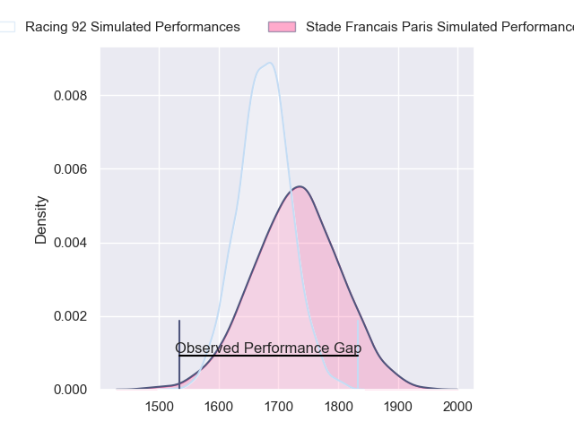
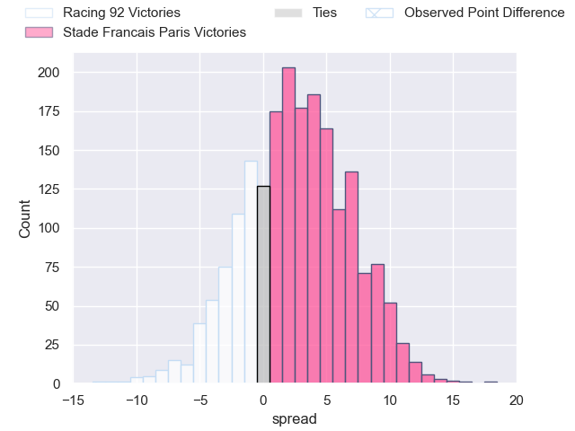
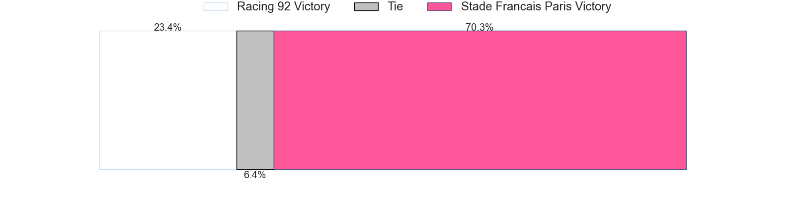

---  
layout: page  
title: Racing 92 at Stade Francais Paris; 33-20  
date: 2023-06-03 14:00:00 18:00:00 -0500  
categories: match review  
---
# Racing 92 at Stade Francais Paris; 33-20

# Club Level Predictions

The first set of predictions treats a club as the smallest object, as the club develops its members, organizes a gameplan, and deploys its players as needed for each match. This club model has a prediction of 0.573, which translates to predicting Stade Francais Paris to win by 2.6.

Each club has a rating and a rating deviation (simiar to a Glicko system), and expected performances can be generated. This allows for simulated matches and spreads like the ones below.
## Projected Performances

## Projected Spreads

## Projected Results

# Player Level Predictions

Treating teams instead as an entity made up of the currently active players, I have ratings for each player in an altogether different system. These can be combined to form team ratings once teamsheets are announced, weighting starters a bit higher than the reserves. After the match is played, players can be weighted by their minutes on the field, allowing for an accurate measure of the team's composition. With these compiled team ratings, we can make predictions, measure inaccuracy, and update the individual player ratings.
## Prediction with Player Minutes: Stade Francais Paris by 1.6

Racing 92 by 2.4 on a neutral field

There were 11 large changes in win probability in this match
## Prediction without Player Minutes: Stade Francais Paris by 2.0

Racing 92 by 2.0 on a neutral pitch

|   Away Minutes | Away Player           |   Away elo |   Away Percentile |   Number |   Home Percentile |   Home elo | Home Player             |   Home Minutes |
|---------------:|:----------------------|-----------:|------------------:|---------:|------------------:|-----------:|:------------------------|---------------:|
|             68 | Guram Gogichashvili   |      77.98 |                51 |        1 |                38 |      72.97 | Moses Eneliko Alo-Emile |             61 |
|             52 | Camille Chat          |      71.88 |                38 |        2 |                30 |      68.37 | Mickaël Ivaldi          |             56 |
|             59 | Trevor Ntando Nyakane |      85.27 |                69 |        3 |                40 |      73.95 | Paul Alo-Emile          |             41 |
|             80 | Fabien Sanconnie      |      86.08 |                70 |        4 |                53 |      78.52 | Paul Gabrillagues       |             80 |
|             48 | Veikoso Poloniati     |      74.11 |                42 |        5 |                38 |      72.73 | Baptiste Pesenti        |             80 |
|             80 | Wenceslas Lauret      |      64.5  |                22 |        6 |                45 |      75.25 | Marcos Kremer           |             80 |
|             56 | Ibrahim Diallo        |      81.03 |                58 |        7 |                36 |      71.13 | Romain Briatte          |             68 |
|             80 | Cameron Woki          |      65.93 |                25 |        8 |                34 |      71.74 | Sekou Macalou           |             80 |
|             56 | Nolann Le Garrec      |      82.33 |                61 |        9 |                41 |      76.94 | Arthur Coville          |             66 |
|             80 | Finn Russell          |      76.53 |                48 |       10 |                50 |      81.92 | Joris Segonds           |             80 |
|             80 | Juan Imhoff           |      75.83 |                46 |       11 |                67 |      85.47 | Lester Etien            |             59 |
|             68 | Henry Chavancy        |      82.59 |                59 |       12 |                34 |      70.79 | Alex Arrate             |             80 |
|             80 | Gael Fickou           |      93.09 |                76 |       13 |                32 |      69.54 | Jeremy Charles Ward     |             80 |
|             59 | Donovan Taofifenua    |      51.42 |                 8 |       14 |                66 |      84.91 | Peniasi Dakuwaqa        |             64 |
|             80 | Max Spring            |      84.55 |                58 |       15 |                48 |      79.87 | Kylan Hamdaoui          |             65 |
|             32 | Boris Palu            |      66.44 |                25 |       16 |                31 |      69.7  | Vincent Philip Koch     |             39 |
|             24 | Antoine Gibert        |      74.77 |                40 |       17 |                38 |      72.04 | Lucas Peyresblanques    |             24 |
|             21 | Warrick Wayne Gelant  |      65.87 |                22 |       18 |                23 |      65.26 | Pierre-Henri Azagoh     |             21 |
|             21 | Cedate Gomes Sa       |      71.17 |               nan |       19 |                33 |      70.94 | Vasil Kakovin           |             19 |
|             12 | Eddy Ben Arous        |      74.21 |                41 |       20 |                40 |      73.57 | Nadir Megdoud           |             16 |
|             12 | Francis Saili         |      71    |                34 |       21 |                38 |      74.08 | Léo Barré               |             15 |
|             24 | Anthime Hemery        |      75.7  |                47 |       22 |                25 |      66.37 | Morgan Parra            |             14 |
|             28 | Janick Tarrit         |      75.98 |                46 |       23 |                28 |      67.76 | Mathieu Hirigoyen       |             12 |

