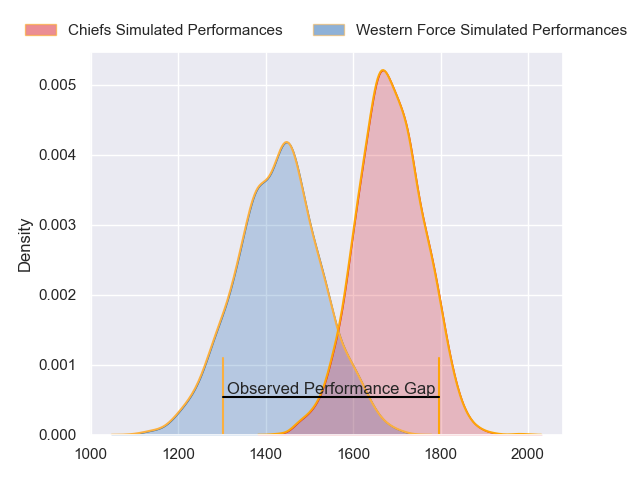
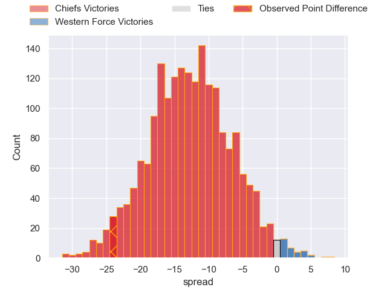

---  
layout: page  
title: Chiefs at Western Force; 43.0-19.0  
date: 2023-06-03 08:00:00 18:00:00 -0500  
categories: match review  
---
# Chiefs at Western Force; 43.0-19.0

# Club Level Predictions

The first set of predictions treats a club as the smallest object, as the club develops its members, organizes a gameplan, and deploys its players as needed for each match. This club model has a prediction of 0.195, which translates to predicting Chiefs to win by 12.6.

Each club has a rating and a rating deviation (simiar to a Glicko system), and expected performances can be generated. This allows for simulated matches and spreads like the ones below.
## Projected Performances

## Projected Spreads

## Projected Results

# Player Level Predictions

Treating teams instead as an entity made up of the currently active players, I have ratings for each player in an altogether different system. These can be combined to form team ratings once teamsheets are announced, weighting starters a bit higher than the reserves. After the match is played, players can be weighted by their minutes on the field, allowing for an accurate measure of the team's composition. With these compiled team ratings, we can make predictions, measure inaccuracy, and update the individual player ratings.
## Prediction with Player Minutes: Chiefs by 1.0

Chiefs by 5.0 on a neutral field

There were 10 large changes in win probability in this match
## Prediction without Player Minutes: Western Force by 1.3

Chiefs by 2.7 on a neutral pitch

|   Away Minutes | Away Player            |   Away elo |   Away Percentile |   Number |   Home Percentile |   Home elo | Home Player           |   Home Minutes |
|---------------:|:-----------------------|-----------:|------------------:|---------:|------------------:|-----------:|:----------------------|---------------:|
|             57 | Ollie Norris           |      94.28 |                84 |        1 |                45 |      75.69 | Angus Wagner          |             49 |
|             47 | Tyrone Thompson        |      88.84 |                75 |        2 |                96 |     111.55 | Folau Fainga'a        |             57 |
|             66 | John Ryan              |     100.3  |                90 |        3 |               nan |      85.78 | Nelson Rebolo         |             64 |
|             17 | Laghlan McWhannell     |     101.41 |                88 |        4 |                46 |      76.99 | Jeremy Williams       |             80 |
|             54 | Tupou Vaa'i            |      70.68 |                32 |        5 |               nan |      90.45 | Izack Rodda           |             43 |
|             80 | Naitoa Ah Kuoi         |     104.82 |                91 |        6 |                80 |      92.71 | Michael Wells         |             80 |
|             80 | Simon Parker           |      73.89 |                39 |        7 |                69 |      86.22 | Carlo Tizzano         |             80 |
|             80 | Samipeni Finau         |     104.43 |                90 |        8 |                85 |      99.96 | Rahboni Vosayaco      |             49 |
|             66 | Te Toiroa Tahuriorangi |      94.53 |                78 |        9 |                86 |     100.23 | Gareth Simpson        |             45 |
|             80 | Rameka Poihipi         |      97.79 |                81 |       10 |                52 |      80.98 | Max Burey             |             80 |
|             80 | Etene Nanai-Seturo     |      94.75 |                80 |       11 |                89 |     102.91 | Manasa Mataele        |             76 |
|             80 | Anton Lienert-Brown    |     118.62 |                97 |       12 |                98 |     123.97 | Hamish Stewart        |             42 |
|             30 | Alex Nankivell         |     103.15 |                87 |       13 |                76 |      93.95 | Sam Spink             |             80 |
|             80 | Liam Coombes-Fabling   |      99.06 |                85 |       14 |                98 |     126.94 | Toni Pulu             |             80 |
|             80 | Shaun Stevenson        |      91.77 |                71 |       15 |                63 |      87.75 | Chase Tiatia          |             80 |
|             33 | Bradley Slater         |     102.39 |                89 |       16 |                85 |      97.01 | Tom Horton            |             23 |
|             23 | Jared Proffit          |      79.51 |                53 |       17 |               nan |      81.2  | Marley Pearce         |             31 |
|             14 | Atu Moli               |      94.41 |                83 |       18 |                68 |      85.64 | Siosifa Amone         |             16 |
|             63 | Manaaki Selby-Rickit   |      81.78 |                60 |       19 |                 2 |      39.45 | Felix Kalapu          |             37 |
|             26 | Pita Gus Sowakula      |      96.74 |                84 |       20 |                29 |      69.27 | Tim Anstee            |             31 |
|             14 | Cortez Ratima          |     100.71 |                86 |       21 |                75 |      92.17 | Issak Fines-Leleiwasa |             35 |
|             34 | Rivez Reihana          |      90.28 |               nan |       22 |               nan |      86.13 | George Poolman        |              4 |
|             16 | Lalomilo Lalomilo      |      96.72 |               nan |       23 |                67 |      85.28 | Bayley Kuenzle        |             38 |

