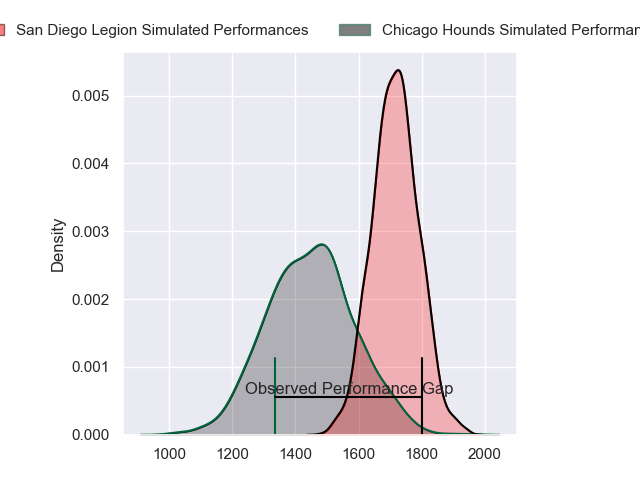
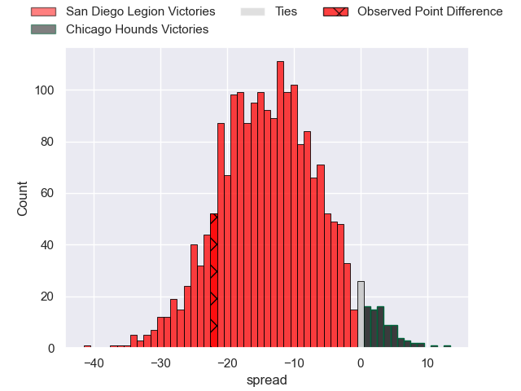
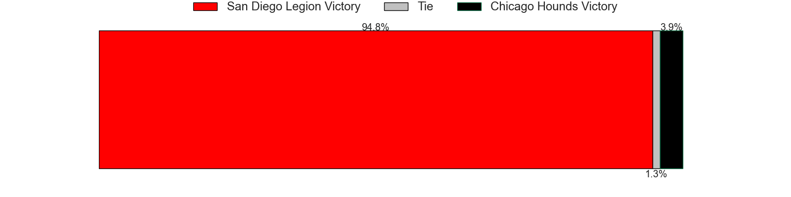

---  
layout: page  
title: San Diego Legion at Chicago Hounds; 36-14  
date: 2023-06-04 01:00:00 18:00:00 -0500  
categories: match review  
---
# San Diego Legion at Chicago Hounds; 36-14

# Club Level Predictions

The first set of predictions treats a club as the smallest object, as the club develops its members, organizes a gameplan, and deploys its players as needed for each match. This club model has a prediction of 0.183, which translates to predicting San Diego Legion to win by 13.3.

Each club has a rating and a rating deviation (simiar to a Glicko system), and expected performances can be generated. This allows for simulated matches and spreads like the ones below.
## Projected Performances

## Projected Spreads

## Projected Results

# Player Level Predictions

Treating teams instead as an entity made up of the currently active players, I have ratings for each player in an altogether different system. These can be combined to form team ratings once teamsheets are announced, weighting starters a bit higher than the reserves. After the match is played, players can be weighted by their minutes on the field, allowing for an accurate measure of the team's composition. With these compiled team ratings, we can make predictions, measure inaccuracy, and update the individual player ratings.
## Prediction with Player Minutes: San Diego Legion by 14.2

San Diego Legion by 18.2 on a neutral field

There were 3 large changes in win probability in this match
## Prediction without Player Minutes: San Diego Legion by 14.2

San Diego Legion by 18.2 on a neutral pitch

|   Away Minutes | Away Player          |   Away elo |   Away Percentile |   Number |   Home Percentile |   Home elo | Home Player      |   Home Minutes |
|---------------:|:---------------------|-----------:|------------------:|---------:|------------------:|-----------:|:-----------------|---------------:|
|             80 | Faka'osi Pifeleti    |      43.22 |                 2 |        1 |                 4 |      47.71 | George Thornton  |             80 |
|             80 | Sama Malolo          |      93.75 |                82 |        2 |                11 |      56.42 | Hugh Roach       |             80 |
|             80 | Luke Green           |      77.55 |                50 |        3 |                15 |      60.52 | Paddy Ryan       |             80 |
|             80 | Ben Grant            |     100.25 |                86 |        4 |                41 |      73.35 | John Cullen      |             80 |
|             80 | Chris Turori         |      76.4  |                49 |        5 |                47 |      75.58 | Cam Dodson       |             80 |
|             80 | Christian Poidevin   |      70.48 |                35 |        6 |                 0 |       6.35 | Mike Matarazzo   |             80 |
|             80 | Blair Cowan          |      69.91 |                33 |        7 |                11 |      56.07 | Maclean Jones    |             80 |
|             80 | Tupou Afungia        |      84.42 |                66 |        8 |                 7 |      51.29 | Luke White       |             80 |
|             80 | Richard Judd         |      74.22 |                41 |        9 |                56 |      84.15 | Michael Baska    |             80 |
|             80 | Will Hooley          |      66.39 |                24 |       10 |                11 |      57.13 | Luke Carty       |             80 |
|             80 | Nathaniel Augspurger |      76.41 |                46 |       11 |                21 |      62.85 | Julian Dominguez |             80 |
|             80 | Ma'a Nonu            |      75.21 |                44 |       12 |                22 |      64.23 | Bill Meakes      |             80 |
|             80 | Marcel Brache        |      84.78 |                63 |       13 |                17 |      60.69 | Bryce Campbell   |             80 |
|             80 | Tomas Aoake          |      64.67 |                24 |       14 |                21 |      62.59 | Matai Leuta      |             80 |
|             80 | Mike Te'o            |      73.53 |                39 |       15 |                97 |     130.3  | Chris Mattina    |             80 |

