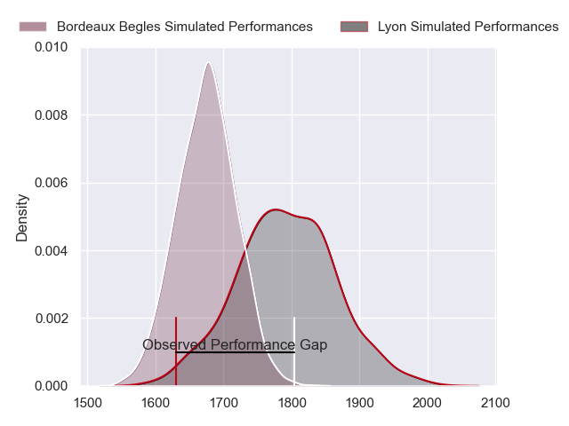
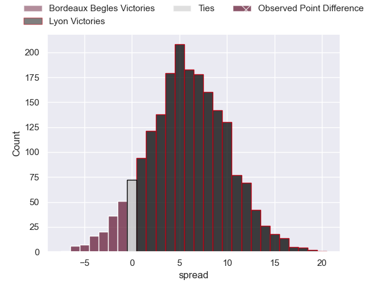
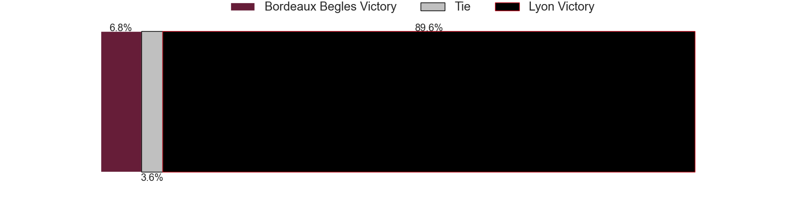

---  
layout: page  
title: Bordeaux Begles at Lyon; 32-25  
date: 2023-06-04 21:05:00 18:00:00 -0500  
categories: match review  
---
# Bordeaux Begles at Lyon; 32-25

# Club Level Predictions

The first set of predictions treats a club as the smallest object, as the club develops its members, organizes a gameplan, and deploys its players as needed for each match. This club model has a prediction of 0.661, which translates to predicting Lyon to win by 5.9.

Each club has a rating and a rating deviation (simiar to a Glicko system), and expected performances can be generated. This allows for simulated matches and spreads like the ones below.
## Projected Performances

## Projected Spreads

## Projected Results

# Player Level Predictions

Treating teams instead as an entity made up of the currently active players, I have ratings for each player in an altogether different system. These can be combined to form team ratings once teamsheets are announced, weighting starters a bit higher than the reserves. After the match is played, players can be weighted by their minutes on the field, allowing for an accurate measure of the team's composition. With these compiled team ratings, we can make predictions, measure inaccuracy, and update the individual player ratings.
## Prediction with Player Minutes: Lyon by 5.5

Lyon by 1.5 on a neutral field

There were 7 large changes in win probability in this match
## Prediction without Player Minutes: Lyon by 9.1

Lyon by 5.1 on a neutral pitch

|   Away Minutes | Away Player          |   Away elo |   Away Percentile |   Number |   Home Percentile |   Home elo | Home Player               |   Home Minutes |
|---------------:|:---------------------|-----------:|------------------:|---------:|------------------:|-----------:|:--------------------------|---------------:|
|             45 | Jefferson Poirot     |      88.85 |                75 |        1 |                70 |      86.64 | Sébastien Taofifenua      |             54 |
|             45 | Maxime Lamothe       |      84.56 |                67 |        2 |                56 |      80.13 | Liam Coltman              |             60 |
|             45 | Vadim Cobilas        |      86.09 |                69 |        3 |                59 |      81.49 | Demba Bamba               |             66 |
|             80 | Cyril Cazeaux        |      82.13 |                58 |        4 |                69 |      87.73 | Félix Lambey              |             49 |
|             35 | Jan Andre Marais     |      81.19 |                56 |        5 |                90 |     104.76 | Romain Taofifenua         |             80 |
|             59 | Mahamadou Diaby      |      74.48 |                42 |        6 |                39 |      73.23 | Dylan Cretin              |             80 |
|             80 | Pierre Bochaton      |      87.4  |                70 |        7 |                48 |      76.6  | Beka Saghinadze           |             80 |
|             80 | Tom Willis           |      82.33 |                57 |        8 |                48 |      78.77 | Liam Allen                |             70 |
|             80 | Maxime Lucu          |      83.73 |                60 |        9 |                53 |      79.8  | Baptiste Couilloud        |             49 |
|             80 | Matthieu Jalibert    |      76.85 |                44 |       10 |                60 |      84.68 | Lima Sopoaga              |             71 |
|             80 | Santiago Cordero     |      79.2  |                53 |       11 |                78 |      93.94 | Ethan Dumortier           |             80 |
|             80 | Yoram Moefana        |      80.02 |                53 |       12 |                60 |      84.04 | Josua Tuisova             |             66 |
|             51 | Jean-Baptiste Dubié  |      81.5  |                55 |       13 |                71 |      90.67 | Josiah Maraku             |             80 |
|             80 | Madosh Tambwe        |      67.26 |                27 |       14 |                51 |      78.41 | Tavite Veredamu           |             80 |
|             80 | Louis Bielle Biarrey |      98.61 |                81 |       15 |                58 |      84.94 | Toby Arnold               |             80 |
|             35 | Lesko Kaulashvili    |      95.54 |                85 |       16 |               nan |      80.43 | Feao Fotuaika             |             26 |
|             35 | Gabriel Oghre        |      80.29 |                58 |       17 |                35 |      74.33 | Guillaume Marchand        |             20 |
|             35 | Sipili Falatea       |      83.06 |                65 |       18 |                38 |      75.44 | Francisco Gomez Kodela    |             14 |
|             45 | Kane Douglas         |      82.16 |                58 |       19 |                52 |      83.13 | Temo Sukayawa Mayanavanua |             31 |
|             21 | Caleb Timu           |      90.5  |                75 |       20 |                47 |      77.8  | Mickael Guillard          |             10 |
|             29 | Nicolas Depoortere   |      91.13 |                76 |       21 |                52 |      82.37 | Jonathan Pelissié         |             31 |
|            nan | nan                  |     nan    |               nan |       22 |                35 |      73.48 | Jean-Marc Doussain        |              9 |
|            nan | nan                  |     nan    |               nan |       23 |               nan |      75.35 | Alfred Parisien           |             14 |

