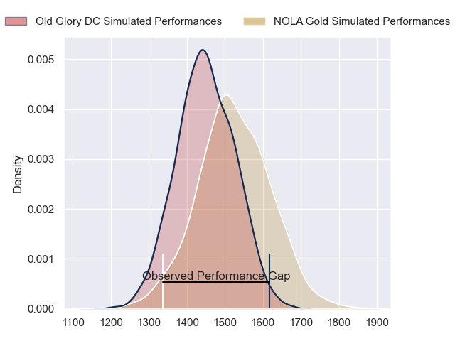
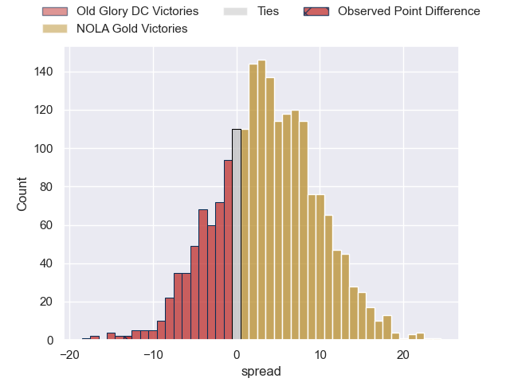

---  
layout: page  
title: Old Glory DC at NOLA Gold  
date: 2023-06-04 18:00:00 -0500  
categories: match review  
---
# Old Glory DC at NOLA Gold

# Club Level Predictions

The first set of predictions treats a club as the smallest object, as the club develops its members, organizes a gameplan, and deploys its players as needed for each match. This club model has a prediction of 0.606, which translates to predicting NOLA Gold to win by 3.8.

Each club has a rating and a rating deviation (simiar to a Glicko system), and expected performances can be generated. This allows for simulated matches and spreads like the ones below.
## Projected Performances

## Projected Spreads

## Projected Results

# Player Level Predictions

Treating teams instead as an entity made up of the currently active players, I have ratings for each player in an altogether different system. These can be combined to form team ratings once teamsheets are announced, weighting starters a bit higher than the reserves. After the match is played, players can be weighted by their minutes on the field, allowing for an accurate measure of the team's composition. With these compiled team ratings, we can make predictions, measure inaccuracy, and update the individual player ratings.
## Prediction with Player Minutes: NOLA Gold by 1.7

Old Glory DC by 1.5 on a neutral field
## Prediction without Player Minutes: NOLA Gold by 1.7

Old Glory DC by 1.5 on a neutral pitch

|   Away Minutes | Away Player             |   Away elo |   Away variance |   Number |   Home variance |   Home elo | Home Player                              |   Home Minutes |
|---------------:|:------------------------|-----------:|----------------:|---------:|----------------:|-----------:|:-----------------------------------------|---------------:|
|             80 | Jack Iscaro             |     -66.64 |           47.87 |        1 |           49.04 |      41.08 | Jarred Adams                             |             80 |
|             80 | Nic Souchon             |      36.32 |           48.16 |        2 |           48.83 |     -38    | Pat O'Toole                              |             80 |
|             80 | Kyle Stewart            |      39.47 |           48.67 |        3 |           48.97 |      42.63 | Sean Bradley Paranihi                    |             80 |
|             80 | Tevita Naqali           |     -32.63 |           49.68 |        4 |           48.74 |      40.93 | Cameron Dolan                            |             80 |
|             80 | Kyle Baillie            |      42.02 |           49.06 |        5 |           49.21 |      35.97 | Liam Hallam-Eames                        |             80 |
|             80 | Lautaro Ezequiel Bavaro |     109.65 |           47.77 |        6 |           48.41 |       2.56 | Malcolm May                              |             80 |
|             80 | Alejandro Daireaux      |      37.14 |           49.29 |        7 |           48.26 |     -47.68 | Moni Tonga'uiha                          |             80 |
|             80 | Niko Jones              |      33.43 |           49.2  |        8 |           49.17 |      46.25 | Tom Florence                             |             80 |
|             80 | Danny Joseph Tusitala   |     -47.4  |           47.9  |        9 |           48.83 |      44.45 | Luke Campbell                            |             80 |
|             80 | Gradyn Bowd             |      34.54 |           48.39 |       10 |           48.67 |      43.92 | Rodney Iona                              |             80 |
|             80 | Marcos Young            |      59.27 |           49.09 |       11 |           50    |      17.75 | Cael Hodgson                             |             80 |
|             80 | Douglas Fraser          |      46.08 |           50    |       12 |           48.99 |     -15.97 | Ross Depperschmidt                       |             80 |
|             80 | William Talataina-Mu    |      -8.14 |           48.15 |       13 |           48.37 |      38.32 | Philippus Jacobus Snyman (JP) du Plessis |             80 |
|             80 | Peni Lasaqa             |      36.3  |           48.45 |       14 |           48.99 |      13.7  | Harley Wheeler                           |             80 |
|             80 | Joaquin Diaz Bonilla    |      28.29 |           48.6  |       15 |           49.74 |      46.35 | Jordan Trainor                           |             80 |

