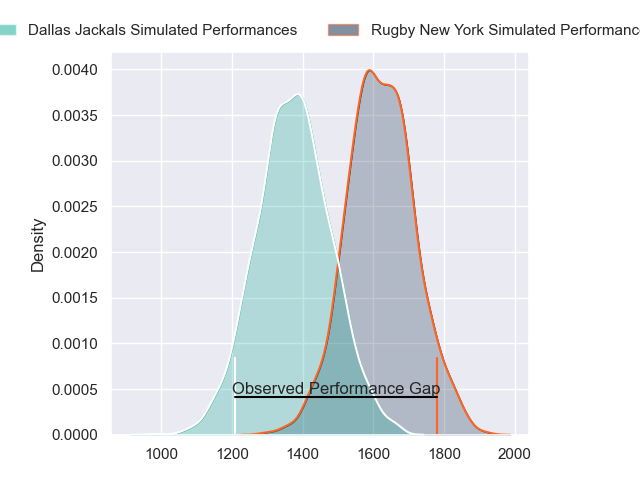
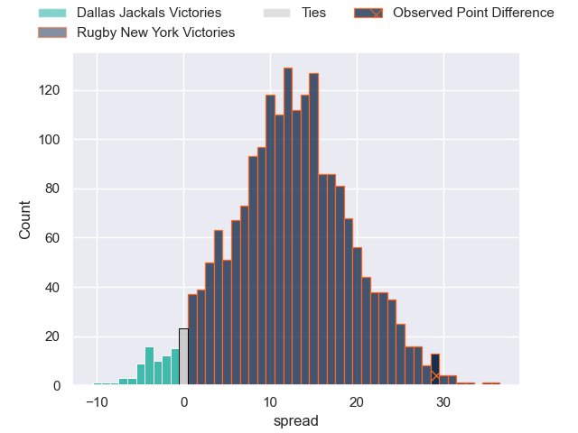
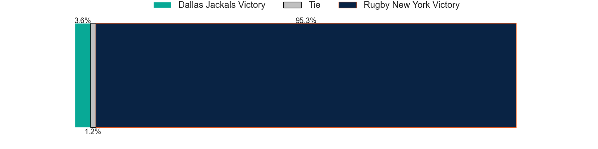

---  
layout: page  
title: Dallas Jackals at Rugby New York; 14-43  
date: 2023-06-04 21:00:00 18:00:00 -0500  
categories: match review  
---
# Dallas Jackals at Rugby New York; 14-43

# Club Level Predictions

The first set of predictions treats a club as the smallest object, as the club develops its members, organizes a gameplan, and deploys its players as needed for each match. This club model has a prediction of 0.795, which translates to predicting Rugby New York to win by 12.4.

Each club has a rating and a rating deviation (simiar to a Glicko system), and expected performances can be generated. This allows for simulated matches and spreads like the ones below.
## Projected Performances

## Projected Spreads

## Projected Results

# Player Level Predictions

Treating teams instead as an entity made up of the currently active players, I have ratings for each player in an altogether different system. These can be combined to form team ratings once teamsheets are announced, weighting starters a bit higher than the reserves. After the match is played, players can be weighted by their minutes on the field, allowing for an accurate measure of the team's composition. With these compiled team ratings, we can make predictions, measure inaccuracy, and update the individual player ratings.
## Prediction with Player Minutes: Rugby New York by 17.3

Rugby New York by 13.3 on a neutral field

There were 4 large changes in win probability in this match
## Prediction without Player Minutes: Rugby New York by 17.3

Rugby New York by 13.3 on a neutral pitch

|   Away Minutes | Away Player         |   Away elo |   Away Percentile |   Number |   Home Percentile |   Home elo | Home Player       |   Home Minutes |
|---------------:|:--------------------|-----------:|------------------:|---------:|------------------:|-----------:|:------------------|---------------:|
|             80 | Liam Murray         |      57.81 |                12 |        1 |                23 |      65.86 | Nic Mayhew        |             80 |
|             80 | Dewald Kotze        |      41.62 |                 3 |        2 |                11 |      55.08 | Dylan Fawsitt     |             80 |
|             80 | Juan Pablo Zeiss    |      55.36 |                 8 |        3 |                95 |     110.29 | Kaleb Geiger      |             80 |
|             80 | Sam Golla           |      51.65 |                 7 |        4 |                 6 |      50.79 | Nate Brakeley     |             80 |
|             80 | Lucas Bur           |      61.84 |                17 |        5 |                17 |      61.64 | Hamish Dalzell    |             80 |
|             80 | Jeronimo Gomez Vara |      59.42 |                14 |        6 |                12 |      57.45 | Brad Tucker       |             80 |
|             80 | Conrado Roura       |      31.14 |                 0 |        7 |                35 |      71.21 | Akuei Monate      |             80 |
|             80 | Jan Adriaan Booysen |      47.75 |                 4 |        8 |                 7 |      52.21 | Pago Haini        |             80 |
|             80 | Pedro Imhoff        |      72.29 |                35 |        9 |                 8 |      54.73 | Connor Buckley    |             80 |
|             80 | Alejandro Torres    |      51.84 |                 7 |       10 |                12 |      57.66 | Jason Emery       |             80 |
|             80 | Lui Sitama          |      61.47 |                18 |       11 |                32 |      70.54 | Teofilo Ed Fidow  |             80 |
|             80 | Tomas Cubilla       |      27.29 |                 0 |       12 |                14 |      58.74 | Teihorangi Walden |             80 |
|             80 | Tomas Malanos       |      94.76 |                77 |       13 |                 6 |      50.58 | Fa'asiu Fuatai    |             80 |
|             80 | Campbell Johnstone  |      28.85 |                 1 |       14 |                13 |      57.24 | Brooklyn Hardaker |             80 |
|             80 | Marcos Moroni       |      57.73 |                14 |       15 |                14 |      59.61 | Andrew Coe        |             80 |

