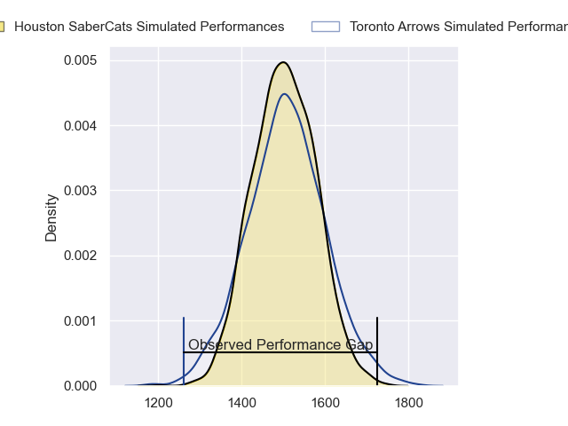
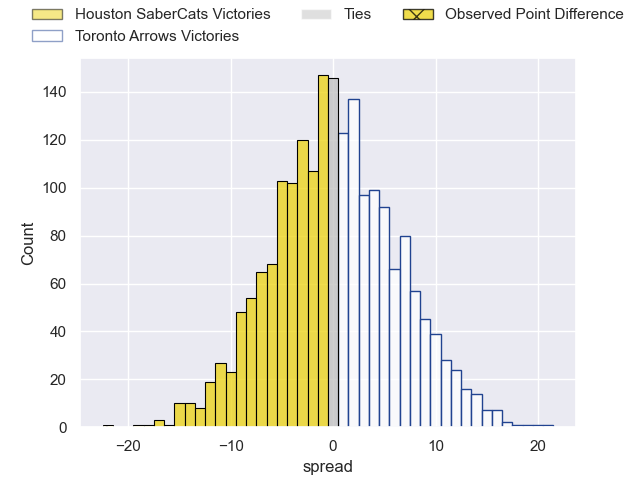

---  
layout: page  
title: Houston SaberCats at Toronto Arrows; 48-26  
date: 2023-06-04 01:00:00 18:00:00 -0500  
categories: match review  
---
# Houston SaberCats at Toronto Arrows; 48-26

# Club Level Predictions

The first set of predictions treats a club as the smallest object, as the club develops its members, organizes a gameplan, and deploys its players as needed for each match. This club model has a prediction of 0.502, which translates to predicting Toronto Arrows to win by 0.1.

Each club has a rating and a rating deviation (simiar to a Glicko system), and expected performances can be generated. This allows for simulated matches and spreads like the ones below.
## Projected Performances

## Projected Spreads

## Projected Results

# Player Level Predictions

Treating teams instead as an entity made up of the currently active players, I have ratings for each player in an altogether different system. These can be combined to form team ratings once teamsheets are announced, weighting starters a bit higher than the reserves. After the match is played, players can be weighted by their minutes on the field, allowing for an accurate measure of the team's composition. With these compiled team ratings, we can make predictions, measure inaccuracy, and update the individual player ratings.
## Prediction with Player Minutes: Houston SaberCats by 10.5

Houston SaberCats by 14.5 on a neutral field
## Prediction without Player Minutes: Houston SaberCats by 10.5

Houston SaberCats by 14.5 on a neutral pitch

|   Away Minutes | Away Player              |   Away elo |   Away Percentile |   Number |   Home Percentile |   Home elo | Home Player      |   Home Minutes |
|---------------:|:-------------------------|-----------:|------------------:|---------:|------------------:|-----------:|:-----------------|---------------:|
|             80 | Rob Cobb                 |      62.5  |                17 |        1 |                 2 |      43.98 | Connor Grindal   |             80 |
|             80 | Joseph Taufete'e         |      62.31 |                19 |        2 |                81 |      93.59 | Ramon Ayarza     |             80 |
|             80 | Morgan Mitchell          |      48.25 |                 4 |        3 |                 4 |      48.89 | Tyler Rowland    |             80 |
|             80 | Emmanuel Albert          |      53.4  |                14 |        4 |                 0 |      23.11 | Mason Flesch     |             80 |
|             80 | Marno Redelinghuys       |      83.04 |                60 |        5 |                 3 |      45.19 | Shay Kerry       |             80 |
|             80 | Danny Barrett            |      57.49 |                12 |        6 |                 9 |      54.74 | Lucas Rumball    |             80 |
|             80 | Wynand Grassmann         |      84.28 |                64 |        7 |                69 |      84.4  | James O'Neill    |             80 |
|             80 | Malon Maurice Al-Jiboori |      64.36 |                22 |        8 |                28 |      69.28 | Travis Larsen    |             80 |
|             80 | Dillon Smit              |      71.63 |                33 |        9 |                14 |      59.31 | Ross Braude      |             80 |
|             80 | Robert Povey             |      63.08 |                19 |       10 |                 3 |      44.5  | Peter Nelson     |             80 |
|             80 | Vereniki Tikoisolomone   |      73.58 |                40 |       11 |                18 |      57.96 | D'Shawn Bowen    |             80 |
|             80 | Louritz van der Schyff   |      69.23 |                31 |       12 |                 2 |      44.16 | Liam Bowman      |             80 |
|             80 | Dominic Akina            |      55.29 |                10 |       13 |                 5 |      49.28 | Tautalatasi Tasi |             80 |
|             80 | Christian Dyer           |      53.34 |                 9 |       14 |                 6 |      47.98 | Ciaran Breen     |             80 |
|             80 | Drew Wild                |      60.47 |                16 |       15 |                 7 |      50.77 | Shane O'Leary    |             80 |

